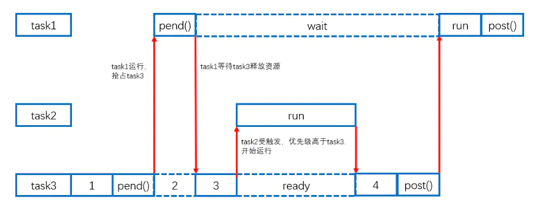
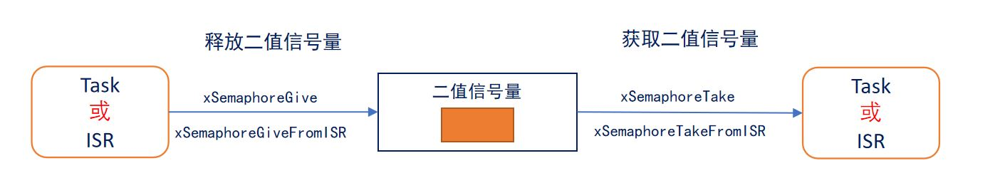
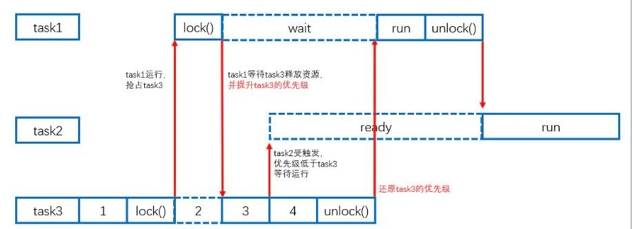

# STM32 FreeRTOS 4_信号量(Semaphore)

## 1. 二值信号量

### 二值信号量的应用
**二值信号量的本质是一个队列长度为 1 的队列 ，该队列就只有空和满两种情况**，这就是二值信号量；

二值信号量用于**任务同步和中断同步**，也可以实现互斥访问，但**不具有优先级继承**。

- 优先级翻转（二值信号量用于互斥访问）

> 
> 任务优先级：Task1>Task2>Task3。
>
> 1. 开始时Task3获取二值信号量，但是随后Task1进入就绪态使得Task3被抢占。
> 2. Task1试图获取二值信号量，但是由于二值信号量为空，Task1进入阻塞态，Task3继续运行。
> 3. Task2进入就绪态，抢占Task3运行，Task2运行结束后Task3将信号量释放，Task1立刻进入就绪态继续运行。
> 4. 宏观来看，**Task1需要等待Task2运行进入阻塞态后进行执行，任务优先级发生了翻转。**

- 任务和中断同步
> 
>
> 1. 程序开始运行时，信号量无效，因此任务阻塞在这个信号量下。
> 2. 一段时间后，一个中断发生，在中断服务程序中使用API函数`xSemaphoreGiveFromISR()`给出了一个信号，信号量变得有效。
> 3. 当退出中断服务程序后，执行上下文切换，任务解除阻塞，使用API函数`xSemaphoreTake()`取走信号量并执行任务。
> 4. 之后信号量变得无效，任务再次进入阻塞。实现了中断同步。

---

> 当一个任务需要等待某个资源，而该资源由中断服务程序（ISR）或其他任务释放时，就需要使用信号量来实现同步 ：
>
> 1. **初始化阶段：**
>    - 在程序开始运行时，通过 `xSemaphoreCreateBinary()` 或类似的函数创建一个信号量。这个信号量被初始化为无效状态，即计数为 0。
> 2. **中断处理：**
>    - 当中断发生时，中断服务程序（ISR）可能会执行某些操作并释放一个信号量，以通知一个或多个任务可以继续执行了。
>    - 在中断服务程序中，使用 `xSemaphoreGiveFromISR()` 函数来释放一个信号量。这个函数专门设计用于从中断服务程序中释放信号量。
>    - `xSemaphoreGiveFromISR()` 函数将信号量的计数增加，并在必要时唤醒等待该信号量的任务。**在中断服务程序中，不能使用 `xSemaphoreTake()` 函数，因为它会导致任务上下文的切换，破坏中断的执行流程。****
> 3. **退出中断服务程序：**
>    - 中断服务程序执行完毕后，会进行上下文切换，控制权返回到任务上下文。
>    - 在任务上下文中，通过调用 `xSemaphoreTake()` 函数来获取信号量并执行任务。这个函数会阻塞任务，直到信号量变为有效，并且成功地获取到了信号量。
>    - 在任务中调用 `xSemaphoreTake()` 函数时，如果信号量的计数大于零，则减少信号量的计数，并且任务可以继续执行。如果信号量的计数为零，则任务将被阻塞，直到有其他任务或中断释放了该信号量。
> 4. **任务执行完成：**
>    - 当任务完成了它的工作后，可能会释放信号量，并将其变为无效状态，以便其他任务可以继续等待。
>    - 这可以通过调用 `xSemaphoreGive()` 函数来实现，该函数适用于在任务上下文中释放信号量。
>
> 通过这种方式，任务和中断之间实现了同步，确保了在资源准备好之前，任务不会继续执行，而是等待信号量的释放。这种方法是实时系统中常见的同步机制之一，用于确保任务执行的顺序和时序要求。

---

### API函数(标准API)

#### 创建二值信号量

```c
/**
  * @brief 二值信号量创建函数
  * @retval 二值信号量句柄
  */
SemaphoreHandle_t  xSemaphoreCreateBinary(void);
```

#### 获取信号量

```c
/**
  * @brief 信号量获取函数
  */
BaseType_t xSemaphoreTake(SemaphoreHandle_t xSemaphore, TickType_t xTicksToWait)
```

### API函数(CMSIS API)

```C
/**
  * @brief 信号量宏定义
  * @param name 指定名称
  */
#define osSemaphoreDef (name) const osSemaphoreDef_t os_semaphore_def_##name = { 0 }

/**
  * @brief 信号量创建
  * @param semaphore_def：指定osSemaphoreDef宏所定义结构体变量的指针，此时需要用到osSemaphore宏。
  * @param count：指定初始资源数
  * @retval 函数调用成功就返回唯一识别信号量的ID，否者就返回 NULL。
  */
osSemaphoreId osSemaphoreCreate(const osSemaphoreDef_t *semaphore_def, int32_t count);

/**
  * @brief 信号量获取
  * @param semaphore_id：信号量 ID
  * @param millisec：超时设置 0：不管成功与否都立即返回 osWaitForever：如果无法获取资源则休眠，直到获取到资源位置。
  * @retval 返回资源数
  */
int32_t osSemaphoreWait(osSemaphoreId semaphore_id, uint32_t millisec);

/**
  * @brief 信号量释放
  * @param semaphore_id：信号量 ID
  */
osStatus osSemaphoreRelease(osSemaphoreId semaphore_id);
```

## 2. 互斥信号量(Mutex)

### 互斥信号量的应用（互斥锁）

互斥信号量简单说是**具有优先级继承**的**二值**信号量，用于进程中的互斥，**不可用于中断中**。

- 优先级继承

---

优先级继承是一种处理多任务系统中资源竞争和优先级反转问题的技术。当一个低优先级任务持有一个高优先级任务需要的资源时，系统可以临时提升低优先级任务的优先级，以确保高优先级任务能够尽快完成，并尽量减少优先级反转的影响。

具体来说，优先级继承通常包括以下几个步骤：

1. **高优先级任务请求资源：** 高优先级任务发出请求，需要使用某个资源，但该资源当前被低优先级任务占用。
2. **低优先级任务被阻塞：** 高优先级任务由于资源被占用而被阻塞，无法继续执行。
3. **优先级提升：** 系统将低优先级任务的优先级临时提升到高优先级任务的优先级，使其具有更高的执行优先级。
4. **资源释放：** 高优先级任务使用完资源后，释放资源，并唤醒低优先级任务。
5. **恢复优先级：** 低优先级任务的优先级恢复为原始值，继续执行。

通过优先级继承，可以避免低优先级任务长时间占用高优先级任务需要的资源而导致优先级反转的问题。这种技术通常在实时操作系统（RTOS）中得到应用，例如在嵌入式系统中。

---

> 
>
> 1. Task3获得互斥锁；
> 2. 此时Task1抢占Task3，试图读取资源，由于互斥锁被获取且未被释放，则Task1进入阻塞态并将Task3变为和Task1一致的优先级。
> 3. Task2进入就绪态，但是由于Task3此时优先级高于Task2，所以Task2无法运行。
> 4. Task3释放互斥锁，Task1可以读取资源后并释放互斥锁，随后Task2才能运行。
> 5. Task2和Task1优先级没有发生反转。

**互斥信号量的申请（获取）与释放是要在同一个任务中进行的**，不能在一个任务中申请而在另一个任务中释放。

### API函数(标准API)

```c
/**
  * @brief 互斥信号量创建函数
  * @retval 互斥信号量句柄
  */
SemaphoreHandle_t xSemaphoreCreateMutex(void);
```

### API函数(CMSIS API)

```C
/**
  * @brief 互斥信号量创建函数
  * @param mutex_def 引用由osMutexDef定义的互斥量
  * @retval 互斥信号量句柄
  */
osMutexId osMutexCreate (const osMutexDef_t *mutex_def);

/**
  * @brief 互斥信号量获取函数
  * @param mutex_id 互斥量ID
  * @param 等待信号量可用的最大超时时间，单位为系统节拍周期。
  * @note  在需要访问共享资源或进入临界区的代码中，使用 osMutexWait 函数获取互斥信号量。
  *        如果信号量当前不可用（已被其他任务获取），当前任务会被阻塞，直到信号量可用。
  */
osStatus osMutexWait (osMutexId mutex_id, uint32_t millisec);

/**
  * @brief 互斥信号量释放函数
  * @param mutex_id 互斥量ID
  */
osStatus osMutexRelease (osMutexId mutex_id);
```

## 3. 计数信号量

### 计数信号量的应用

计数型信号量相当于队列长度大于 1 的队列，因此计数型信号量能够容纳多个资源，这是在计数型信号量被创建的时候确定的。

1. **事件计数**

- 在事件处理函数中，每次事件发生后，在事件处理函数中释放计数型信号量（计数值+1），**表示事件发生的次数**。
- 其他任务可以获取计数型信号量（计数值-1），表示任务已经处理了事件。
- 这种场景通常在创建时将初始计数值设置为 0。

2. **资源管理**

- **计数型信号量表示有效的资源数量**。任务必须先获取信号量（信号量计数值-1 ）才能获取资源控制权。
- 当计数值为零时，表示没有可用的资源。当任务使用完资源后，必须释放信号量（信号量计数值+1）。
- 在创建计数型信号量时，初始计数值应等于最大资源数目。

### API函数(标准API)

```c
/**
  * @brief 计数信号量创建函数
  * @param uxMaxCount 最大值，即计数型信号量能够容纳的最大资源数量
  * @param uxInitialCount 初始值，即创建时的初始资源数量
  * @retval 计数信号量句柄
  */
SemaphoreHandle_t xSemaphoreCreateCounting (UBaseType_t uxMaxCount,UBaseType_t uxInitialCount);

/**
  * @brief 计数信号量计数函数
  * @param xSemaphore 计数信号量句柄
  */
UBaseType_t uxSemaphoreGetCount(SemaphoreHandle_t xSemaphore);
```

---

> 计数信号量在多任务系统中具有广泛的应用，特别是在需要控制对资源的并发访问或同步事件的场景中。下面是一些常见情况下会用到计数信号量的示例：
>
> 1. **资源管理：**
>    - 当有多个任务需要共享有限的资源时，可以使用计数信号量来控制对资源的访问。每个资源的可用性可以用计数信号量的计数值来表示。
>    - 例如，在一个生产者-消费者模型中，生产者任务生产了多个资源（如消息、数据等），而消费者任务则需要消耗这些资源。可以使用计数信号量来控制资源的生产和消费，确保生产者不会在资源已满时继续生产，消费者也不会在资源为空时尝试消费。
> 2. **事件计数：**
>    - 当需要同步任务或线程以处理一系列事件时，可以使用计数信号量来进行事件计数。每次事件发生时，信号量计数值加一；每次任务处理完一个事件时，信号量计数值减一。
>    - 例如，在一个多任务系统中，一个任务负责接收传感器数据，另一个任务负责处理数据并发送给外部设备。可以使用计数信号量来控制数据接收和处理的同步，以确保数据在处理之前已经接收完整。
> 3. **限流控制：**
>    - 在需要限制某些操作的并发数量时，可以使用计数信号量来实现限流控制。每次执行操作时，首先获取计数信号量，如果计数值已达到上限，则任务会被阻塞，直到有其他任务释放了计数信号量。
>    - 例如，在一个网络服务器中，可以使用计数信号量来限制同时处理的连接数，避免服务器过载。
> 4. **排队等待：**
>    - 当任务需要等待某些操作的完成时，可以使用计数信号量来进行排队等待。每个任务获取计数信号量后进入等待状态，直到所有任务都完成了操作。
>    - 例如，在一个并行处理任务的系统中，可以使用计数信号量来控制任务的执行顺序，确保某些任务在其他任务完成后才能执行。
>
> 总之，计数信号量是一种非常有用的同步机制，可以在多任务系统中实现资源管理、事件同步、限流控制和排队等待等功能。
