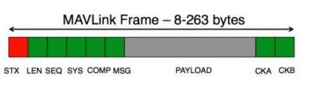
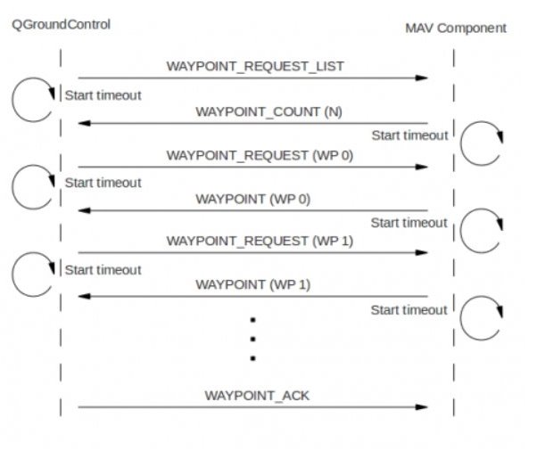

# Mavlink_StudyNote

> 参考资料：http://t.csdnimg.cn/J1KGM
>
> [MAVLink v1.0详解和2.0介绍_mavlink中文解析-CSDN博客](https://blog.csdn.net/zhiyuan2021/article/details/90256604)
>
> https://blog.csdn.net/luckpl/article/details/52608868
>
> [MAVLink系列——基础介绍 - 知乎 (zhihu.com)](https://zhuanlan.zhihu.com/p/415266156)

## 一、概述

###  1. MAVLink简介

MAVLink（Micro Air Vehicle Link，微型空中飞行器链路通讯协议）是一种用于小型无人载具的通信协议，于2009年首次发布。MAVLink通讯协议是一个为微型飞行器设计的非常轻巧的、只由**头文件**构成的信息编组库。它可以**通过串口非常高效地封装C结构数据**，并将这些数据包发送至地面控制站。该协议广泛应用于地面站（Ground Control Station，GCS）与无人载具（Unmanned vehicles）之间的通信，同时也应用在载具内部子系统的内部通信中，协议以消息库的形式定义了参数传输的规则。MavLink协议支持无人固定翼飞行器、无人旋翼飞行器、无人车辆等多种载具，是无人飞行器与地面（Ground Control Station ，GCS）之间通讯，以及无人飞行器之间通讯最常用的协议。该协议被PX4, PIXHAWK, APM和Parrot AR.Drone平台所广泛测试，并在以上的项目中作为**MCU/IMU间以及Linux进程和地面站链路通信间的主干通信协议**。

MavLink协议本身由一系列消息包（MassagePacket）组成，所有消息包具有通用的消息包结构，同时每个消息包又具有各自特殊的**负载信息**（payload）结构。**消息包结构封装的信息用于发送消息、接收消息、识别消息种类**，而**负载信息则用于描述消息所要传达的具体内容**，可以理解为信封和信纸的关系。

MavLink协议中，无人机各组件各参数的传输均需要消息包作为载体，而**参数实际数据则保存在消息包内的负载信息段中**。例如，当无人机端向地面站发送飞行姿态信息时，会将飞行姿态参数按照飞行姿态消息包内的负载信息格式封装，再按照飞行姿态信息包格式封装，最后通过串口发送至地面站，地面站软件逆向解析出飞行姿态数据，根据数据调整GUI图形向操作者展示当前无人机飞行姿态。因为消息包种类众多，导致负载信息格式定义情况复杂，本文只选取部分主要消息包进行分析。

通过MavLink协议实现通信需要地面站软件和飞行控制软件的协作。地面站软件与飞行控制软件在发送、接收MavLink消息时需要依照预先设定的流程，本文以无人机与地面站连接时通信握手、参数列表请求、参数设定、状态消息包循环收发为例。

---

**Mavlink_versionV1.0 2013年发布**
**Mavlink_versionV2.0 2017年发布**

- V2.0极大地简化了传输
- V2.0向下兼容Ｖ1.0
> v2.0
Support for more than 256 message IDs
Packet signing (authentication)
Support for extending existing messages
Support for variable length arrays


### 2. MAVLink相关资料
维基百科：https://en.wikipedia.org/wiki/MAVLink 
MavLink官方网站：http://qgroundcontrol.org/mavlink/start 
Mavlink协议理解Pixhawk APM http://blog.csdn.net/super_mice/article/details/44836585
Mavlink-最强大的微型飞行器通信协议 http://bbs.loveuav.com/thread-36-1-1.html
Mavlink微型飞行器的通信协议 http://wenku.baidu.com/view/44b9d4dd50e2524de5187eab.html?from=search

Python写的用于生成C、Java等语言的MavLink生成器软件：https://github.com/mavlink/mavlink

### 3.MAVlink源文件结构


- 1. common文件夹：原始的MAVLink消息，包括各种消息的头文件,放一些常用的MavLink消息和CRC校验工具

　　　common.h：定义MAVLink各个消息包中用到的枚举类型，各个消息包对应的CRC—EXTRA值、LENGTH值，包含（include）各个消息包的头文件

>  各个消息的头文件：1）定义消息内容对应的数据结构，2）打包、发送消息的便捷函数，3）消息包解析并获取各个参数

- 2. autopilotmega，ASLUAV，pixhawk等文件夹：这些文件夹包含各个飞控自定义的MAVLink消息类型.存放针对mega板子特有的消息

- 3. checksum.h：计算校验码的代码 

-   4.mavlink_conversions.h：dcm，欧拉角，四元数之间的转换

- 5. **mavlink_helper.h：提供各种便捷函数**：

　　 1）将各个消息包补充完整并发送。将数据载荷加上消息帧的头部，如sysid和compid等，计算校验码，补充成为完整的mavlink消息包后发送；

　 　2）MAVLink消息包解析。

- 6. **mavlink_types.h**：定义用到的各种基本结构体（如mavlink_message_t）、枚举类型（如 mavlink_param_union_t）
-   7.Messages包:**提供消息基本类和一些缓存处理类**
-   8.enums包:存放一些常量
-   9.MAVLinkPacket类:**用来记录原始报文**
-   10.Parser类:用于解析信道中传递过来的数据,生成MAVLinkPacket格式的报文。


---

### 5.性能

Mavlink协议**传输速度快**且**安全性高**。协议允许检验消息内容，同样允许检测丢失的消息序列且最少只需要每个包中6个字节的开销来保证。传输实例：


### 6.优点

MAVLink有如下功能：

- 给你提供了代码生成工具，一键生成不同语言的API库，让你直接使用！再也不用自己写通信协议的具体实现了，不用担心在收包的时候低效、丢包，不用费劲心思写校验函数。常见的编程语言基本上都支持了，这也意味着你可以在很多不同的平台上使用，例如windows、linux、stm32、Android等等。
- 极易扩展！MAVLink给予XML格式给定了消息定义模板，当基础消息无法满足你的通信需求时，你可以根据模板定义扩展消息，然后使用生成工具一键重新生成即可！
- 高效、稳定，从2009年起，无数应用场景已经证明这点。
- 标准就是最大的优点！

## 二、MAVLink架构简易理解

为了更全面理解MAVLink消息，我们打开官网并且点开`Messages(common)`页面，这个页面详细描述了MAVLink基础消息的所有内容。


点击左上角消息导航，你会看到非常多非常多的标题！不用怕，这些标题虽然多，但是绝大部分都是”重复“的概念，我们精简为如下的目录：

>- MAVLINK Common Message Set
>- MAVLink Protocol Version
>- MAVLink Type Enumerations
>- MAV_MODE
>- MAVLink Commands(MAV_CMD)
>- MAV_CMD_NAV_LAND (21)
>- MAV_CMD_COMPONENT_ARM_DISARM (400)
>- MAV_CMD_GET_HOME_POSITION (410 )
>- MAVLink Messages
>- SET_MODE(#11)
>- ATTITUDE(#30)
>- COMMAND_LONG ( #76 )
>- SET_POSITION_TARGET_LOCAL_NED ( #84 )

### 1.MAVLink Messages

首先我们看到`MAVLink Messages`标题，这个下面的所有内容都是消息定义，例如前面我们看到的ATTITUDE消息等等。

关于消息你需要几点：

- 每个MAVLink数据包都能够对应一条消息，每个消息都有唯一的编号（**MSG ID**）；
- MAVLink消息可以理解为一个密码本，**MSG ID**是密钥，根据密钥我们在密码本上就知道消息的具体内容！
- 每个MAVLink消息可能内容不同，类似于C语言中的结构体，定义的不同结构体其成员数量、类型可能都不一样，这个导致了不同消息对应的MAVLink Payload字段长度不同，进而导致数据包的长度不同！

其中有一个消息特别重要，就是#76号消息`COMMAND_LONG`，我们先看下这个消息的定义：


从名称来看，COMMAND有的是控制的含义，其实**这个消息就是传输的控制指令**，**一般都是地面站传给无人机**。

可以看到消息`COMMAND_LONG`包含了很多数据内容，接下来我们详细说下其具体含义：

> target_system : 表示目标设备sys id，如果你要控制的无人机sys_id=201，那么就把target_system=201；
> target_component : 表示目标设备cmp id，如果你要控制的无人机cmp_id=1，那么就把target_component=1；
> command : 非常重要！表示命令编号，由于命令可能很多，例如解锁、降落等等，每个命令对应一个编号！
> confirmation : 置0即可，暂时不管；
> param1~param7 : **命令包含的参数**，有的命令通过命令编号就能够表达完整命令的含义，就不用附加参数描述，例如**MAV_CMD_GET_HOME_POSITION (410)**就是获取起飞点位置，但是有个命令必须进行一些备注描述才能完整表明命令含义，例如**MAV_CMD_COMPONENT_ARM_DISARM(400)**是解锁关锁命令，但到底是要去解锁还是关锁，需要通过附件参数进行描述。

### 2.MAVLink Commands

一开始很多人会混肴**消息Message**和**命令Commands**，其实很容易理解，**命令是一个独特的消息**，**这个消息包含了命令编号以及定义了7个参数，具体这些参数的含义是什么，是由命令编号来给定的**。

例如地面站要传输一个让无人机解锁的命令，那么这个MAVLink消息包的具体内容应该是如下：


### 3.MAVLink Type Enumerations

这部分主要是定义了MAVLink相关的常量，为什么定义常量？很简单，为了编程方便，更容易理解。

举例来说，当机载计算机希望发送位置控制消息，消息ID=84，SET_POSITION_TARGET_LOCAL_NED，其中我们需要指定坐标系类型，根据我们根据消息ID知道这个消息中包含有`coordinate_frame`成员，表示坐标类型，我们需要给它赋值，例如MAVLink规定0表示全局大地坐标系（GLOBAL），1表示局部坐标系（LOCAL_NED），但实际编程中，我们不可能记清楚或者再去MAVLink官网查每个数字代表的是什么类型坐标系，这时候最好的方法是定义好常量。


在MAVLink的python实现中，我们可以看到有如下常量定义：


这样，当我们编程的时候，给消息内成员赋值时不用再写0，1，2等数字，而是`MAV_FRAME_GLOBAL`,`MAV_FRAME_LOCAL_NED`等有意义的常量即可！

## 三、消息结构

### 1. 消息包结构

消息包结构定义了消息包在发送、接收、初次解析中所需信息的存储规则。

**Mavlink 1.0版本**

在MavLink 1.0版本中，消息包结构如下图表所示。首部由STX段引导；校验位标记为自动，表示应由软件根据包数据自动计算生成。




> STX：包开始帧  v1.0:0xFE  (FE=254)
>
> LEN:  PAYLOAD的数据长度
>
> SEQ：  消息帧序号,每发送完一个消息，内容加一，用以检测丢包情况
>
> SYS：  发送本条消息包的系统/飞行器（消息系统）的编号，不同硬件的系统编号不同。用于消息接收端在同一网络中识别不同的MAV系统
>
> COMP：发送本条消息包的部件的编号。用于消息接收端在同一系统中区分不同的组件，如IMU和飞控
>
> MSG：有效载荷中消息包的编号。该id定义了有效载荷内放的是什么类型的消息，以便消息接收端正确地解码消息包。标示有效PLAYLODAD里面的消息类型，比如坐标消息、指令消息
>
> PAYLOAD：要用的数据放在有效载荷里。内容取决于message id

---
> 校验码由crc16算法得到，算法从消息包的1~n+6字节（不包含STX），还要额外加上个MAVLINK_CRC_EXTRA进行计算得到一个16位的校验码。每个消息的头文件里都包含MAVLINK_CRC_EXTRA，这个 MAVLINK_CRC_EXTRA是由生成mavlink代码的xml文件生成的，加入这个额外的东西是为了当飞行器和地面站使用不同版本的mavlink协议时，双方计算得到的校验码会不同，这样不同版本间的mavlink协议就不会在一起正常工作，避免了由于不同版本间通讯时带来的重大潜在问题。

---

**Mavlink 2.0版本**

> - v2版本能够定义的消息数量更多，有三个字节定义MSG ID，也就是多达2^24=16777216个，而v1版本只有2^8=256个。
> - v2版本增加了签名信息。


```C
uint8_t magic;              ///< protocol magic marker
uint8_t len;                ///< Length of payload
uint8_t incompat_flags;     ///< flags that must be understood
uint8_t compat_flags;       ///< flags that can be ignored if not understood
uint8_t seq;                ///< Sequence of packet
uint8_t sysid;              ///< ID of message sender system/aircraft
uint8_t compid;             ///< ID of the message sender component
uint8_t msgid 0:7;          ///< first 8 bits of the ID of the message
uint8_t msgid 8:15;         ///< middle 8 bits of the ID of the message
uint8_t msgid 16:23;        ///< last 8 bits of the ID of the message
uint8_t target_sysid;       ///< Optional field for point-to-point messages, used for payload else
uint8_t target_compid;      ///< Optional field for point-to-point messages, used for payload else
uint8_t payload[max 253];   ///< A maximum of 253 payload bytes
uint16_t checksum;          ///< X.25 CRC
uint8_t signature[13];      ///< Signature which allows ensuring that the link is tamper-proof
```

包结构大致如下：


2.0包的总长为10+n+3(+2),其中括号的2为可选内容。

---

根据MSG id：


### 2.消息包封装
以上各区域信息存在关联，当使用MavLink协议提供的方法封装消息包时，会**根据所使用的MSG获取到该类别MSG消息的LEN信息，同时软件（地面站或飞行控制软件）会根据自身状态信息填写SYS、COMP**。信息填写完毕生成数据包时，封装方法会自动添加STX，并**在上一次发送消息包所使用的SEQ上加1作为本次发送的SEQ写入**，当SEQ超过255时，会回到0并重新开始计数。CKA、CKB会在PAYLOAD信息写入后、封装完成之前，根据CRC[Fe1] （CyclicRedundancy Check）循环冗余校验码算法计算得出并自动写入包内。

也就是说，**设定SYS和COMP并且正确调用MavLink所提供方法后，整个消息包的生成过程中仅有MSG和PAYLOAD两项内容需要用户关心**，消息包封装过程如活动图所示。


MAVLink数据包的结构在mavlink_types.h中用mavlink_message_t结构体定义：

```c
 typedef struct __mavlink_message {  
 uint16_t checksum; /// CRC
 uint8_t magic;    /// STX
 uint8_t len;      /// LEN
 uint8_t seq;      /// SEQ
 uint8_t sysid;    /// SYS
 7uint8_t compid;  /// COMP
 uint8_t msgid;    /// MSG
 uint64_t payload64[(MAVLINK_MAX_PAYLOAD_LEN+MAVLINK_NUM_CHECKSUM_BYTES+7)/8];  
 } mavlink_message_t; 
```

### 3.MAVLINK Common Message Set
MAVLink通用消息集可以在《MAVLLINK Common Message set specifications》文档中查看。这些消息定义了通用消息集，这是大多数地面控制站和自动驾驶仪实现的参考消息集，头文件包含在common文件夹中。

> 分为两部分：MAVLink Type Enumerations(MAVLink类型枚举 )和MAVLink Messages（MAVLink消息包）。

#### (1) MAVLink Type Enumerations
MAVLink Type Enumerations在common.h文件中定义。如下，枚举变量定义了飞行器的类型MAV_AUTOPILOT。


```C
 1 typedef enum MAV_AUTOPILOT
 2 {
 3     MAV_AUTOPILOT_GENERIC=0, /* Generic autopilot, full support for everything | */
 4     MAV_AUTOPILOT_RESERVED=1, /* Reserved for future use. | */
 5     MAV_AUTOPILOT_SLUGS=2, /* SLUGS autopilot, http://slugsuav.soe.ucsc.edu | */
 6     MAV_AUTOPILOT_ARDUPILOTMEGA=3, /* ArduPilotMega / ArduCopter, http://diydrones.com | */
 7     MAV_AUTOPILOT_OPENPILOT=4, /* OpenPilot, http://openpilot.org | */
 8     MAV_AUTOPILOT_GENERIC_WAYPOINTS_ONLY=5, /* Generic autopilot only supporting simple waypoints | */
 9     MAV_AUTOPILOT_GENERIC_WAYPOINTS_AND_SIMPLE_NAVIGATION_ONLY=6, /* Generic autopilot supporting waypoints and other simple navigation commands | */
10     MAV_AUTOPILOT_GENERIC_MISSION_FULL=7, /* Generic autopilot supporting the full mission command set | */
11     MAV_AUTOPILOT_INVALID=8, /* No valid autopilot, e.g. a GCS or other MAVLink component | */
12     MAV_AUTOPILOT_PPZ=9, /* PPZ UAV - http://nongnu.org/paparazzi | */
13     MAV_AUTOPILOT_UDB=10, /* UAV Dev Board | */
14     MAV_AUTOPILOT_FP=11, /* FlexiPilot | */
15     MAV_AUTOPILOT_PX4=12, /* PX4 Autopilot - http://pixhawk.ethz.ch/px4/ | */
16     MAV_AUTOPILOT_SMACCMPILOT=13, /* SMACCMPilot - http://smaccmpilot.org | */
17     MAV_AUTOPILOT_AUTOQUAD=14, /* AutoQuad -- http://autoquad.org | */
18     MAV_AUTOPILOT_ARMAZILA=15, /* Armazila -- http://armazila.com | */
19     MAV_AUTOPILOT_AEROB=16, /* Aerob -- http://aerob.ru | */
20     MAV_AUTOPILOT_ASLUAV=17, /* ASLUAV autopilot -- http://www.asl.ethz.ch | */
21     MAV_AUTOPILOT_ENUM_END=18, /*  | */
22 } MAV_AUTOPILOT;

```

#### (2) MAVLink Messages
　　MAVLink Messages在common文件夹内每个消息包的头文件中定义。**在文档中msgid以蓝色的“#”加数字的方式来表示，如心跳包的“#0”**，在心跳包的头文件mavlink_msg_heartbeat.h中，MAVLINK_MSG_ID_HEARTBEAT对应心跳包的message ID，为0。

```
#define MAVLINK_MSG_ID_HEARTBEAT 0
```

心跳包的内容存放在payload数据载荷中。以心跳包为例:


```C
typedef struct __mavlink_heartbeat_t
{
 uint32_t custom_mode; /*< A bitfield for use for autopilot-specific flags.*/
 uint8_t type; /*< Type of the MAV (quadrotor, helicopter, etc., up to 15 types, defined in MAV_TYPE ENUM)*/
 uint8_t autopilot; /*< Autopilot type / class. defined in MAV_AUTOPILOT ENUM*/
 uint8_t base_mode; /*< System mode bitfield, see MAV_MODE_FLAG ENUM in mavlink/include/mavlink_types.h*/
 uint8_t system_status; /*< System status flag, see MAV_STATE ENUM*/
 uint8_t mavlink_version; /*< MAVLink version, not writable by user, gets added by protocol because of magic data type: uint8_t_mavlink_version*/
} mavlink_heartbeat_t;
```

---
**心跳包一般用来表明发出该消息的设备是否活跃（一般以1Hz发送），消息接收端会根据是否及时收到了心跳包来判断是否和消息发送端失去了联系。**

心跳包由6个数据成员组成，占用9个字节。

- 1、 type：飞行器类型，表示了当前发消息的是什么飞行器，如四旋翼，直升机等。type的取值对应枚举类型MAV_TYPE（如四旋翼，对应数值2）。

- 2、autopilot：飞控类型，如apm，Pixhawk等，发送心跳包的飞行器的飞控类型。autopilot的取枚举类型MAV_AUTOPILOT。

- 3、base mode（基本模式）：飞控现在所处的飞行模式，这个参数要看各个飞控自己的定义方式，会有不同的组合、计算方式。

- 4、custom mode（用户模式）：飞控现在所处的飞行模式，这个参数要看各个飞控自己的定义方式，会有不同的组合、计算方式。

- 5、system status：系统状态，见MAV_STATE枚举变量。

- 6、mavlink version：消息发送端的MAVLink版本。

> 其余的消息也是类似的结构，基本消息的定义可以查看官方网页的说明（具体说明以各个飞控为准），也可查看各个消息包头文件的定义。

---
### 4.消息包示例

本文开始提到MavLink使用消息库的形式定义传输规则，用户可以在在源码中查阅消息库的内容，此处使用Java语言下的消息库作为实例，以便更清晰地展示包结构（MavLink源码自带了多语言的生成器，可从源码中的xml文件转换为对应C，C++，Java等语言的MavLink协议包）。以下表格中，SEQ为计算得出，数值不固定，故用X代替，SYS，COMP两项为笔者使用的Mission Planner地面站设定的系统ID和组件ID，MSG项0代表HEARTBEAT消息的ID，PAYLOAD内存储详细信息，，最后的CKA CKB为封包后计算得出，以Y代替。

---
msg_heartbeat：最基本的心跳信号包，周期性发送，用于确认地面站与无人机之间的连接是否有效。


msg_request_data_stream：数据流请求包，地面站使用该消息包向飞行控制软件提交数据流申请，飞行控制软件收到该消息后将按照设定的参数周期性返回消息包。


无人机姿态角消息格式如下:


这是官网定义的消息结构，我们可以看到**ATTITUDE**这个消息的ID=30，有7个数据成员，time_boot_ms(飞行器启动（或复位）开始计算的毫秒数)，roll，pitch，yaw，rollspeed，pitchrollspeed，yawrollspeed，类型都已定义好，分别是uint32_t，float，float，float，float，float，float。

## 四、航点协议

航点协议描述了航点是如何发送和读取的。其目标是在发送端和接收端确保建立一种连续稳定的状态，以达到每个使用MAVLINK的MAV能够和QGC通信并交换或更新它的航点。

> 使用航点协议时，除了应答消息之外的其他信息在被发送之后，发送端的部件就会启动一个定时器。如果**在特定的时间内，没有收到响应则请求的消息将会被重新发送一次。该重传过程会重复数次**，如果在最后一次的重传超时后仍然没有收到相应，则认定该项事务失败。**该重传机制意味着所有的部件必须能够处理重复的消息**。

### 1. 读取MAV的航点列表

读取过程如下：

- QGC端先发送一个**WAYPOINT_REQUEST_LIST**消息给MAV；MAV则会回一个**WAYPOINT_COUNT**消息，**该消息描述了MAV的航点列表中航点的数量**。
- QGC端发送一个**WAYPOINT_REQUEST(WP0)**的消息请求得到第1个航点的信息；MAV则会回**对应的包含航点数据的消息WAYPOINT(WP0)**。
- 重复步骤2得到第2、3、4…直到最后一个航点的数据。
- 当全部接收完所有的航点消息后，**QGC端会发送一个WAYPOINT_ACK消息给MAV，用来表明整个读取过程结束了。**
  



### 2.写MAV的航点列表
写入过程为：

- QGC先将航点列表中航点的数量以WAYPOINT_COUNT(N)消息发送给MAV；MAV则回应请求第1个航点的消息WAYPOINT_REQUEST(WP0)
- QGC接收到第1个航点的请求消息后，将包含第1个航点的数据以WAYPOINT(WP0)消息发送给MAV；MAV收到后继续请求下一个航点的信息
- 当MAV接收到最后一个航点的信息后，MAV会向QGC发送一个WAYPOINT_ACK消息来表明整个事件的结束
  


### 3. 清除MAV的航点列表


### 4. 设置当前MAV航点


## 五、参数的读写

### 1.读取参数列表


### 2. 读取单个参数

单个参数可以通过`PARAM_REQUEST_READ`消息来读取

### 3. 写参数


## 六、增加新的mavlink消息

MAVLINK的消息是定义在XML文件中，再被转换成C/C++,C#或Python代码。以心跳消息为例对如何增加新的消息进行说明。

> 注意：心跳消息heartbeat是唯一必须被使用的消息，飞行器与地面站相连时，地面站通常是根据心跳消息来判断是否和飞行器失去了联系，所以飞行器端需要以一定频率发送这个心跳包（通常为1HZ）

### 1.XML文件中消息的定义
以下代码为在XML文件中心跳消息的定义，来自`mavlink/message_definitions/common.xml`

```C
<message id="0" name="HEARTBEAT">
  <description>The heartbeat message shows that a system is present and responding. The type of the MAV and Autopilot hardware allow the receiving system to treat further messages from this system appropriate (e.g. by laying out the user interface based on the autopilot).</description>
  <field type="uint8_t" name="type">Type of the MAV (quadrotor, helicopter, etc., up to 15 types, defined in MAV_TYPE ENUM)</field>
  <field type="uint8_t" name="autopilot">Autopilot type / class. defined in MAV_CLASS ENUM</field>
  <field type="uint8_t" name="base_mode">System mode bitfield, see MAV_MODE_FLAGS ENUM in mavlink/include/mavlink_types.h</field>
  <field type="uint32_t" name="custom_mode">Navigation mode bitfield, see MAV_AUTOPILOT_CUSTOM_MODE ENUM for some examples. This field is autopilot-specific.</field>
  <field type="uint8_t" name="system_status">System status flag, see MAV_STATUS ENUM</field>
  <field type="uint8_t_mavlink_version" name="mavlink_version">MAVLink version</field>
</message>
```

**代码解读：**

每条消息都是在`<message></message>`之间定义的
`id="0"`表示这条消息的ID或索引是数字0。**消息ID的有效数字是从0~255，其中150~240是预留给用户来自定义消息的。**
`name="HEARTBEAT"是一个易读的消息名称`，只用在定义代码中，**消息传输时不会发送这个名字，消息本身只依赖于消息ID**。
定义中的`<description></description>`**表示消息的描述**，消息的描述很重要，但不是必须的。消息的描述可以让用户明确该消息的含义和用途。
定义中的`<field></field>`表示消息的字段，**类似于C中结构体的变量**。消息的字段可以是有无符号的8位、16位、32位、64位的整型，也可以是单双精度的IEEE754浮点型。
`type="uint8_t"`表示该字段为无符号的8位整型。如果你想定义一个数组可以这样定义：`type="uint8_t[5]"` ，`uint8_t_mavlink_version`是一个特殊的类型，它是一个无符号的8位整型，用来表示当前使用的mavlink协议的版本号，该字段是只读的，当消息发送时会自动被填充。

### 2.建立消息定义文件
如果你想建立一个单独的消息定义文件，就像`commn.xml`或其它位于`message_definitions`文件夹下的XML文件一样。你可以像下面代码一样定义，注意一定要包含版本号;

**如果这个XML文件和`commn.xml`位于同一个路径下，那么最终生成的MAVLINK代码中会包含`commn.xml`的内容。**

```c
<?xml version="2.0"?>
<mavlink>
        <include>common.xml</include>
        <!-- NOTE: If the included file already contains a version tag, remove the version tag here, else uncomment to enable. -->
    <!--<version>3</version>-->
    <enums>
    </enums>
    <messages>
        <message id="150" name="RUDDER_RAW">
            <description>This message encodes all of the raw rudder sensor data from the USV.</description>
            <field type="uint16_t" name="position">The raw data from the position sensor, generally a potentiometer.</field>
            <field type="uint8_t" name="port_limit">Status of the rudder limit sensor, port side. 0 indicates off and 1 indicates that the limit is hit. If this sensor is inactive set to 0xFF.</field>
            <field type="uint8_t" name="center_limit">Status of the rudder limit sensor, port side. 0 indicates off and 1 indicates that the limit is hit. If this sensor is inactive set to 0xFF.</field>
            <field type="uint8_t" name="starboard_limit">Status of the rudder limit sensor, starboard side. 0 indicates off and 1 indicates that the limit is hit. If this sensor is inactive set to 0xFF.</field>
        </message>
    </messages>
</mavlink>
```

### 3.编绎XML文件
在完成消息定义文件后，它可被编绎成C代码，编绎步骤如下：

- 先下载一个代码生成器：`https://github.com/mavlink/mavlink`	
- 然后运行里面的mavgenerate.py，运行这个文件需要先安装Python2.7+:
  	`http://rj.baidu.com/soft/detail/17016.html?ald`
- 装载`mavlink/message_definitions`下的XML文件
- 选择输出路径，如`mavlink/include`
- 点击`“Generate”`

---

 编绎完成后，以心跳消息为例，会在相应的头文件中得到如下C结构体代码：

```c
#define MAVLINK_MSG_ID_HEARTBEAT 0

typedef struct __mavlink_heartbeat_t
{
 uint32_t custom_mode; ///< Navigation mode bitfield, see MAV_AUTOPILOT_CUSTOM_MODE ENUM for some examples. This field is autopilot-specific.
 uint8_t type; ///< Type of the MAV (quadrotor, helicopter, etc., up to 15 types, defined in MAV_TYPE ENUM)
 uint8_t autopilot; ///< Autopilot type / class. defined in MAV_CLASS ENUM
 uint8_t base_mode; ///< System mode bitfield, see MAV_MODE_FLAGS ENUM in mavlink/include/mavlink_types.h
 uint8_t system_status; ///< System status flag, see MAV_STATUS ENUM
 uint8_t mavlink_version; ///< MAVLink version
} mavlink_heartbeat_t;
```

> 这段代码定义了一个结构体 `mavlink_heartbeat_t`，用于表示 MAVLink 协议中的心跳消息的数据结构。让我解释一下这个结构体的各个字段：
>
> - `custom_mode`: 这是一个 `uint32_t` 类型的字段，用于存储自定义模式信息，具体含义可以参考 `MAV_AUTOPILOT_CUSTOM_MODE` 枚举类型中的定义。这个字段是自动驾驶仪特定的，用于描述飞行器的导航模式。
> - `type`: 这是一个 `uint8_t` 类型的字段，用于表示飞行器的类型。它可以是一个枚举类型 `MAV_TYPE` 中定义的值，包括如四旋翼飞行器、直升机等多种类型。
> - `autopilot`: 这是一个 `uint8_t` 类型的字段，用于表示自动驾驶仪的类型或类别。它可以是一个枚举类型 `MAV_CLASS` 中定义的值。
> - `base_mode`: 这是一个 `uint8_t` 类型的字段，用于表示飞行器的基本模式。它是一个位字段，具体含义可以参考 `mavlink/include/mavlink_types.h` 中的 `MAV_MODE_FLAGS` 枚举类型的定义。
> - `system_status`: 这是一个 `uint8_t` 类型的字段，用于表示飞行器当前的系统状态。它可以是 `MAV_STATUS` 枚举类型中定义的值之一。
> - `mavlink_version`: 这是一个 `uint8_t` 类型的字段，用于表示当前使用的 MAVLink 版本。
>
> 这个结构体定义了心跳消息的数据格式，其中包含了飞行器的各种信息，如类型、自动驾驶仪类型、模式等。

---

也会自动生成相应的打包函数

```C
/**
 
    * @brief Pack a heartbeat message
  * @param system_id ID of this system
  * @param component_id ID of this component (e.g. 200 for IMU)
  * @param msg The MAVLink message to compress the data into
    *
  * @param type Type of the MAV (quadrotor, helicopter, etc., up to 15 types, defined in MAV_TYPE ENUM)
  * @param autopilot Autopilot type / class. defined in MAV_CLASS ENUM
  * @param base_mode System mode bitfield, see MAV_MODE_FLAGS ENUM in mavlink/include/mavlink_types.h
  * @param custom_mode Navigation mode bitfield, see MAV_AUTOPILOT_CUSTOM_MODE ENUM for some examples. This field is autopilot-specific.
  * @param system_status System status flag, see MAV_STATUS ENUM
  * @return length of the message in bytes (excluding serial stream start sign)
    */
    static inline uint16_t mavlink_msg_heartbeat_pack(uint8_t system_id, uint8_t component_id, mavlink_message_t* msg,
                      uint8_t type, uint8_t autopilot, uint8_t base_mode, uint32_t custom_mode, uint8_t system_status)
 /**
 
  * @brief Encode a heartbeat struct into a message
    *
  * @param system_id ID of this system
  * @param component_id ID of this component (e.g. 200 for IMU)
  * @param msg The MAVLink message to compress the data into
  * @param heartbeat C-struct to read the message contents from
    */
    static inline uint16_t mavlink_msg_heartbeat_encode(uint8_t system_id, uint8_t component_id, mavlink_message_t* msg,         const mavlink_heartbeat_t* heartbeat) 
```

> 1. `mavlink_msg_heartbeat_pack` 函数用于打包心跳消息。它接受一系列参数，包括系统 ID、组件 ID、消息结构体指针以及心跳消息的各个字段值。它会将这些参数打包成一个 MAVLink 消息，并存储在给定的消息结构体指针中。该函数返回一个 `uint16_t` 类型的值，表示打包后的消息的长度。
> 2. `mavlink_msg_heartbeat_encode` 函数用于将心跳消息结构体编码到消息中。它接受系统 ID、组件 ID、消息结构体指针以及心跳消息结构体指针作为参数。该函数会从心跳消息结构体中读取数据，并将其编码到给定的消息结构体中。同样，它也返回一个 `uint16_t` 类型的值，表示编码后的消息的长度。
>
> 这两个函数的作用类似，但是前者直接接受心跳消息的各个字段值，而后者接受一个心跳消息结构体指针，从中读取数据。

---

当然也会生成解析函数

```c
 **
  * @brief Decode a heartbeat message into a struct
  *
  * @param msg The message to decode
  * @param heartbeat C-struct to decode the message contents into 
      #这是一个指向 mavlink_heartbeat_t 结构的指针，表示要将解码后的数据填充到的结构体。
  */
static inline void mavlink_msg_heartbeat_decode(const mavlink_message_t* msg, mavlink_heartbeat_t* heartbeat) 
```

> 该函数将从 `msg` 指向的消息中读取数据，并将其解码为心跳消息结构体，然后将解码后的数据填充到 `heartbeat` 指向的结构体中。

 ## 七、消息的发送与解析

分析过消息包的结构后，继续向消息包的内部探索，开始分析负载信息PAYLOAD。

在消息库中，每条消息都作为一个类存在（Java版本），类中的注释文本详细地注明了每个成员变量代表的含义。这些成员变量不仅包括STX、SEQ这些包的描述信息，还包括封装入PAYLOAD的各个参数。在消息类中，还包含了pack() 打包方法和 unpack() 解包方法，为地面站和飞行控制软件的开发、应用提供了接口。

负载信息PAYLOAD内，大部分数据以Byte类型存储，同时也存在float型、short型等类型。需要注意的是，在Java中byte类型有符号位，能够覆盖-128—127范围，而**C中byte为无符号位，覆盖范围为0—255**。这一类差异在MavLink提供的方法中已经得到了妥善处理，使用MavLink协议提供的方法封装信息时无需担心，但如果是自己写封包解包方法，需要注意解析后读取参数值的类型转换问题。

负载信息的长度和格式并不统一，这是由于不同类型的消息包所需要传递的参数不一致而形成的。通过自己编写的“伪飞控”向地面站发送消息并接收，可以从Mission Planner地面站获取一系列消息包。查询各消息包内PAYLOAD含义，翻译后得到文本。

### 1.发送端发送

以心跳包为例，对如何发送消息和解析消息进行说明，首先打开`mavlink_msg_heartbeat.h`头文件，在这个头文件中包含了结构体的定义，打包函数，发送函数，接收函数和解析函数。我们通常要使用的是发送函数和接收函数。以下为发送函数

```c
static inline void mavlink_msg_heartbeat_send(mavlink_channel_t chan, uint8_t type, uint8_t autopilot, uint8_t base_mode, uint32_t custom_mode, uint8_t system_status)
{
#if MAVLINK_NEED_BYTE_SWAP || !MAVLINK_ALIGNED_FIELDS //采用大端模式，则需要进行byte swap
    char buf[MAVLINK_MSG_ID_HEARTBEAT_LEN];
    _mav_put_uint32_t(buf, 0, custom_mode);
    _mav_put_uint8_t(buf, 4, type);
    _mav_put_uint8_t(buf, 5, autopilot);
    _mav_put_uint8_t(buf, 6, base_mode);
    _mav_put_uint8_t(buf, 7, system_status);
    _mav_put_uint8_t(buf, 8, 3);

#if MAVLINK_CRC_EXTRA
    _mav_finalize_message_chan_send(chan, MAVLINK_MSG_ID_HEARTBEAT, buf, MAVLINK_MSG_ID_HEARTBEAT_LEN, MAVLINK_MSG_ID_HEARTBEAT_CRC);
#else
    _mav_finalize_message_chan_send(chan, MAVLINK_MSG_ID_HEARTBEAT, buf, MAVLINK_MSG_ID_HEARTBEAT_LEN);
#endif
#else                                               // 小端模式（mavlink默认的模式）
    mavlink_heartbeat_t packet;
    packet.custom_mode = custom_mode;
    packet.type = type;
    packet.autopilot = autopilot;
    packet.base_mode = base_mode;
    packet.system_status = system_status;
    packet.mavlink_version = 3;

#if MAVLINK_CRC_EXTRA
    _mav_finalize_message_chan_send(chan, MAVLINK_MSG_ID_HEARTBEAT, (const char *)&packet, MAVLINK_MSG_ID_HEARTBEAT_LEN, MAVLINK_MSG_ID_HEARTBEAT_CRC);// 将消息完整打包并发送
#else
    _mav_finalize_message_chan_send(chan, MAVLINK_MSG_ID_HEARTBEAT, (const char *)&packet, MAVLINK_MSG_ID_HEARTBEAT_LEN);
#endif
#endif
}
```


接下来进入打包发送函数，该函数位于`mavlink_helper.h`中

```c
#if MAVLINK_CRC_EXTRA//默认
MAVLINK_HELPER void _mav_finalize_message_chan_send(mavlink_channel_t chan, uint8_t msgid, const char *packet, uint8_t length, uint8_t crc_extra)
#else
MAVLINK_HELPER void _mav_finalize_message_chan_send(mavlink_channel_t chan, uint8_t msgid, const char *packet, uint8_t length)
#endif
{
    uint16_t checksum;
    uint8_t buf[MAVLINK_NUM_HEADER_BYTES];
    uint8_t ck[2];
    mavlink_status_t *status = mavlink_get_channel_status(chan);
    buf[0] = MAVLINK_STX;                   // 加入STX
    buf[1] = length;                        // 加入LEN
    buf[2] = status->current_tx_seq;        // 加入SEQ
    buf[3] = mavlink_system.sysid;          // 加入SYS
    buf[4] = mavlink_system.compid;         // 加入COMP
    buf[5] = msgid;                         // 加入MSG
    status->current_tx_seq++;               // 消息序列号加1
    checksum = crc_calculate((const uint8_t*)&buf[1], MAVLINK_CORE_HEADER_LEN);//计算非载荷的CRC校验码（不包含STX）
    crc_accumulate_buffer(&checksum, packet, length);//计算载荷的CRC校验码
#if MAVLINK_CRC_EXTRA
    crc_accumulate(crc_extra, &checksum);// 计算crc_extra的CRC校验码
#endif
    ck[0] = (uint8_t)(checksum & 0xFF);// 低8位CRC校验码
    ck[1] = (uint8_t)(checksum >> 8);  // 高8位CRC校验码

    MAVLINK_START_UART_SEND(chan, MAVLINK_NUM_NON_PAYLOAD_BYTES + (uint16_t)length);// 空宏，无作用
    _mavlink_send_uart(chan, (const char *)buf, MAVLINK_NUM_HEADER_BYTES);//向串口发送载荷之前的部分
    _mavlink_send_uart(chan, packet, length);//发送载荷部分
    _mavlink_send_uart(chan, (const char *)ck, 2);// 发送CRC校验码
    MAVLINK_END_UART_SEND(chan, MAVLINK_NUM_NON_PAYLOAD_BYTES + (uint16_t)length);// 空宏，无作用

}
```

### 2.接收端解析

到此，一个消息就发送完毕，接下来进入接收端的解析过程，消息的解析函数也位于`mavlink_helper.h`中（由于该函数太长，故略）。

```c
MAVLINK_HELPER uint8_t mavlink_parse_char(uint8_t chan, uint8_t c, mavlink_message_t* r_message,
                                          mavlink_status_t* r_mavlink_status)
```

注意：解析时，会对从串口收到的每一个字节进行识别，如果为STX，则开始进行消息解码，将其以及此后的每个字节都存入一个消息结构体中，并计算对应的CRC校验码。如果最后的CRC校验码能匹配上，则将整个消息的数据存入`r_message`结构体中，如果解析完成一个消息，则会返回一个真值；然后继续检验字节是否为STX，循环解析。

### 3.识别r_message结构体中的信息

解析完成后，可以对`r_messsage`结构体中的信息进行识别，`r_message`结构体就是相当于一个消息帧，包含了消息帧的所有信息：

```c
typedef struct __mavlink_message {
    uint16_t checksum; ///< sent at end of packet
    uint8_t magic;   ///< protocol magic marker     是STX
    uint8_t len;     ///< Length of payload
    uint8_t seq;     ///< Sequence of packet
    uint8_t sysid;   ///< ID of message sender system/aircraft
    uint8_t compid;  ///< ID of the message sender component
    uint8_t msgid;   ///< ID of message in payload
    uint64_t payload64[(MAVLINK_MAX_PAYLOAD_LEN+MAVLINK_NUM_CHECKSUM_BYTES+7)/8];// 除以8是因为uint64是8个字节的
} mavlink_message_t;
```

如果`r_message`中的`msgid == MAVLINK_MSG_ID_HEARTBEAT`,则可调用`mavlink_msg_heartbeat.h`头文件中的接收函数去得到相应要得到的变量，如

```c
static inline uint8_t mavlink_msg_heartbeat_get_system_status(const mavlink_message_t* msg)
{
    return _MAV_RETURN_uint8_t(msg,  7);
}
```

### 4.无人机姿态相关信息打包与解包例子

我们以python编程为例，展示下如何进行数据的打包（pack）与解包（unpack）。例如**无人机**希望发一个自身姿态相关的信息给**地面站**，当前时间为154956940（系统启动累计时间，ms，这个我们暂时先不深究如何来的，随便给一个整形），无人机姿态角为roll=0.328，pitch=0.1345，yaw=0.0034，rollspeed=0.0235，pitchspeed=0.124，yawspeed=0.00043。

接下来，我们只关注MAVLink消息包中`MSG ID`和`PAYLOAD`字段的处理。


#### (1)发送者打包

由于无人机要发送ATTITUDE信息，那么根据MAVLink协议可知MSG ID肯定就是30，也就是十六进制三个字节表示为0x00 0x00 0x1e。

根据ATTITUDE信息定义的PAYLOAD数据内容和格式，要将姿态角转成字节数组可以由如下代码实现：

```python
import struct
time_boot_ms = 154956940
roll=0.328
pitch=0.1345
yaw=0.0034
rollspeed=0.0235
pitchspeed=0.124
yawspeed=0.00043

buf = struct.pack('<Iffffff', time_boot_ms, roll, pitch, yaw, rollspeed, pitchspeed, yawspeed)
print(buf)
```

> 
> 这行代码使用 Python 中的 `struct.pack` 函数将一组数据打包成一个字节流。让我解释一下这行代码中的各个部分：
>
> - `struct.pack`: 这是 Python 中的一个函数，用于将数据打包成字节流。它需要一个格式字符串来指定打包的格式，然后按照这个格式将数据打包成字节流。
> - `'<Iffffff'`: 这是格式字符串，用于指定打包数据的格式。在这个格式字符串中：
>   - `<` 表示使用小端字节序，即低位字节存放在内存的低地址处。
>   - `I` 表示一个无符号整数，占据 4 个字节。
>   - `f` 表示一个单精度浮点数，占据 4 个字节。
> - `time_boot_ms, roll, pitch, yaw, rollspeed, pitchspeed, yawspeed`: 这是要打包的数据，分别是时间戳 `time_boot_ms`、滚转角、俯仰角、偏航角、滚转速度、俯仰速度和偏航速度。
>
> 这行代码的作用是将这些数据按照指定的格式打包成一个字节流 `buf`，以便进行传输或存储。

---

结果为：

```python
b'\x8ct<\t\x9e\xef\xa7>^\xba\t>\x89\xd2^;\x12\x83\xc0<\xb6\xf3\xfd=\x9fq\xe19'
```

#### (2)接收者解包

当地面站接收到一串消息的时候，首先提取MSG ID字段，得知为0x00 0x00 0x1e，也就是30，那么地面站根据MAVLink协议就知道接收的数据包存放的就是ATTITUDE消息，那么就需要根据ATTITUDE消息定义的内容和格式进行解包即可，代码实现如下：

```python
import struct 
buf = b'\x8ct<\t\x9e\xef\xa7>^\xba\t>\x89\xd2^;\x12\x83\xc0<\xb6\xf3\xfd=\x9fq\xe19'
unpacker = struct.Struct('<Iffffff')
time_boot_ms, roll, pitch, yaw, rollspeed, pitchspeed, yawspeed = unpacker.unpack(buf)

print(time_boot_ms, roll, pitch, yaw, rollspeed, pitchspeed, yawspeed)
```

> - `import struct`: 这是导入 Python 中的 `struct` 模块，该模块提供了用于处理字节流的功能。
> - `buf = b'\x8ct<\t\x9e\xef\xa7>^\xba\t>\x89\xd2^;\x12\x83\xc0<\xb6\xf3\xfd=\x9fq\xe19'`: 这是一个字节流，包含了一组经过打包的数据。
> - `unpacker = struct.Struct('<Iffffff')`: 这一行创建了一个 `Struct` 对象 `unpacker`，用于指定解包数据的格式。与之前打包时的格式相同，使用了小端字节序，后面依次是一个无符号整数和六个单精度浮点数。
> - `time_boot_ms, roll, pitch, yaw, rollspeed, pitchspeed, yawspeed = unpacker.unpack(buf)`: 这一行使用 `unpack` 方法将字节流 `buf` 解包成指定的数据类型，并将解包后的数据赋值给对应的变量 `time_boot_ms`、`roll`、`pitch`、`yaw`、`rollspeed`、`pitchspeed` 和 `yawspeed`。
>
> 这段代码的作用是从字节流中解析出一组数据，并将其存储在相应的变量中，以便后续使用。

---

结果为：

```python
154956940 0.328000009059906 0.13449999690055847 0.0034000000450760126 0.02349999919533729
```
