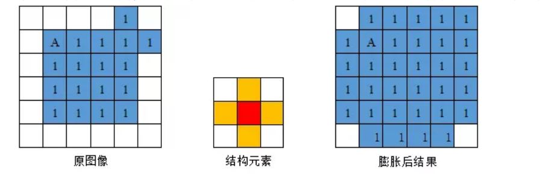
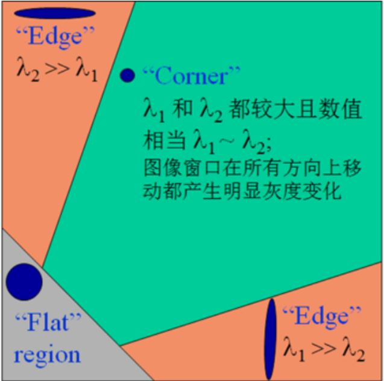
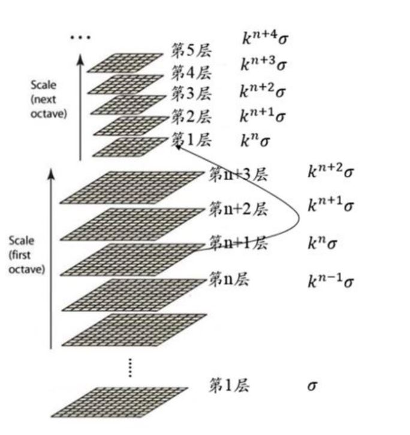

# 一、Anaconda配置OpenCV环境

（前情提要：由于未知原因本机window下python环境无法正常在Vscode终端下安装OpenCV环境^_^）

> Ubuntu下在miniconda中配置Open环境详见`Study_log/Linux_Note/Ubuntu miniconda3安装与环境配置.md`

##      1.下载OpenCV环境

   首先进入Anaconda Prompt找到自己安装anaconda/Scripts>目录下。

	

1. `pip install -i https://pypi.tuna.tsinghua.edu.cn/simple opencv-python==3.4.1.15`

2. `pip install -i https://pypi.tuna.tsinghua.edu.cn/simple opencv-contrib-python==3.4.1.15`

## 2.在当前Scripts目录下使用命令：pip list查看是否安装成功

## 3.查看opencv环境是否安装成功。

   在cmd命令中输入python

   再输入下面两个命令

   1. `import cv2`
      2. `cv2.__version_`


##  4.VSCODE内选择相应python解释器

  `fn+f1`选择python解释器

测试：

```python
import numpy as np
import cv2

img = cv2.imread('test.jpg', cv2.IMREAD_UNCHANGED)
cv2.namedWindow('img', cv2.WINDOW_AUTOSIZE)
cv2.imshow('img', img)
cv2.waitKey(0)
```

> 附：查看USB摄像头设备信息：`sudo v4l2-ctl --list-devices`

# 二、GUI操作

## 1. 图像的读取，显示和保存

### ==图像的读取==

使用`cv2.imread()`方法读入图像。

```python
"""
	读取图像函数
	第一个参数：图片路径
			图片路径应在程序工作路径或给出绝对路径
	第二个参数：读取方式
			cv2.IMREAD_COLOR 读入彩色图像 默认为1
            cv2.INREAD_GRAY_SCALE 读入灰度图像 默认为0
            cv2.IMREAD_UNCHANGED  读入图像和其ALPHA通道
            #为实现图形的透明效果，采取在图形文件的处理与存储中附加上另一个8位信息的方法
             这个附加的代表图形中各个素点透明度的通道信息就被叫做Alpha通道(通常不使用)
"""
cv2.imread()
```

```python
import numpy as np
import cv2

img = cv2.imread('test.jpg',0)

# 如果路径错误，opencv 不会有提示，但是 img 是 None
```

### ==图像的显示==

使用`cv2.imshow()`方法显示图像。

```python
"""
	显示图像函数
	第一个参数：窗口名称，不同的窗口应有不同的名称
	第二个参数：图像，窗口生成后自动调整为图像大小
"""
cv2.imshow()

"""
	窗口删除函数
"""
cv2.destroyAllWindows()

"""
	键盘绑定函数
	第一个参数：毫秒数
			函数等待特定的几毫秒检查是否有键盘输入，若按下键盘，则返回对应的ASCII值，程序继续运行；如果无输入则返回-1.
			若此值取0，则等待时间为无限期。
			
	#ESC键对应的ASCII值为27
"""
cv2.waitKey()
```

```python
key = cv2.waitKey(0)
if key==27:                                 # ESC键
    cv2.destroyAllWindows()
elif key == ord('s'):                       # waitKey 函数可以返回键值，通过返回的键值(ord()方法)进行下一步操作
    cv2.imwrite('test.jpg',img)             #输入s键，保存图片
    cv2.destroyAllWindows()
```

> 可以先创建窗口，再加载图像  (否则`imshow（）`会创建一个窗口，窗口大小依赖于图片大小)
>
> 此时可以决定窗口是否可以调整大小。使用`cv2.namedWindow()`函数，其默认值为`cv2.WINDOW_AUTOSIZE`，调整成`cv2.WINDOW_NORMOL`时可以在打开的窗口中手动调整窗口大小。

```python
img1 = cv2.imread('winter.jpg',1)
#cv2.imshow('image',img1)

# 创建一个可以手动调整大小的窗口
cv2.namedWindow('image1', cv2.WINDOW_NORMAL)

# 在窗口中显示图像
cv2.imshow('image1', img1)
```

### 图像的保存

使用`cv2.imwrite()`函数进行图像的保存

```python
"""
	图像保存函数
	第一个参数：图像保存的文件名
	第二个参数：图像
"""
cv2.imwrite()
```

## 2. 视频的获取和保存

### ==视频的获取==

视频是`VideoCapture`对象，其参数可以为摄像头设备的索引号，或者一个视频文件。

**笔记本电脑的内置摄像头对应的参数就是0**。可以改变此值选择别的摄像头。

```python
import cv2
import numpy as np

# 初始化 VideoCapture 对象，使用外置摄像头
cap = cv2.VideoCapture(1)

while(True):
    ret,frame = cap.read()    #可以给空参数（一般设置为25ms）
    gray = cv2.cvtColor(frame,cv2.COLOR_BGR2GRAY)
    cv2.imshow('frame',gray)
    if cv2.waitKey(1) & 0xFF == ord('q'):  #cv2.waitkey()参数为1而非零，否则x
        break
     #&0xFF 是为了确保只关心 ASCII 值的最后八位（在某些操作系统上，cv2.waitKey() 返回的值可能包含其他信息）
    
cap.release()    #释放摄像头对象
cv2.destroyAllWindows()
```

1. `cap.read()`函数返回一个元组，第一个返回值为布尔类型，用于判断是否收到视频数据。第二个值为传回的每一帧的图像。

2. 可以使用`cap.isOpened()`方法判断摄像头是否被成功初始化。若未被初始化，使用`cap.open()`函数。
3. 可以使用`cap.get(propID)`看到视频的一些信息。同时，可以使用`cap.set(propID,Value)`改变视频对应参数的值。

| 标志参数              | 值   | 含义                                   |
| --------------------- | ---- | -------------------------------------- |
| CAP_PROP_POS_MESC     | 0    | 视频文件的当前位置（单位为ms）         |
| CAP_PROP_FRAME_WIDTH  | 3    | 视频流中图像的宽度                     |
| CAP_PROP_FRAME_HEIGHT | 4    | 视频流中图像的高度                     |
| CAP_PROP_FPS          | 5    | 视频流中图像帧率（每秒帧数）           |
| CAP_PROP_FOURCC       | 6    | 解编码器的4字符编码                    |
| CAP_PROP_FRAME_COUNT  | 7    | 视频流中图像的帧数                     |
| CAP_PROP_FORMAT       | 8    | 返回的Mat对象的格式                    |
| CAP_PROP_BRIGHTNESS   | 10   | 图像的亮度（适用于相机）值越大图像越亮 |
| CAP_PROP_CONTRAST     | 11   | 图像的对比度                           |
| CAP_PROP_SATURATION   | 12   | 图像的饱和度                           |
| CAP_PROP_HUE          | 13   | 图像的色调                             |
| CAP_PROP_GAIN         | 14   | 图像的增益                             |

4. 退出程序时请使用`cap.release()`进行清理。

> 对于视频文件而言，需要将设备索引号改为文件名称。

### 视频的保存

为对每一帧图像处理后得到保存，需要创建`VideoWriter`对象

```python
"""
	VideoWriter对象创建：
	第一个参数：输出文件名
	第二个参数：编码格式
	第三个参数：播放频率
	第四个参数：帧的大小
"""
out = cv2.VideoWriter('out.avi',fourcc,20.0,(640,480))

"""
	fourcc编码对象创建：
	参数：编码格式（*'编码格式'）
"""
fourcc = cv2.VideoWriter_fourcc(*'XVID')
```

1. 编码格式

| 解编码器标志 | 含义         |
| ------------ | ------------ |
| DIVX         | MPEG-4编码   |
| PIM1         | MPEG-1编码   |
| MJPG         | JPEG编码     |
| MP42         | MPEG-4.2编码 |
| DIV3         | MPEG-4.3编码 |
| U263         | H263编码     |
| I263         | H263I编码    |
| FLV1         | FLV1编码     |

2. 使用`out.write()`函数即可将帧保存到文件中

## 3. 绘图函数

绘图统一参数：

> 1. `img`：绘图用的图像
> 2. `color`：绘图的颜色，RGB图为一个元组，灰度图给出灰度值。
> 3. `thickness`：绘图的粗细，默认为1，如果为-1则为闭合填充。
> 4. `linetype`：线条类型，默认为8连接，`cv2.LINE_AA`为抗锯齿，图像会比较平滑。

- 线条函数

```python
"""
	线条绘制函数
	第一个参数：图像
	第二个参数：左上角点
	第三个参数：右下角点
	第四个参数：绘制颜色（BGR）
	第五个参数：绘图粗细
"""
cv2.line()
```

- 矩形函数

```python
"""
	矩形绘制函数
	#将最后一个参数设置为-1矩形将被填充
"""
cv2.rectangle()
```

- 圆形函数

```python
"""
	圆形绘制函数
	第一个参数：图像
	第二个参数：中心点坐标
	第三个参数：半径
"""
cv2.circle()
```

- 椭圆函数

```python
"""
	椭圆绘制函数
	第一个参数：图像
	第二个参数：中心点坐标
	第三个参数：两个轴的长度
	第四个参数：椭圆沿逆时针旋转的角度
	第五个参数：椭圆弧的起始角度
	第六个参数：椭圆弧的结束角度
"""
cv2.ellipse()
```

- 多边形

对于多边形，需要指定每个顶点的坐标来构建一个数组，数据类型必须为`int32`

```python
pts = np.array([[点坐标1],[点坐标2]],np.int32)
pts = pts.reshape((-1,1,2))
"""
	多边形绘制函数
	第一个参数：图片
	第二个参数：点集（用[]框住）
	第三个参数：布尔值，表示是否闭合
"""
cv2.polylines()
```

- 写文字

```python
"""
	绘制文字函数
	第一个参数：图片
	第二个参数：文字
	第三个参数：绘制位置
	第四个参数：字体
	第五个参数：字体大小
"""
cv2.putText()
```

## 4. 鼠标事件的处理

鼠标事件可以是鼠标上发生的任何动作，可以通过各种鼠标事件执行不同的任务。

通过以下代码查询鼠标事件的种类：

``` python
import cv2
events = [i for i dir(cv2) if 'EVENT' in i]
print(events)

EVENT_MOUSEMOVE              //滑动
EVENT_LBUTTONDOWN            //左键点击
EVENT_RBUTTONDOWN            //右键点击
EVENT_MBUTTONDOWN            //中键点击
EVENT_LBUTTONUP              //左键放开
EVENT_RBUTTONUP              //右键放开
EVENT_MBUTTONUP              //中键放开
EVENT_LBUTTONDBLCLK          //左键双击
EVENT_RBUTTONDBLCLK          //右键双击
EVENT_MBUTTONDBLCLK          //中键双击

EVENT_FLAG_LBUTTON        //左鍵拖曳
EVENT_FLAG_RBUTTON        //右鍵拖曳
EVENT_FLAG_MBUTTON        //中鍵拖曳
EVENT_FLAG_CTRLKEY        //(8~15)按Ctrl不放事件
EVENT_FLAG_SHIFTKEY      //(16~31)按Shift不放事件
EVENT_FLAG_ALTKEY        //(32~39)按Alt不放事件
```

鼠标事件发生后会调用对应的回调函数，从而执行对应的操作。

> 1. 创建对应的窗口`cv2.nameWindows()`（先创建窗口，再设置回调函数）
> 2. 使用`cv2.setMouseCallback()`将窗口名和回调函数绑定；
> 3. 回调函数中，判断鼠标事件和鼠标状态以确定操作。
>
 ```python
无法动态显示摄像头画面可能原因：
cv2.waitKey(0) 会等待直到键盘按键被按下（不论是哪个键），然后返回按键的 ASCII 值，但这会导致程序停止在这一行，直到按下按键才能继续执行后面的代码。
要解决这个问题，可将 cv2.waitKey(0) 中的参数改为一个小于等于 0 的值，或者去掉 waitKey() 函数，这样就能持续地读取并显示摄像头画面了。
 ```

## 5. 滑动条

```python
"""
	滑动条创建函数：
	第一个参数：滑动条名字
	第二个参数：滑动条被放置窗口的名字
	第三个参数：滑动条默认位置
	第四个参数：滑动条的最大值
	第五个参数：回调函数(一般pass)
"""
cv2.createTrackbar()

"""
	滑动条键值获取函数：
	第一个参数：滑动条名字
	第二个参数：滑动条被放置窗口的名字
"""
cv2.getTrackbarPos()
```

# 三、图像基本操作

## ==1. 图像信息的获取==

### 图像像素的获取

使用索引的方式获取并修改像素值

```python
import cv2
import numpy as np

cap = cv2.VideoCapture(1)
cap.set(10,1)

while cap.isOpened() == True:
    ret,frame = cap.read()
    if ret == True:
        px = frame[100,100]
        cv2.imshow('img',frame)
        print(px)
        key = cv2.waitKey(1)
        if key == 27:
            break
    else:
        break
        
cv2.destroyAllWindows()
cap.release()
```

> 使用索引的方法并不推荐（性能低），可以使用numpy的`array.item()`和`array.itemset()`方法进行逐点修改，注意返回值为标量，需要进行分割。

### 图像属性的获取

1. `img.shape`属性

此方法可以依次返回行数，列数，通道数。

2. `img.dtype`属性

返回图像数据类型。

```python
import cv2
import numpy as np

cap = cv2.VideoCapture(1)
cap.set(10,1)

while cap.isOpened() == True:
    ret,frame = cap.read()
    if ret == True:
        # 行数，列数，通道数（元组）
        attr = frame.shape
        print(attr)
        # 图像数据类型
        dtype = frame.dtype
        print(dtype)
        cv2.imshow('img',frame)
        key = cv2.waitKey(1)
        if key == 27:
            break
    else:
        break

cv2.destroyAllWindows()
cap.release()
```

## 2. ROI

ROI，即图像的感兴趣区。用于对图像特定区域进行操作，提高操作效率。

使用索引方式获得ROI。

```python
import cv2
import numpy as np

cap = cv2.VideoCapture(1)
cap.set(10,1)

while cap.isOpened() == True:
    ret,frame = cap.read()
    if ret == True:
		# 索引方式获取ROI
        roi = frame[100:200,100:200]
        cv2.imshow('img',roi)
        key = cv2.waitKey(1)
        if key == 27:
            break
    else:
        break
    
cv2.destroyAllWindows()
cap.release()
```

## 3. 通道分离和合并

有时需要对R,G,B三个通道进行分离和合并操作以便于处理。

使用`img.merge()`方法对通道进行合并，输入参数为列表。

使用`img.split()`方法对通道进行拆分。

```python
import cv2
import numpy as np

cap = cv2.VideoCapture(1)
cap.set(10, 1)

while cap.isOpened() == True:
    ret, frame = cap.read()
    if ret == True:
        # 通道分离
        # b, g, r = cv2.split(frame)
        # print(b)
        # 通道合并
        # img = cv2.merge([b, g, r])
        # cv2.imshow('img',img)
        ## 通道合并和分离耗时比较大，能使用索引操作，就使用索引操作。
        frame[:,:,1] = 0
        cv2.imshow('img',frame)
        key = cv2.waitKey(1)
        if key == 27:
            break
    else:
        break

cv2.destroyAllWindows()    
cap.release()
```

## 4. 图像扩边

使用`cv2.copyMakeBorder()`对图像进行扩充边界。通常在卷积运算或0填充时被用到。

```python
"""
	图像填充函数
	第一个参数：输入图像
	第二个参数：填充类型
		1.cv2.BORDER_CONSTANT 添加有颜色的常数值边界
		2.cv2.BORDER_REFLECT 边界元素的镜像
		3.cv2.BORDER_DEFAULT
		4.cv2.BORDER_REPLICATE 重复最后一个元素
		5.cv2.BORDER_WRAP
	第三个参数：边界颜色（cv2.BORDER_CONSTANT）
"""
cv2.copyMakeBorder()
```

## 5. 图像的加运算

```python
"""
	图像加法运算
	注意：图像的大小和类型必须一致，也可以让图像和标量相加
"""
cv2.add()

"""
	图像混合运算
"""
cv2.addWeighted()
```

- 图像混合

图像混合可以体现透明效果：
$$
g(x) = (1-\alpha)f_0(x)+\alpha f_1(x)+\gamma
$$

# 四、图像处理

> **视频读取每一帧——颜色空间转换获得灰度图——模糊去噪点（低通滤波）——二值化——形态学转换去噪点（及分割等操作)**

## 1.颜色空间转换

OpenCV中使用`cv2.cvtColor()`函数转换颜色空间。

常用的颜色空间转换有**BGR->Gray，BGR->HSV**。

```python
"""
	颜色空间转换函数
	第一个参数：待转换图像
	第二个参数：转换方式，若为BGR->Gray，选择cv2.COLOR_BGR2Gray;若为BGR->HSV，选择cv2.COLOR_BGR2HSV
"""
cv2.cvtcolor()
```

### HSV 颜色空间

HSV是**色度（Hue）、饱和度（Saturation）和亮度（Value）的简写**，该模型通过这三个特性对颜色进行描述。

>色度是色彩的基本属性。
>
>饱和度是指颜色的纯度，饱和度越高色彩越纯越艳，饱和度越低色彩则逐渐地变灰变暗，饱和度的取值范围是由0到100%；
>
>亮度是颜色的明亮程度，其取值范围由0到计算机中允许的最大值。

在OpenCV中，H的范围从0到179，S的范围从0到255，V的范围从0到255。

HSV 对于颜色的追踪性质比较好。

### BGR 颜色空间

> B ---- 蓝色（第一通道）
> G ---- 绿色（第二通道）
> R ---- 红色（第三通道）

三个通道对于颜色描述的范围是相同的，因此BGR颜色模型的空间构成是一个立方体。

在BGR颜色模型中，所有的颜色都是由这三种颜色通过不同比例的混合得到，如果三种颜色分量都为0，则表示为黑色，如果三种颜色的分量相同且都为最大值，则表示为白色。

### 彩色图的阈值确定

使用`cv2.inRange()`函数可以限定图像素的有效值范围。常用于==建立掩膜==。

```python
"""
	用以确认元素值是否介于某个区域
	第一个参数：原图像
	第二个参数：指图像中低于lowerb的值，其所对应的图像值将为0；
	第三个参数：指图像中高于upperb的值，图像值变为0。
	源图像中仅有图像值介于lowerb和upperb之间的值才不为0，且值将变成255
"""
cv2.inRange(src, lowerb, upperb)
```

## 2. （几何变换）

### 缩放变换

OpenCV 中的`cv2.resize()`可以实现缩放变换。

> 对于缩小，常使用`cv2.INTER_AREA`作为插值方法。
>
> 对于放大，常使用`cv2.INTER_CUBIC`或`cv2.INTER_LINEAR`作为插值方法。

```python
"""
	图像缩放函数
	第一个参数：原图像
	第二个参数：缩放后的图像尺寸（元组），若设置缩放因子此项为None
	第三/四个参数：横向/纵向缩放因子，若设置缩放后尺寸则此项不填。
	第五个参数：interpolation 插值方式
"""
cv2.resize()
```

```python
import cv2
import numpy as np

cap = cv2.VideoCapture(1)
cap.set(10,2)


while cap.isOpened() == True:
    ret,frame = cap.read()
    if ret == True:
        # 图像使用两倍放大的放大因子
        # img = cv2.resize(frame,None,fx = 2,fy = 2,interpolation=cv2.INTER_LINEAR)
        # 图像指定尺寸缩放
        height,width = frame.shape[:2]
        img = cv2.resize(frame,(2*width,2*height),interpolation=cv2.INTER_LINEAR)
        cv2.imshow('img',img)
        key = cv2.waitKey(1)
        if key == 27:
            break
    else:
        break

cv2.destroyAllWindows()
cap.release()
```

### 旋转/平移变换

矩阵的旋转可由以下方式得到：
$$
\left[\begin{matrix}
x^, \\ 
y^, \\
1
\end{matrix}\right]=
\left[
	\begin{matrix}
		1 & 0 & x_0 \\
		0 & 1 & y_0 \\
		0 & 0 & 1   
	\end{matrix}
\right]
\left[
	\begin{matrix}
		cos\theta & -sin\theta & 0 \\
		sin\theta & cos\theta & 0 \\
		0 & 0 & 1   
	\end{matrix}
\right]
\left[
	\begin{matrix}
		1 & 0 & -x_0 \\
		0 & 1 & -y_0 \\
		0 & 0 & 1   
	\end{matrix}
\right]
\left[\begin{matrix}
x \\ 
y \\
1
\end{matrix}\right]
$$
通过此方程可以构造出3*3的旋转矩阵（任一点）：

> 首先平移旋转中心到原点；
>
> 随后进行旋转；
>
> 最后平移旋转中心至原位。

舍弃最后一行即可得到旋转矩阵。
$$
M = \left[\begin{matrix}\alpha & \beta & (1-\alpha)*center.x-\beta*center.y \\-\beta & \alpha & \beta*center.x+(1-\alpha)*center.y\end{matrix}\right]
$$

			式中，
$$
\alpha = scale*cos(angle)
$$

$$
\beta = scale*sin(angle)
$$

> 对于平移，使用以下的旋转矩阵
> $$
> M = \left[\begin{matrix}
> 	1 & 0 & \Delta x \\
> 	0 & 1 & \Delta y 
> \end{matrix}\right]
> $$

对于旋转矩阵，可以由`cv2.getRotationMatrix2D()`函数得到：

```python
"""
	旋转矩阵构造函数
	第一个参数：缩放中心
	第二个参数：旋转角度
	第三个参数：缩放因子
	返回值：M（2*3）
"""
cv2.getRotationMatrix2D(center, angle, scale)
```

使用求得的旋转矩阵，可以使用`cv2.warpAffrine()`方法进行图像旋转。

```python
"""
	图像旋转函数
	第一个参数：原图像
	第二个参数：旋转矩阵
	第三个参数：宽度和高度（元组）
	第四个参数：borderValue 填充颜色设置
"""
cv2.warpAffrine()
```

```python
import cv2
import math
import numpy as np

cap = cv2.VideoCapture(1)
cap.set(10, 2)
alpha = 45

while cap.isOpened() == True:
    ret, frame = cap.read()
    if ret == True:
        height, width = frame.shape[:2]
        x_0, y_0 = width/2, height/2
        # 旋转后窗口大小计算
        new_height = (height*math.cos(alpha/180 * math.pi)) + \
            (width*math.sin(alpha/180 * math.pi))
        new_width = (width*math.cos(alpha/180 * math.pi)) + \
            (height*math.sin(alpha/180 * math.pi))
        # 平移
        N = np.zeros((2, 3), np.float32)
        N[0, 0] = 1
        N[1, 1] = 1
        N[0, 2] = new_width/2 - x_0
        N[1, 2] = new_height/2 - y_0
        img = cv2.warpAffine(frame, N, (int(new_width), int(new_height)))
        # 构建旋转矩阵并进行旋转
        M = cv2.getRotationMatrix2D(
            (int(new_width)/2, int(new_height)/2), alpha, 1.0)
        res = cv2.warpAffine(img, M, (int(new_width), int(new_height)))

        cv2.imshow('res', res)
        key = cv2.waitKey(1)
        if key == 27:
            break
    else:
        break

cv2.destroyAllWindows()
cap.release()
```

### 仿射变换

**图像中的平行关系、面积比、共线线段或平行线段的长度比、矢量的线性组合不变**。
$$
\left[\begin{matrix}x^, \\ y^, \\1\end{matrix}\right]=
M_A
\left[\begin{matrix}x \\ y \\1\end{matrix}\right]
$$
$M_A$为仿射变换矩阵。有六个未知参数，可以由图像中三点坐标和对应的变换后三点坐标得到。

```python
"""
	仿射变换矩阵函数
	第一个参数：原图中的三个点（矩阵）
	第二个参数：变换后的对应三点
	返回值：仿射变换矩阵（2*3）
"""
cv2.getAffineTransform(pts1, pts2)
```

```python
import cv2
import numpy as np

img = cv2.imread('img.jpg',cv2.IMREAD_COLOR)
height,width = img.shape[:2]

pts1 = np.array([[50,50],[100,20],[20,100]],np.float32)
pts2 = np.array([[10,10],[90,5],[5,90]],np.float32)

M = cv2.getAffineTransform(pts1,pts2)
res = cv2.warpAffine(img,M,(width,height))

while True:
    cv2.imshow('res',res)
    key = cv2.waitKey(1)
    if key == 27:
        break

cv2.destroyAllWindows()
```

### 透视/投影变换

投影变换（Projective mapping）也称透视变换（Perspective transformation）是建立两平面场之间的对应关系， 将**图片投影到一个新的视平面（Viewing plane）**。

```python
"""
	透视变换矩阵函数
	第一个参数：四边形顶点坐标（原图）
	第二个参数：四边形顶点坐标（变换）
	第三个参数：矩阵分解方法
		cv2.DECOMP_LU：选择最优轴的高斯消去法，默认方法
		cv2.DECOMP_SVD：奇异值分解（SVD）方法
		cv2.DECOMP_EIG：特征值分解方法，src 必须对称
		cv2.DECOMP_QR：QR（正交三角）分解
		cv2.DECOMP_CHOLESKY：Cholesky LLT 分解
	返回值：透视变换矩阵（3*3）
"""
cv2.getPerspectiveTransform(src, dst[,solveMethod])
```

```python
"""
	透视变换函数
	第一个参数：图像
	第二个参数：透视变换矩阵
	第三个参数：输出图像大小
	第四个参数：flags 插值方法
		cv2.INTER_LINEAR：线性插值，默认选项
		cv2.INTER_NEAREST：最近邻插值
		cv2.INTER_AREA：区域插值
		cv2.INTER_CUBIC：三次样条插值
		cv2.INTER_LANCZOS4：Lanczos 插值
"""
cv2.warpPerspective()
```

## 3. 图像二值化(Thresh)

### 简单阈值

$$
Binary(x,y)=\begin{cases}
maxval &  src(x,y)>thresh\\
0 & otherwise
\end{cases}\\
Binary\__{INV}(x,y)=\begin{cases}
0 & src(x,y)>thresh\\
maxval & otherwise
\end{cases}
$$


像素值高于设定阈值时设置为白色（黑色），低于阈值时设置为黑色（白色）。

```python
"""
	二值化函数
	第一个参数：原图像
	第二个参数：阈值
	第三个参数：二值化最大值
	第四个参数：二值化方法（简单阈值方法为cv2.THRESH_BINARY_INV,cv2.THRESH_BINARY）
	返回值：元组，第二个元素为处理后图像
"""
cv2.threshold()
```

### 自适应阈值

自适应阈值算法的核心是将图像分割为不同的区域，每个区域都计算阈值。在背景明暗有差别时可以有效使用。

```python
"""
	自适应二值化函数
	第一个参数：原图像
	第二个参数：二值化最大值
	第三个参数：自适应方法
		ADAPTIVE_THRESH_MEAN_C，为局部邻域块的平均值，该算法是先求出块中的均值。			ADAPTIVE_THRESH_GAUSSIAN_C，为局部邻域块的高斯加权和。该算法是在区域中(x, y)周围的像素根据高斯函数按照他们离中心点的距离进行加权计算。
	第四个参数：简单阈值二值化
	第五个参数：要分成的区域大小，一般取奇数。大图像127左右，小图像25左右
	第六个参数：C，每个区域计算出的阈值的基础上在减去这个常数作为这个区域的最终阈值，取值一般取10/15/25
	返回值：元素为处理后图像
"""
cv2.adaptiveThreshold(src, maxValue, adaptiveMethod, thresholdType, blockSize, C, dst=None)
```

> 自适应阈值过于灵敏，识别性质不好

### 基于直方图的阈值

- ==OTSU（大津法）==

OTSU算法对**直方图有两个峰**，中间有明显波谷的直方图对应图像二值化效果比较好，而对于只有一个单峰的直方图对应的图像分割效果没有双峰的好。

OTSU是通过计算类间最大方差来确定分割阈值的阈值选择算法，它的原理是不断地求前景和背景的类间方差。

OTSU定义为`cv2.THRESH_OTSU` 。

此时，`cv2.threshold()`函数返回的元组第一个值为求得的全局阈值，==第二个值==为处理后图像。

- TRIANGLE（三角形法）

直方图有一个波峰时使用三角形法效果较好。

TRIANGLE定义为`cv2.TRIANGLE`。

**大津法和三角形法一般配合简单阈值使用。**

```python
cap = cv2.VideoCapture(1)
cap.set(10, 2)

while cap.isOpened() == True:
    ret, frame = cap.read()
    if ret == True:
        img = cv2.cvtColor(frame, cv2.COLOR_BGR2GRAY)
        # 大津法二值化
        ## retval, res = cv2.threshold(
        ##     img, 0, 255, cv2.THRESH_BINARY+cv2.THRESH_OTSU) #大津法配合简单阈值
        
        # 三角形法二值化
        retval, res = cv2.threshold(
            img, 0, 255, cv2.THRESH_BINARY+cv2.THRESH_TRIANGLE) #三角形法配合简单阈值
        cv2.imshow('res', res)
        key = cv2.waitKey(1)
        if key == 27:
            break
    else:
        break

cv2.destroyAllWindows()
cap.release()
```

## 4. 图像滤波(Filter)

### 图像的2D卷积

和一维信号类似，可以对2D图片进行卷积。

**低通滤波（LPF）**：去除图像的噪声，使图像模糊。

**高通滤波（HPF）**：提取边缘。

### （自定义滤波）

使用`CV2.filter2D()`函数可以自定义滤波器。卷积运算时，将对卷积核内的每个像素做加权平均，将结果赋值给中心像素。

```python
"""
	自定义滤波函数
	第一个参数：滤波图像
	第二个参数：结果通道数（深度），使用-1使得结果和原图通道一致
	第三个参数：卷积核
"""
CV2.filter2D()
```

```python
import cv2
import numpy as np

cap = cv2.VideoCapture(1)
cap.set(10, 2)

# 卷积核创建
kernel = np.ones((5, 5), np.float32)/25

while cap.isOpened() == True:
    ret, frame = cap.read()
    if ret == True:
        res = cv2.cvtColor(frame, cv2.COLOR_BGR2GRAY)
        # 一般而言，先进行降噪操作，然后再二值化
        res = cv2.filter2D(res, -1, kernel)
        res = cv2.adaptiveThreshold(
            res, 255, cv2.ADAPTIVE_THRESH_GAUSSIAN_C, cv2.THRESH_BINARY, 25, 10)

        cv2.imshow('res', res)
        key = cv2.waitKey(1)
        if key == 27:
            break
    else:
        break

cv2.destroyAllWindows()
cap.release()
```

### （均值滤波）

均值滤波由归一化卷积框完成。

均值滤波将滤波器内所有的像素值都看作中心像素值的测量，将滤波器内所有的像数值的平均值作为滤波器中心处图像像素值。

**优点**：在像素值变换趋势一致的情况下，可以将受噪声影响而突然变化的像素值修正到接近周围像素值变化的一致性下。

**缺点**：缩小像素值之间的差距，使得细节信息变得更加模糊，滤波器范围越大，变模糊的效果越明显。

```python
"""
	均值滤波函数
	第一个参数：原图片
	第二个参数：卷积核大小，元组
"""
cv2.blur()
"""
	方框滤波函数：舍去归一化流程，直接进行像素求和
	第一个参数：原图片
	第二个参数：卷积核大小，元组
	第三个参数: normalize 取 False
"""
cv2.boxFilter()
```

```python
import cv2
import numpy as np

cap = cv2.VideoCapture(1)
cap.set(10, 2)

while cap.isOpened() == True:
    ret, frame = cap.read()
    if ret == True:
        frame = cv2.cvtColor(frame, cv2.COLOR_BGR2GRAY)
        # 均值滤波
        frame = cv2.blur(frame, (5, 5))
        # 方框滤波
        # frame = cv2.boxFilter(frame,-1,(5,5),normalize=False)
        res,frame = cv2.threshold(frame, 0, 255, cv2.THRESH_BINARY+cv2.THRESH_OTSU)
        cv2.imshow('res',frame)
        key = cv2.waitKey(1)
        if key == 27:
            break
    else:
        break

cv2.destroyAllWindows()
cap.release()
```

### ==高斯滤波==

高斯噪声是一种常见的噪声，图像采集的众多过程中都容易引入高斯噪声，因此针对**高斯噪声**的高斯滤波也广泛应用于图像去噪领域。

高斯滤波器考虑了像素离滤波器中心距离的影响，以滤波器中心位置为高斯分布的均值，根据高斯分布公式和每个像素离中心位置的距离计算出滤波器内每个位置的数值，从而形成一个高斯滤波器。

```python
"""
	高斯滤波函数
	第一个参数：原图像
	第二个参数：卷积核大小，元组，常设置为（3，3）、（5，5）
	第三个参数：高斯函数标准差，一般取0
"""
cv2.GaussianBlur()
```

### ==中值滤波==

中值滤波将滤波器范围内所有的像素值按照由小到大的顺序排列，选取排序序列的中值作为滤波器中心处像素的新像素值，之后将滤波器移动到下一个位置，重复进行排序取中值的操作，直到将图像所有的像素点都被滤波器中心对应一遍。

中值滤波不依赖于滤波器内那些与典型值差别很大的值，因此对**斑点噪声**和**椒盐噪声**的处理具有较好的处理效果。

```python
"""
	中值滤波函数
	第一个参数：原图像
	第二个参数：卷积核大小
"""
cv2.medianBlur()
```

> **实际应用中，可先进行高斯滤波，再进行中值滤波**

### 双边滤波

双边滤波是一种综合考虑滤波器内图像空域信息和滤波器内图像像素灰度值相似性的滤波算法，可以实现在保留区域信息的基础上实现对噪声的去除、对局部边缘的平滑。双边滤波对高频率的波动信号起到平滑的作用，同时保留大幅值的信号波动，进而实现对**保留图像中边缘信息的作用**。

空间高斯函数保证邻近区域的像素对中心点有影响。

灰度值相似性高斯函数保证只有与中心灰度值相似的像素能够进行运算。

```python
"""
	双边滤波函数
	第一个参数：原图像
	第二个参数：滤波器大小 当滤波器的直径大于5时，函数的运行速度会变慢，因此如果需要在实时系统中使用该函数，建议将滤波器的半径设置为5，对于离线处理含有大量噪声的滤波图像时，可以将滤波器的半径设为9，当滤波器半径为非正数的时候，会根据空间滤波器的标准差计算滤波器的直径。
	第三/四个参数：空间/灰度值高斯函数标准差 一般将两个参数设置成相同的数值，当小于10时，滤波器对图像的滤波作用较弱，当大于150时滤波效果会非常的强烈。
"""
cv2.bilateralFilter()
```

## 5. 形态学转换(Morphology)

形态学转换是根据图像形状进行的简单操作，一般对二值化的图像进行操作。

> 现有的图像处理流程：转换颜色空间 -> 滤波 -> 二值化 -> 形态学转换。

基本的形态学操作：**图像腐蚀**和**图像膨胀**。

### 图像的腐蚀

图像的腐蚀过程与图像的卷积操作类似，都需要模板矩阵来控制运算的结果，在图像的腐蚀和膨胀中这个模板矩阵被称为**结构元素**。


定义结构元素之后，将结构元素的中心点依次放到图像中每一个非0元素处，**如果此时结构元素内所有的元素所覆盖的图像像素值均不为0，则保留结构元素中心点对应的图像像素**，否则将删除结构元素中心点对应的像素。

腐蚀操作后，前景图像会减少，白色区域会变小。一般情况下，结构元素的种类相同时，结构元素的尺寸越大腐蚀效果越明显。

**腐蚀常用于去除白噪声，也可断开两个物体间的连接。**

> 滤波——二值化——还有噪点即可考虑进行腐蚀

```python
"""
	图像腐蚀函数
	第一个参数：原图像
	第二个参数：卷积核（结构元素）
	第三个参数：iterations 腐蚀操作迭代的次数
"""
cv2.erode()
```


```python
import cv2
import numpy as np

img = cv2.imread('1.jpg',cv2.IMREAD_COLOR)

# 结构元素定义
kernel = np.ones((9,9),np.uint8)

while True:
    res = cv2.erode(img,kernel,iterations=5)
    cv2.imshow('res',res)
    cv2.imshow('img',img)
    key = cv2.waitKey(1)
    if key == 27:
        break
    
cv2.destroyAllWindows()
```

### 图像的膨胀

定义结构元素之后，将结构元素的中心点依次放到图像中每一个非0元素处，**如果原图像中某个元素被结构元素覆盖，但是该像素的像素值不与结构元素中心点对应的像素点的像素值相同，那么将原图像中的该像素的像素值修改为结构元素中心点对应点的像素值。**



```python
"""
	图像膨胀函数
	第一个参数：原图像
	第二个参数：卷积核（结构元素）
	第三个参数：iterations 膨胀操作迭代的次数
"""
cv2.dilate()
```


### ==开运算==

先腐蚀再膨胀即为开运算。

**开运算用于去除图像的白噪声。**

```python
"""
	开运算函数
	第一个参数：图像
	第二个参数：形态学操作参数 cv2.MORPH_OPEN
	第三个参数：结构元素
"""
cv2.morphologyEx()
```


### ==闭运算==

先膨胀再腐蚀即为闭运算。

**闭运算用于填充前景物体上的小洞或黑点。**

```python
"""
	闭运算函数
	第一个参数：图像
	第二个参数：形态学操作参数 cv2.MORPH_CLOSE
	第三个参数：结构元素
"""
cv2.morphologyEx()
```


### 形态学梯度

膨胀图像减去腐蚀图像，类似于图像的轮廓。

```python
"""
	形态学梯度函数
	第一个参数：图像
	第二个参数：形态学操作参数 cv2.MORPH_GRADIENT
	第三个参数：结构元素
"""
cv2.morphologyEx()
```


### 礼帽

原始图像和开运算的差。

```python
"""
	礼帽函数
	第一个参数：图像
	第二个参数：形态学操作参数 cv2.MORPH_TOPHAT
	第三个参数：结构元素
"""
cv2.morphologyEx()
```


### 黑帽

原始图像和闭运算的差。

```python
"""
	黑帽函数
	第一个参数：图像
	第二个参数：形态学操作参数 cv2.MORPH_BLACKHAT
	第三个参数：结构元素
"""
cv2.morphologyEx()
```


### 关于结构元素

使用`cv2.getStructuringElement()`创建结构化元素。

```python
"""
	结构化元素创建函数
	第一个参数：结构元素形态 cv2.MORPH_RECT(矩形)  cv2.MORPH_ELLIPSE(椭圆)  cv2.MORPH_CROSS(十字)
	第二个参数：结构元素大小
"""
cv2.getStructuringElement()
```

## 6. 图像梯度

图像的梯度就是对两个像素求导数，是边缘检测的前提。

Sobel 算子和 Scharr 算子为求一阶或二阶导数，Scharr 算子为对 Sobel 算子的优化。Laplacian 算子为求二阶导数。 

### Sobel 算子和 ==Scharr 算子==

Sobel 算子为高斯平滑和微分操作的结合，抗噪声能力强。可以设定求导的方向（xorder 和    yorder）和卷积核大小（ksize）。

`ksize = -1` 时使用 Scharr 算子作为滤波器，效果更好。

Scharr 算子卷积核如下：
$$
\Delta src = \left[\begin{matrix}
-3 & 0 & 3 \\
-10 & 0 & 10 \\
-3 & 0 & 3
\end{matrix}\right]
$$

### Laplacian 算子

Laplacian 算子使用二阶导数定义：
$$
\Delta src = \left[\begin{matrix}0 & 1 & 0 \\1 & -4 & 1 \\0 & 1 & 0\end{matrix}\right]
$$

```python
"""
	图像梯度Sobel算子函数：
	第一个参数：原图像
	第二个参数：图像通道数，默认为-1
	第三，四个参数：求导方向
	第五个参数：ksize 卷积核大小
"""
cv2.Sobel()

"""
	图像梯度Laplacian算子函数：
	第一个参数：原图像
	第二个参数：图像通道数，默认为-1.
"""
cv2.Laplacian()
```

> **scharr算子常用于边沿检测**，laplacian算子得到图像边缘较浅。

## 7. Canny 边缘检测

Canny 边缘检测是一种流行的边缘检测算法。

**第一步：噪声去除**

使用5×5的高斯滤波器进行滤波。

**第二步：计算图像梯度**

使用 Sobel 算子计算水平和竖直方向的一阶导数，根据图像的梯度图找到边界的梯度和方向，图像的梯度方向总与边界垂直。

**第三步：非极大值抑制**

获得梯度的方向和大小之后，对整幅图像进行扫描，去除非边界点，对每一个像素进行检查，检查此点梯度值是否为同向最大值。

**第四步：滞后阈值**

设置小阈值`minVal`和大阈值`maxVal`。

1. 高于`maxVal`的点为真边界点；
2. 低于`minVal`的点被舍弃；
3. 若在`maxVal`和`minVal`之间，如果这个点和确定的边界点相连，会被认为为真边界点。

```python
"""
	Canny 边缘检测算法：
	第一个参数：输入图像
	第二个参数：滞后阈值最小值
	第三个参数：滞后阈值最大值
	第四个参数：卷积核大小，默认为3
	第五个参数：L2gradient 选择梯度方程，一般为False
"""
cv2.Canny()
```

```python
import cv2
import numpy as np

cap = cv2.VideoCapture(1)
cap.set(10,2)
cv2.namedWindow('image')

def trackbar_callback():
    pass

cv2.createTrackbar('minVal','image',0,255,trackbar_callback)
cv2.createTrackbar('maxVal','image',0,255,trackbar_callback)

while cap.isOpened():
    ret,frame = cap.read()
    if ret == True:
        frame = cv2.cvtColor(frame,cv2.COLOR_BGR2GRAY)
        minVal = cv2.getTrackbarPos('minVal','image')
        maxVal = cv2.getTrackbarPos('maxVal','image')
        res = cv2.Canny(frame,float(minVal),float(maxVal))
        cv2.imshow('image',res)
        key = cv2.waitKey(1)
        if key == 27:
            break
    else:
        break

cv2.destroyAllWindows()
cap.release()
```

## 8. 图像金字塔（Pyramid）

当处理同一目标的不同分辨率的图像时，需要制作一组图像，构成同一图像的不同分辨率的子图集合，这个集合即为图像金字塔。

通常将大尺寸高分辨率图像放在金字塔底端，而小尺寸低分辨率图像放在金字塔顶端。

### 高斯金字塔


**下采样**

当下采样向上生成金字塔图像时，是直接删除偶数行偶数列的操作，但这种操作意味着直接丢弃图像中的信息。

为了减轻图像信息的丢失，在下采样操作之前先用滤波器对原始图像滤波操作一遍，这样滤波后的图像就是原始图像的近似图像，此时再删偶数行偶数列，就没有直接的信息损失了。

对原始图像进行滤波操作有很多方法，比如用**邻域滤波器**进行操作，这样生成的图像就是**平均金字塔**。如果用**高斯滤波器**处理，生成的是**高斯金字塔**。

```python
"""
	下采样函数：尺寸变小，分辨率降低
"""
cv2.pyrDown()
```

**上采样**

当上采样向下生成图像金字塔时，直接右插入列下插入行操作，这种操作会生成大量的0值像素点，这些0值像素点毫无意义，就需要对0值像素点进行赋值。

赋值就是**插值处理**。插值处理也有很多方法，比如用**区域均值补充**，那生成的就是**平均金字塔**，如果用**高斯核填充**就是**高斯金字塔**。

```python
"""
	上采样函数：尺寸变大，分辨率不会升高
"""
cv2.pyrDown()
```

### 拉普拉斯金字塔

$$
L_i = G_i - PyrUp(G_{i+1})
$$

拉普拉斯金字塔看起来像边界图像。

拉普拉斯金字塔的作用就在于能够恢复图像的细节，提取特征后还能通过拉普拉斯金字塔数据找回高层像素点对应的底层清晰度更高的图像，就是返回来找到更多图像的细节。

拉普拉斯金字塔更多的用于图像压缩。

# 五、轮廓提取（Counter）

## 1. 轮廓的基本概念

轮廓是将边界点连在一起的曲线，具有相同颜色和灰度。

在寻找轮廓之前需要进行 二值化 或者 Canny 边缘检测以提高准确度。

**查找轮廓的代码会修改原始图像，应保存原始图像**。

```python
"""
   	查找轮廓图像：
   	第一个参数：输入图像，应为canny边缘检测后输出的二值化图像；
   	第二个参数：轮廓检索模式  #cv2.RETR_TREE 表示检索所有轮廓，并重建它们的完整层次结构。
   	第三个参数：轮廓近似方法，一般使用cv2.CHAIN_APPROX_SIMPLE
   	#cv2.CHAIN_APPROX_NONE会保存所有轮廓点，内存消耗过大
   	返回值：第一个：轮廓（使用列表存储，每个轮廓为一个元组）；第二个：层析结构 		   
"""
cv2.findContours()
```

```python
"""
	绘制轮廓函数
	第一个参数：原始图像
	第二个参数：轮廓，为一个列表
	第三个参数：轮廓的索引（-1绘制所有轮廓）
"""
cv2.drawCounters()
```

- 在轮廓近似方法中，使用`cv2.CHAIN_APPROX_SIMPLE`可以去除轮廓上的冗余点，压缩轮廓（比如在直线中保留两个端点），从而节省内存开支。

```python
import cv2
import numpy as np

cap = cv2.VideoCapture(1)
cap.set(10, -1)
kernel = cv2.getStructuringElement(cv2.MORPH_CROSS,(5,5))

while cap.isOpened() == True:
    ret, frame = cap.read()
    if ret == True:
        gray = cv2.cvtColor(frame, cv2.COLOR_BGR2GRAY)
        res, binary = cv2.threshold(gray, 127, 255, cv2.THRESH_BINARY)
        img = cv2.morphologyEx(binary, cv2.MORPH_ERODE,kernel)
        contours, hierarchy = cv2.findContours(
            img, cv2.RETR_TREE, cv2.CHAIN_APPROX_SIMPLE)
        cv2.drawContours(frame, contours, -1, (0, 255, 255), 3)
        cv2.imshow('img', frame)
        key = cv2.waitKey(1)
        if key == 27:
            break
    else:
        break

cv2.destroyAllWindows()
cap.release()
```

## 2. 轮廓的特征

### 2.1 矩（moments）

矩是描述图像特征的算子，被广泛用于图像检索和识别、图像匹配、图像重建、图像压缩以及运动图像序列分析等领域。

#### 普通矩

$$
m_{ji} = \Sigma_{x,y}I(x,y)x^jy^i
$$

其中$I(x,y)$是像素$(x,y)$处的像素值。

当i和j同时取值0时称为零阶矩，零阶矩可以用于计算某个形状的质量

当$i + j = 1$时被称为一阶矩，一阶矩可求出图像的质心。

当$i + j = 2$时被称为二阶矩，二阶矩可求出图像的旋转半径。

当$i+j = 3$时被称为三阶矩，三阶矩可求出目标的方位和斜度以及扭曲程度。

#### 中心矩

具有位移不变性，利用这些矩，可将出现在图像中任意位置的物体与参考图像中可能出现在另外位置的参考物体进行比较；
$$
mu_{ji} = \Sigma_{x,y}I(x,y)(x-\overline x)^j(y - \overline y)^i
$$
其中：
$$
\overline x = \frac{m_{10}}{m_{00}} \\
\overline y = \frac{m_{01}}{m_{00}}
$$
为图像中心。

```python
"""
	图像矩求取函数
	参数：边界
	返回值：图像矩，使用['mij']索引进行特定图像矩的获取
"""
cv2.moments()
```

```python
import cv2
import numpy as np

img = cv2.imread('picture_3.jpg')
gray = cv2.cvtColor(img, cv2.COLOR_BGR2GRAY)
ret, binary = cv2.threshold(gray, 127, 255, cv2.THRESH_BINARY)

# 寻找轮廓
counter, hierarchy = cv2.findContours(
    binary, cv2.RETR_TREE, cv2.CHAIN_APPROX_SIMPLE)
# 求取质心
cnt = counter[0]
M = cv2.moments(cnt)
cx = int(M['m10']/M['m00'])
cy = int(M['m01']/M['m00'])

while True:
    cv2.circle(img, (cx, cy), 5, (0, 255, 0), -1)
    cv2.imshow('res', img)
    key = cv2.waitKey(1)
    if key == 27:
        break

cv2.destroyAllWindows()

```

#### Hu 矩

**Hu矩具有旋转、平移和缩放不变性**，因此在图像具有旋转和放缩的情况下Hu矩具有更广泛的应用领域。Hu矩是由二阶和三阶中心距计算得到七个不变矩.


由Hu矩形组成的特征量对图片进行识别，速度快但识别率较低，因此常用来进行简单的**模板匹配**。

```python
"""
	轮廓相似度比较函数
	第一个参数：原图像
	第二个参数：进行匹配的图像
	第三个参数：比较方式
	返回值：相似度，0为完全相似
"""
cv2.matchShape()
```

> Hu矩的形状匹配效果优于模板匹配

```python
import cv2
import numpy as np

img = cv2.imread('picture_2.jpg')
shape = cv2.imread('picture_1.jpg')

img1 = cv2.cvtColor(img, cv2.COLOR_BGR2GRAY)
ret, img1 = cv2.threshold(img1, 127, 255, cv2.THRESH_BINARY)
shape = cv2.cvtColor(shape, cv2.COLOR_BGR2GRAY)
ret, shape = cv2.threshold(shape, 127, 255, cv2.THRESH_BINARY)

counter_img, hierarchy_img = cv2.findContours(
    img1, cv2.RETR_TREE, cv2.CHAIN_APPROX_SIMPLE)
counter_shape, hierarchy_shape = cv2.findContours(
    shape, cv2.RETR_TREE, cv2.CHAIN_APPROX_NONE)

n = len(counter_img)
k = []
# 逐个进行模板匹配
for i in range(n):
    temp = cv2.matchShapes(counter_img[i], counter_shape[0], 1, 0.0)
    print(temp)
    if temp < 2:
        k.append(counter_img[i])
    
cv2.drawContours(img, k, -1, (0, 255, 0), 2)


while True:
    cv2.imshow('shape', shape)
    cv2.imshow('res', img)
    key = cv2.waitKey(1)
    if key == 27:
        break

cv2.destroyAllWindows()
```

### 2.2 周长（Length）和面积（Area）

1. 图像面积可以由0阶矩直接求出，也可由`cv2.counterArea()`直接求出。

   **可用于去除噪点（面积过小则为噪点）**

```python
"""
	图像面积获取函数
	参数：轮廓
"""  
cv2.counterArea()
```

```python
import cv2
import numpy as np

img = cv2.imread('picture_1.jpg')
gray = cv2.cvtColor(img, cv2.COLOR_BGR2GRAY)
ret, binary = cv2.threshold(gray, 127, 255, cv2.THRESH_BINARY)

counter, hierarchy = cv2.findContours(
    binary, cv2.RETR_TREE, cv2.CHAIN_APPROX_SIMPLE)

# 图像矩方法求面积
## M = cv2.moments(counter[0])
## print(M['m00'])

# 函数方法求面积
S = cv2.contourArea(counter[0])
print(S)
```

2. 使用`cv2.arcLength()`可以求得轮廓周长

```python
"""
	轮廓周长获取函数
	第一个参数：轮廓
	第二个参数：闭合参数，True为轮廓闭合
"""
cv2.arcLength()
```

```python
import cv2
import numpy as np

img = cv2.imread('picture_1.jpg')
gray = cv2.cvtColor(img, cv2.COLOR_BGR2GRAY)
ret, binary = cv2.threshold(gray, 127, 255, cv2.THRESH_BINARY)

counter, hierarchy = cv2.findContours(
    binary, cv2.RETR_TREE, cv2.CHAIN_APPROX_SIMPLE)

C = cv2.arcLength(counter[0], True)
print(C)
```

### 2.3 多边形拟合

> Douglas-Peucker算法：
>
> 1. 在曲线的起点 A 和终点 B 之间做一条直线 AB，是曲线的弦；
> 2. 寻找曲线上离该直线段距离最大的点 C，计算其与 AB 的距离 d；
> 3. 比较距离 d 与设定的阈值 threshold，如果小于设定阈值则该直线段作为曲线的近似，该段曲线处理完毕。
> 4. 如果距离 d 大于设定阈值，则以 C 点将曲线 AB 分为两段 AC 和 BC，并分别对这两段进行以上步骤的处理。
> 5. 当所有曲线都处理完毕时，依次连接所有分割点形成的折线，作为曲线的近似。

使用`cv2.approxPolyDP()`函数可以用一个指定精度的多边形拟合边界。

```python
"""
	边界多边形拟合函数
	第一个参数：轮廓
	第二个参数：精度，原始图线和近似图线间的最大距离
	第三个参数：闭合标志
"""
cv.approxPolyDP()
```

```python
import cv2
import numpy as np

img = cv2.imread('picture_4.jpg')
gray = cv2.cvtColor(img, cv2.COLOR_BGR2GRAY)
gray = cv2.boxFilter(gray, -1, (5, 5))

ret, binary = cv2.threshold(
    gray, 205, 255, cv2.THRESH_BINARY + cv2.THRESH_OTSU)

counter, hierarchy = cv2.findContours(
    binary, cv2.RETR_TREE, cv2.CHAIN_APPROX_SIMPLE)
# 多边形拟合
epsilon = 0.001 * cv2.arcLength(counter[0], True) #精度为0.001倍的轮廓周长
n = len(counter)
approx_counter = []

for i in range(n):
    approx = cv2.approxPolyDP(counter[i], epsilon, True)
    approx_counter.append(approx)

cv2.drawContours(img, approx_counter, -1, (0, 255, 0), 2)

while True:
    cv2.imshow('res', img)
    key = cv2.waitKey(1)
    if key == 27:
        break

cv2.destroyAllWindows()
```

### 2.4 （凸包（hull））

给定二维平面上的点集，凸包就是将最外层的点连接起来构成的凸多边形，它能包含点集中所有的点。凸包的计算方法有：卷包裹算法（Gift Wrapping Algorithm），Graham扫描法（Graham Scan Algorithm），快速凸包算法（Quickhull Algorithm）等。

```python
"""
	凸包计算函数
	第一个参数：轮廓
	第二个参数：输出值
	第三个参数：方向标志，True为顺时针
	第四个参数：返回参数，True：返回凸包上点的坐标；False：返回凸包上对应的轮廓点
"""
cv2.convexHull()
```

```python
import cv2
import numpy as np

img = cv2.imread('picture_3.jpg')
gray = cv2.cvtColor(img, cv2.COLOR_BGR2GRAY)
ret, binary = cv2.threshold(gray, 127, 255, cv2.THRESH_BINARY)

counter, hierarchy = cv2.findContours(
    binary, cv2.RETR_TREE, cv2.CHAIN_APPROX_SIMPLE)

hull = cv2.convexHull(counter[0])
cv2.drawContours(img, hull, -1, (0, 255, 0), 2)

while True:
    cv2.imshow('res', img)
    key = cv2.waitKey(1)
    if key == 27:
        break

cv2.destroyAllWindows()
```

另外的，可以使用凸性检测函数`cv2.isCounterConvex()`检查曲线的凸性。

### 2.5 边界矩形

边界矩形分为直边界矩形和旋转边界矩形（直边界矩形不会考虑旋转，和屏幕完全平行；旋转边界矩形的面积最小）。

```python
"""
	直边界矩形函数
	第一个参数：轮廓
	返回值：矩形的x,y,w,h
"""
cv2.boundingRect()

"""
	旋转边界矩形函数
	第一个参数：轮廓
	返回值：矩形的Box2D结构
"""
cv2.minArearect()

"""
	Box2D解算函数
	返回值：以y最大点开始的顺时针四点列表
"""
cv2.boxPoints()
```

```python
import cv2
import numpy as np

img = cv2.imread('picture_5.jpg')
gray = cv2.cvtColor(img, cv2.COLOR_BGR2GRAY)
ret, binary = cv2.threshold(gray, 127, 255, cv2.THRESH_BINARY)

counter, hierarchy = cv2.findContours(
    binary, cv2.RETR_TREE, cv2.CHAIN_APPROX_SIMPLE)

# 获取旋转边界矩形
rect_m = cv2.minAreaRect(counter[0])
point = cv2.boxPoints(rect_m)
point = np.int32(point)	# 转为int32或int64即可
cv2.drawContours(img, [point], 0, (255, 255, 255), 1)

rect = cv2.boundingRect(counter[0])


while True:
    cv2.rectangle(img, rect, (255, 0, 0), 1)
    cv2.imshow('res', img)
    key = cv2.waitKey(1)
    if key == 27:
        break

cv2.destroyAllWindows()
```

### **2.6 最小外接圆**

> **一般先使用霍夫圆变换进行严格圆识别，识别不到再采用最小外接圆函数对图像中所有轮廓进行识别**

```python
"""
	最小外接圆函数：
	第一个参数：轮廓
	返回值：(x,y),radius
"""
cv2.minEnclosingCircle()
```

```python
import cv2
import numpy as np

img = cv2.imread('picture_5.jpg')
gray = cv2.cvtColor(img, cv2.COLOR_BGR2GRAY)
ret, binary = cv2.threshold(gray, 127, 255, cv2.THRESH_BINARY)

counter, hierarchy = cv2.findContours(
    binary, cv2.RETR_TREE, cv2.CHAIN_APPROX_SIMPLE)

(x, y), radius = cv2.minEnclosingCircle(counter[0])


while True:
    # 必须化为整型
    cv2.circle(img, (int(x), int(y)), int(radius), (0, 255, 0), 1)
    cv2.imshow('res', img)
    key = cv2.waitKey(1)
    if key == 27:
        break

cv2.destroyAllWindows()
```

### 2.7 椭圆拟合

```python
"""
	椭圆拟合函数：
	第一个参数：轮廓
	返回值：椭圆
"""
cv2.fitEllipse()
```

```python
import cv2
import numpy as np

img = cv2.imread('picture_5.jpg')
gray = cv2.cvtColor(img, cv2.COLOR_BGR2GRAY)
ret, binary = cv2.threshold(gray, 127, 255, cv2.THRESH_BINARY)

counter, hierarchy = cv2.findContours(
    binary, cv2.RETR_TREE, cv2.CHAIN_APPROX_SIMPLE)

ellipse = cv2.fitEllipse(counter[0])


while True:
    cv2.ellipse(img, ellipse, (0, 255, 0), 1)
    cv2.imshow('res', img)
    key = cv2.waitKey(1)
    if key == 27:
        break

cv2.destroyAllWindows()
```

## 3. （轮廓的特征）

### 3.1 长宽比

$$
Aspect \quad Ration =\frac{Width}{Height} 
$$

```python
x,y,w,h = cv2.boundRect(cnt)
aspect_ratio = float(w)/float(h)
```

### 3.2 Extent

Extent 为轮廓面积和边界矩形的比值。
$$
Extent = \frac{Object \quad Area}{Bounding \quad Rectangle \quad Area}
$$

```python
area = cv2.contounerArea(cnt)
x,y,w,h = cv2.boundingRect(cnt)
rect_area = w*h
extent = (float)area/rect_area
```

### 3.3 Solidity

Solidity 为轮廓和凸包面积之比。
$$
Solidity = \frac{Counter \quad Area}{Convex \quad Hull \quad Area}
$$

```python
area = cv2.contounrArea(cnt)
hull = cv2.contexHull(cnt)
hull_area = cv2.contounrArea(cnt)
solidity = float(area)/float(hull_area)
```

### 3.4 Equivalent Diameter

与轮廓相等面积的圆的直径

### 3.5 方向

使用`cv2.fitellipse()`方法返回方向。

### 3.6 掩膜（Mask）

在`cv2.drawContouner()`方法中使用-1填充参数来使用掩膜。

- 使用掩膜求平均灰度

```python
mean_val = cv2.mean(img,mask)
```

- 使用掩膜求最大最小值

```python
min_val,max_val,min_loc,max_loc = minMaxLoc(img,mask)
```

### 3.7 极点

使用列表即可

## 4. 轮廓的层次结构

### 父轮廓和子轮廓

如果一个轮廓在另一个轮廓的**外侧**，则称该轮廓为另一个轮廓的**父轮廓**，另一个轮廓为该轮廓的**子轮廓**。


如图所示，轮廓0为轮廓1的父轮廓，轮廓2为轮廓1的子轮廓，两个轮廓如果无法分辨内外侧关系，为同级轮廓。

对于上图而言，**最外层**的两个轮廓为轮廓组织结构的0级，接下来的轮廓1为轮廓0的子轮廓，组织结构为1级；剩下的两个轮廓为轮廓1的子轮廓，组织结构为2级。OpenCV 将会按照组织结构对轮廓依序编号

### OpenCV 的轮廓信息

OpenCV 的轮廓信息由一个元组表示。

```python
# OpenCV 的轮廓信息元组
(Next, Previous, First_Child, Parent)
```

- `Next`：**同级组织结构**中的下一个轮廓编号，如果没有同级的下一个轮廓，则为-1；
- `Previous`：**同级组织结构**中的前一个轮廓编号，如果没有同级的上一个轮廓，则为-1；
- `First_Child`：该轮廓的第一个**子轮廓**，如果没有子轮廓，则为-1；
- `Parent`：该轮廓的父轮廓，如果没有父轮廓，则为-1。

### OpenCV 的轮廓检索模式

#### RETR_LIST（较少使用）

提取所有轮廓，**不建立父子关系**，此时轮廓的`First_Child`和`Parent`均为-1.

> 在`cv2.findCounter()`函数的第二个返回值（层析结构）中可以看到每个轮廓的信息。

#### RETR_EXTERNAL

提取最外层轮廓（组织结构0级）。

#### RETR_CCOMP

返回所有轮廓并分为两级结构，如0的最外层轮廓为1级结构，内层空洞轮廓为2级结构，这之内的最外层轮廓为1级结构，内层空洞轮廓为2级结构，以此类推。


1级无父轮廓，2级无子轮廓。

#### RETR_TREE

返回完整的组织列表。

# 六、图像直方图（Hist）

直方图用于**分析整体图像的灰度分布**，注意，使用直方图分析前，请将图像转换为灰度图。

## 1. 直方图的绘制

### 直方图的基本属性

`BINS`：直方图的小组数量，会将256个像素值划分为`BINS`个小组。

`DIMS`：收集数据的参数个数，设置为1；

`RANGE`：统计灰度值范围。

### 直方图的绘制

```python
"""
	直方图生成函数（通常使用）
	第一个参数：原图像（uint8或float32类型），列表
	第二个参数：统计直方图的图像类型，灰度图填[0],彩色图填[0]/[1]/[2]对应BGR；
	第三个参数：掩膜图像，如果为整个图像为None
	第四个参数：BIN的数目，为列表
	第五个参数：像素值的范围
	返回值：直方图
"""
cv2.calcHist()

"""
	numpy 直方图生成函数
	第一个参数：一维图像数组，使用img.ravel()函数
	第二个参数：小组数
	第三个参数：统计像素值范围
"""
np.histogram()

"""
	matplotlib 直方图绘制生成函数
	第一个参数：一维图像数组，使用img.ravel()函数
	第二个参数：小组数
	第三个参数：统计像素值范围
"""
plt.hist()
```

```python
import cv2
import numpy as np
import matplotlib.pyplot as plt

img = cv2.imread('picture_1.jpg')
gray = cv2.cvtColor(img, cv2.COLOR_BGR2GRAY)

# hist = cv2.calcHist([gray],[0],None,[256],[0,256]) # OpenCV 生成直方图函数
# hist = np.histogram(gray.ravel(),256,[0,256])    # Numpy 生成直方图

plt.hist(gray.ravel(), 256, [0, 256])
plt.show()
```

### 掩膜的设置

将要计算灰度分布的部分设置为白色，不要的部分设置为黑色，即可实现掩膜。

```python
import cv2
import matplotlib.pyplot as plt
import numpy as np

img = cv2.imread('picture_1.jpg', 0)
mask = np.zeros(img.shape[:2], np.uint8)
mask[100:300, 100:300] = 255

mask_img = cv2.bitwise_and(img, img, mask=mask)

hist_full = cv2.calcHist([img], [0], None, [256], [0, 256])
hist_mask = cv2.calcHist([img], [0], mask, [256], [0, 256])

plt.subplot(221), plt.imshow(img, 'gray')
plt.subplot(222), plt.imshow(mask, 'gray')
plt.subplot(223), plt.imshow(mask_img, 'gray')
plt.subplot(224), plt.plot(hist_mask),plt.plot(hist_full)
plt.xlim([0,256])

plt.show()
```

## 2. 直方图均衡化

### 全局直方图均衡化

**对于亮度分布非常不均匀的图像，可采用直方图均衡化，使亮度分布均匀，对比度增强**

对于像素集中分布在一个区间内的图像，通常使用直方图均衡化增强对比度，使得每个灰度都能够在$x$轴上均匀分布，提高图像的质量，这就是直方图均衡化。

直方图均衡化的步骤如下：

1. 统计原始图像的直方图。计算每个像素值出现的次数，然后将它们归一化，得到每个像素值的频率。

2. 计算累积分布函数（CDF）

   CDF 是对频率分布函数（PDF）的积分，它表示每个像素值在原始图像中出现的概率。CDF 可以通过对 PDF 进行累加计算得到。对于一个灰度值$i$，CDF 的计算公式如下：

$$
CDF(i) = \sum^i_{j = 0}P(j)
$$

$P(j)$为灰度值为$j$的像素在图像中出现的频率。

3. 计算均衡化后的像素值。需要将原始图像中的每个像素值映射到一个新的像素值，使得均衡化后的直方图近似为一个均匀分布的直方图。

$$
H(i) = round(\frac{CDF(i) - CDF(min)}{(M \times N - 1)}\times(L-1))
$$

其中，$H(i)$表示映射后的像素值，$M$和$N$分别表示图像的宽度和高度，$L$表示像素值的范围，$min$表示原始图像中的最小像素值。

4. 将原始图像中的像素值替换为映射后的像素值。

```python
"""
	全局直方图均衡化函数
	参数：灰度图（二值化之前）
"""
cv2.equalizeHist()
```

```python
import cv2
import numpy as np
import matplotlib.pyplot as plt

img = cv2.imread('picture_2.jpg', 0)
equal = cv2.equalizeHist(img)

img_hist = cv2.calcHist([img], [0], None, [256], [0, 256])
equal_hist = cv2.calcHist([equal], [0], None, [256], [0, 256])

# 绘制对比图像
plt.subplot(221), plt.imshow(img, 'gray')
plt.subplot(222), plt.imshow(equal, 'gray')
# 绘制直方图
plt.subplot(223), plt.plot(img_hist), plt.plot(equal_hist)

plt.show()
```

> 全局直方图均衡化的缺陷
>
> 1. 全局变换：直方图均衡化是一种全局变换方法，它将整个图像的直方图都变成了均匀分布的直方图，这可能会导致一些像素值的细节信息丢失或被模糊化。
>
> 2. 非线性变换：直方图均衡化的映射函数是非线性的，这意味着它会改变像素值之间的距离，从而可能导致一些图像特征的失真。
>
> 3. 计算复杂度：直方图均衡化需要计算原始图像的直方图和累计分布函数，这可能会增加算法的计算复杂度，尤其是对于大型图像。
>
> 4. 对噪声敏感：由于直方图均衡化是一种全局变换，它对图像中的噪声也会进行增强，可能会使噪声更加明显。

### 限制对比度自适应直方图均衡化（CLAHE）

**基本原理**：

1. 将原始图像分成许多小块（或称为子图像），每个小块大小为 $N \times N$。

2. 对于每个小块，计算其直方图，并将直方图进行均衡化，得到映射函数。

3. 对于每个小块，使用对应的映射函数对其像素值进行变换。

4. 由于像素值在小块之间可能存在不连续的变化，因此需要进行双线性插值处理，以使得整个图像的对比度保持连续。

> CLAHE 的优点：
>
> 1. 保留了图像的局部细节信息，不会将整个图像都变成均匀分布的直方图。
> 2. 具有自适应性，可以根据图像的局部特征来调整直方图均衡化的参数。
> 3. 通过限制对比度，可以有效地减少直方图均衡化算法对噪声的敏感性。

```python
"""
	CLAHE 模板生成函数
	第一个参数 clipLimit：颜色对比度的阈值，可选项，默认8
	第二个参数 titleGridSize：局部直方图均衡化的模板（邻域）大小，可选项，默认值 (8,8)
	返回值：CLAHE 对象
"""
cv2.createCLAHE()

"""
	CLAHE 处理函数
	参数：灰度图
"""
clahe.apply()
```

```python
import cv2
import numpy as np
import matplotlib.pyplot as plt

img = cv2.imread('picture_2.jpg', 0)
clahe = cv2.createCLAHE(8, (8, 8))
equal = clahe.apply(img)

img_hist = cv2.calcHist([img], [0], None, [256], [0, 256])
equal_hist = cv2.calcHist([equal], [0], None, [256], [0, 256])

plt.subplot(221),plt.imshow(img,'gray')
plt.subplot(222),plt.imshow(equal,'gray')
plt.subplot(223),plt.plot(img_hist),plt.plot(equal_hist)
plt.xlim([0,256])

plt.show()
```

## 3. （2D 直方图）

2D 直方图考虑的是图像的颜色（H），饱和度（S）。因此需要将颜色空间转换为 HSV 颜色空间。仍然使用`cv2.calcHist()`进行直方图绘制。

此时两个通道的参数应组合为一个数组。注意 H 的范围。

> 对应的，numpy 中的 2D 直方图绘制函数为`np.histogram2d()`

- 绘制 2D 直方图：

1. `cv2.imshow()`（不推荐）；
2. `plt.imshow()`（推荐）；
3. OpenCV（不推荐）；

## 4. （直方图反向投影）

直方图反向投影常用于图像分割和寻找目标（特定）；直方图反向投影输出的图像与原图像大小相同，每一个像素值代表了输入图像对应点属于目标图像的概率，概率越大，像素点越白。

1. 建立一张模板图像，使得目标物体尽量的占满图像；（尽量使用颜色直方图，颜色总会比灰度更好识别）
2. 然后将颜色直方图投影到输入图像中进行计算；
3. 得到概率图像，设置适当的阈值对其二值化。

### Numpy 方法

```python
import cv2
import numpy as np
import matplotlib.pyplot as plt

img = cv2.imread('apple_tree.jpg')
plate = cv2.imread('apple.jpg')

hsv_img = cv2.cvtColor(img,cv2.COLOR_BGR2HSV)
hsv_plate = cv2.cvtColor(plate,cv2.COLOR_BGR2HSV)

hist_img = cv2.calcHist([hsv_img],[0,1],None,[180,256],[0,180,0,256])
hist_plate = cv2.calcHist([hsv_plate],[0,1],None,[180,256],[0,180,0,256])

# 计算 模板/输入 进行反向投影
R = hist_plate/hist_img

h,s,v = cv2.split(hsv_img)
B = R[h.ravel(),s.ravel()]
B = np.minimum(B,1)
B = B.reshape(hsv_img.shape[:2])

# 进行卷积
disc = cv2.getStructuringElement(cv2.MORPH_ELLIPSE,(5,5))
B = cv2.filter2D(B,-1,disc)
B = np.uint8(B)
cv2.normalize(B,B,0,255,cv2.NORM_MINMAX)

ret,thresh = cv2.threshold(B,50,255,0)

while True:
    cv2.imshow('res',thresh)
    key = cv2.waitKey(1)
    if key == 27:
        break

cv2.destroyAllWindows()
```

### OpenCV 方法

```python
import cv2
import numpy as np
import matplotlib.pyplot as plt

img = cv2.imread('apple_tree.jpg')
plate = cv2.imread('apple.jpg')

hsv_img = cv2.cvtColor(img, cv2.COLOR_BGR2HSV)
hsv_plate = cv2.cvtColor(plate, cv2.COLOR_BGR2HSV)

hist_plate = cv2.calcHist([hsv_plate], [0, 1], None, [
                          180, 256], [0, 180, 0, 256])

# 归一化直方图
cv2.normalize(hist_plate, hist_plate, 0, 255, cv2.NORM_MINMAX)
# 反向投影
dst = cv2.calcBackProject([hsv_img], [0, 1], hist_plate, [0, 180, 0, 256], 1)

# 卷积用来连接分散的点
disc = cv2.getStructuringElement(cv2.MORPH_ELLIPSE, (5, 5))
dst = cv2.filter2D(dst, -1, disc)


# 二值化概率图像
ret, thresh = cv2.threshold(dst, 50, 255, 0)
thresh = cv2.merge((thresh, thresh, thresh))

# 按位操作进行掩膜计算
res = cv2.bitwise_and(img, thresh)
res = np.hstack((img, thresh, res))

while True:
    cv2.imshow('res', res)
    key = cv2.waitKey(1)
    if key == 27:
        break

cv2.destroyAllWindows()
```

# 七、其他图像方法

## 1. （傅里叶变换（DFT））

傅里叶变换常用来分析不同滤波器的频率特性，对于图像而言，常用 2D 离散傅里叶变换（DFT）分析频域特性，实现 DFT 的一个快速算法为快速傅里叶变换（FFT）。

对于图像信号而言，如果使用单方向的傅里叶变换，会得到一个方向的频谱图（对于图像而言，频谱是离散的）。图像通常有两个方向（X，Y），通过对两个方向的傅里叶变换，可以得到整个图像的频谱图。

空间频率指的是图像中**不同位置像素灰度值的变化速率**，即图像中不同纹理、边缘和细节等特征的分布和变化。

图像中相邻像素点的幅度变化大，称为高频分量；相反为低频分量。对于图像而言，边界点和噪声为高频分量，所以使用高斯滤波器这一种低通滤波器可以很好的将高频分量滤除，使用 Sobel 或 Laplace 算子这种高通滤波器可以进行边缘检测。

```python
"""
	快速傅里叶变换函数
	参数：灰度图像
"""
np.fft.fft2()
```

`np.fft.fftshift`函数则用于将傅里叶变换的结果进行中心移位，使得低频分量位于图像中心，高频分量位于图像边缘。低频分量代表着图像中的整体形象和背景区域，而高频分量则代表着图像中的突变部分和细节特征。

高通滤波即对频谱图中心区域进行掩膜，低通滤波即对频谱图四周进行掩膜。

```python
img = cv2.imread('apple.jpg', 0)
# FFT 快速傅里叶变换
f = np.fft.fft2(img)
# 中心变换
fshift = np.fft.fftshift(f)
# fft 返回复数数组，通过取模形成波特图
magnitude_spectrum = 20*np.log(np.abs(fshift))
# 掩膜进行高通滤波，提取图像边缘信息
rows,cols = img.shape[:2]
fshift[int(rows/2)-15:int(rows/2)+15,int(cols/2)-15:int(cols/2)+15] = 0
magnitude_spectrum = 20*np.log(np.abs(fshift))
# 进行 FFT 反变换
_ifshift = np.fft.ifftshift(fshift)
_if =  np.abs(np.fft.ifft2(_ifshift))
```

对于不同的算子进行 FFT 可以方便的知道这个算子属于什么滤波器。

```python
"""
	FFT/IFFT 变换函数
	参数：np.float32格式的图像
	返回值：双通道数组，第一个通道为实部，第二个通道为虚部
"""
cv2.dft()
cv2.idft()
```

## 2. 模板匹配（MatchTemplate）

模板匹配是寻找模板图像位置的方法，基于Hu矩形的模板匹配是轮廓形状的匹配，基于直方图反向投影的匹配是颜色的匹配（返回单个像素点的概率图像），**模板匹配是颜色和轮廓的匹配**。（当然，如果想在不同条件下对同一个物体进行匹配，最好的方法是深度/强化学习）。

OpenCV 进行模板匹配的函数为`cv2.matchTemplate()`，同卷积一样，通过模板图像在输入图像上进行滑动操作，将每一个子图像和模板图像进行比较，最后返回一个灰度图像，每一个像素值表示了此区域与模板的匹配程度。

```python
"""
	模板匹配函数
	第一个参数：输入图像
	第二个参数：模板图像
	第三个参数：匹配方法
	返回值：相似度（0-1），可以由此设定阈值进行筛选
"""
cv2.matchTemplate()

"""
	最大最小值函数
	第一个参数：图像
	返回值：前两个为最小值和最大值，后两个为最小值坐标和最大值坐标
"""
cv2.minMaxLoc()
```

```python
import cv2
import numpy as np
import matplotlib.pyplot as plt

img = cv2.imread('apple_tree.jpg')
plate = cv2.imread('apple.jpg')

img_gray = cv2.cvtColor(img, cv2.COLOR_BGR2GRAY)
plate_gray = cv2.cvtColor(plate, cv2.COLOR_BGR2GRAY)

w, h = plate_gray.shape[::-1]
methods = ['cv2.TM_CCOEFF', 'cv2.TM_CCOEFF_NORMED', 'cv2.TM_CCORR',
           'cv2.TM_CCORR_NORMED', 'cv2.TM_SQDIFF', 'cv2.TM_SQDIFF_NORMED']

for meth in methods:
    method = eval(meth)

    res = cv2.matchTemplate(img_gray, plate_gray, method)
    min_val, max_val, min_loc, max_loc = cv2.minMaxLoc(res)
    if method in [cv2.TM_SQDIFF, cv2.TM_SQDIFF_NORMED]:
        top_left = min_loc
    else:
        top_left = max_loc
    bottom_right = (top_left[0] + w, top_left[1]+h)
    cv2.rectangle(img, top_left, bottom_right, (255, 0, 0), 2)
    
    plt.subplot(121), plt.imshow(img, cmap='gray')
    plt.title('ERes Image'), plt.xticks([]), plt.yticks([])
    plt.suptitle(meth)
    plt.show()
```

## 3. 霍夫变换（Hough）

### 霍夫直线变换

**笛卡尔空间和霍夫空间**

1. 对于一个点的情况

在笛卡尔坐标系中的一条直线$y = k_0x+b_0$对应霍夫空间的一点$(k_0,b_0)$。


- **笛卡儿空间内的一条直线确定了霍夫空间内的一个点。**
- **霍夫空间内的一个点确定了笛卡儿空间内的一条直线。**

> - 笛卡儿空间内的点$(x_0,y_0)$映射到霍夫空间，就是直线$b=−x_0k+y_0$。
> - 霍夫空间内的直线$b=−x_0k+y_0$映射到笛卡儿空间，就是点$(x_0,y_0)$。

2. 对于两个点的情况

- 笛卡儿空间内的两个点会映射为霍夫空间内两条相交于$(k_1,b_1)$的直线。
- 这两个点对应的直线会映射为霍夫空间内的点$(k_1,b_1)$。

**如果在笛卡儿空间内，有N个点能够连成一条直线$y=k_1x+b_1$，那么在霍夫空间内就会有N条直线穿过对应的点$(k_1,b_1)$。或者反过来说，如果在霍夫空间中，有越多的直线穿过点$(k_1,b_1)$，就说明在笛卡儿空间内有越多的点位于斜率为$k_1$，截距为$b_1$的直线$y=k_1x+b_1$上。**

**霍夫变换选择直线的基本思路是：选择有尽可能多直线交汇的点。**

**极坐标系与霍夫空间**

直线的极坐标方程为$\rho = xcos\theta + ysin\theta$，与上述讨论类似，**选择由尽可能多条线汇成的点**。

因此，我们使用**累加器**，当点对应的霍夫空间直线相交于一点时，累加器加一。设置阈值，当累加器超过一定值时，检测到直线。

OpenCV 中的霍夫直线变换函数为`cv2.HoughLines()`

```python
"""
	霍夫直线变换函数
	第一个参数：二值化图像（应进行二值化或者Canny边缘检测）
	第二个参数：距离的精确度
	第三个参数：角度的精确度
	第四个参数：累加器的阈值
	返回值：元组（距离，角度）
"""
cv2.HoughLines()
```

```python
cap = cv2.VideoCapture(1)
cap.set(10, 2)

while cap.isOpened() == True:
    ret, frame = cap.read()
    if ret == True:
        gray = cv2.cvtColor(frame, cv2.COLOR_BGR2GRAY)
        binary = cv2.Canny(gray, 50, 150, apertureSize=3)

        # 霍夫直线变换
        lines = cv2.HoughLines(binary, 1, np.pi/180, 200)
 
        if not lines is None != False: # 判断列表是空列表还是NoneType类型列表，避免无法遍历报错
            for line in lines:
                rho, theta = line[0]
                a = np.cos(theta)
                b = np.sin(theta)
                x_0 = a*rho
                y_0 = b*rho
                x1 = int(x_0+1000*(-b))
                y1 = int(y_0+1000*a)
                x2 = int(x_0-1000*(-b))
                y2 = int(y_0-1000*a)

                cv2.line(frame, (x1, y1), (x2, y2), (0, 0, 255), 2)

        cv2.imshow('res', frame)
        key = cv2.waitKey(1)
        if key == 27:
            break
    else:
        break

cv2.destroyAllWindows()
cap.release()
```

### 概率霍夫直线变换

概率霍夫变换对基本霍夫变换算法进行了一些修正，是霍夫变换算法的优化。它没有考虑所有的点。相反，它只需要一个足以进行线检测的随机点子集即可。

为了更好地判断直线，概率霍夫变换算法还对选取直线的方法作了两点改进：

1. **所接受直线的最小长度。**如果有超过阈值个数的像素点构成了一条直线，但是这条直线很短，那么就不会接受该直线作为判断结果，而认为这条直线仅仅是图像中的若干个像素点恰好随机构成了一种算法上的直线关系而已，实际上原图中并不存在这条直线。
2. **接受直线时允许的最大像素点间距。**如果有超过阈值个数的像素点构成了一条直线，但是这组像素点之间的距离都很远，就不会接受该直线作为判断结果，而认为这条直线仅仅是图像中的若干个像素点恰好随机构成了一种算法上的直线关系而已，实际上原始图像中并不存在这条直线。

```python
"""
	概率霍夫直线变换函数
	第一个参数：二值化图像（应进行二值化或者Canny边缘检测）
	第二个参数：距离的精确度
	第三个参数：角度的精确度
	第四个参数：累加器的阈值
	第五个参数：接受直线的最小长度
	第六个参数：用来控制接受共线线段之间的最小间隔，即在一条线中两点的最大间隔。
	返回值：元组（起终点坐标）
"""
cv2.HoughLinesP()
```

### 霍夫圆环变换

用霍夫圆变换来检测图像中的圆，与使用霍夫直线变换检测直线的原理类似。在霍夫圆变换中，需要考虑圆半径和圆心（x坐标、y坐标）共3个参数。

在OpenCV中，采用的策略是两轮筛选。**第1轮筛选找出可能存在圆的位置（圆心）；第2轮再根据第1轮的结果筛选出半径大小**。

```python
"""
	霍夫圆环变换函数
	第一个参数 image：灰度图。
	第二个参数 method：检测方法。HOUGH_GRADIENT是唯一可用的参数值。
	第三个参数 dp：累计器分辨率，它是一个分割比率，用来指定图像分辨率与圆心累加器分辨率的比例。例如，如果dp=1，则输入图像和累加器具有相同的分辨率。通常使用1.5.
	第四个参数 minDist：圆心间的最小间距。
	第五个参数 param1：Canny边缘检测器的高阈值（低阈值是高阈值的二分之一）。
	第六个参数 param2：圆心位置必须收到的投票数。只有在第1轮筛选过程中，投票数超过该值的圆，才有资格进入第2轮的筛选。
	第七个参数 minRadius：圆半径的最小值，小于该值的圆不会被检测出来。
	第八个参数 maxRadius：圆半径的最大值，大于该值的圆不会被检测出来。
	返回值：元组（圆心，半径）。
"""
cv2.HoughCircles()
```

```python
import cv2
import numpy as np

cap = cv2.VideoCapture(1)
cap.set(10, 2)

while cap.isOpened() == True:
    ret, frame = cap.read()
    if ret == True:
        gray = cv2.cvtColor(frame, cv2.COLOR_BGR2GRAY)

        # 霍夫圆环变换
        circles = cv2.HoughCircles(
            gray, cv2.HOUGH_GRADIENT, 1, 20, param1=50, param2=30, minRadius=50, maxRadius=60)

        if not circles is None != False:  # 判断列表是空列表还是NoneType类型列表，避免无法遍历
            circles = np.uint16(np.around(circles))
            for i in circles[0, :]:
                cv2.circle(frame, (i[0], i[1]), i[2], (0, 255, 0), 2)
                cv2.circle(frame, (i[0], i[1]), 2, (0, 255, 0), 3)

        cv2.imshow('res', frame)
        key = cv2.waitKey(1)
        if key == 27:
            break
    else:
        break

cv2.destroyAllWindows()
cap.release()
```

## 4. 分水岭图像分割

任何一幅灰度图像都可以视为二维拓扑平面。灰度值高的区域为山峰（前景），灰度值低的区域为山谷（背景）。向每一个山谷中灌入不同颜色的水，随着水的升高，不同山谷的水会汇合，需要在水汇合的地方建立堤坝，实现对图像的分割。

以上的方法通常会造成过度分割，是由于白噪声造成。为减少以上影响，OpenCV使用基于掩膜的分水岭算法，在这种算法中需要设置山谷点是否汇合。如果某个区域是肯定的前景（对象），使用标签值进行标记，如果肯定是背景使用另一个标签标记，不确定区使用0标记。

当灌水时，标签被更新，当两个不同的标签的相遇时构建堤坝直到将山峰淹没。

分水岭算法流程如下：

> 1. 对源图像进行灰度化，使用OTSU进行二值化操作。
> 2. 对二值化图像进行形态学开操作。(去除噪声)
> 3. 利用`cv2.distanceTransform`完成图像距离变换操作。
> 4. 将距离变换后的图像进行二值化，与原图像腐蚀后的图像进行比较，得到不确定区。
> 5. 对二值化距离图像进行连通域分析`cv2.connectedComponents()`并进行标签标记。不确定区标记为0，确定区加1
> 6. 分水岭算法进行分割

```python
import cv2
import numpy as np

img = cv2.imread('picture.jpg')
gray = cv2.cvtColor(img, cv2.COLOR_BGR2GRAY)
# 第一步：OTSU二值化
res, binary = cv2.threshold(gray, 0, 255, cv2.THRESH_BINARY+cv2.THRESH_OTSU)
# 第二步：图像进行开运算去除白噪声
kernel = cv2.getStructuringElement(cv2.MORPH_ELLIPSE, (5, 5))
binary = cv2.morphologyEx(binary, cv2.MORPH_OPEN, kernel)
# 第三步：图像距离变换
dist_transform = cv2.distanceTransform(binary, cv2.DIST_L1, 5)
# 二值化距离图像
res, sure_fg = cv2.threshold(
    dist_transform, 0.7 * (dist_transform.max()), 255, 0)
# 第四步：图像腐蚀并寻找不确定区
sure_bg = cv2.dilate(binary, kernel, iterations=3)
sure_fg = np.uint8(sure_fg)
unknown = cv2.subtract(sure_bg, sure_fg)
# 第五步：标记
ret, marker = cv2.connectedComponents(sure_fg)
# 加一使得前景图像标志为1
marker = marker + 1
# 不确定区标记
marker[unknown == 255] = 0
# 深蓝色为未知区域，其余为浅蓝色标记
# 第六步：分水岭算法，边界标记为-1
markers = cv2.watershed(img, marker)
img[markers == -1] = [255, 0, 0]

cv2.imshow('res',img)
cv2.waitKey()
cv2.destroyAllWindows()
```

- 图像距离变换函数

```python
"""
	计算一个二值图像中每个像素到最近零像素的距离
	第一个参数：输入图像
	第二个参数：指定距离类型
		cv2.DIST_L1：使用L1范数计算距离（绝对值差和）。
		cv2.DIST_L2：使用L2范数计算距离（欧几里得距离）。
		cv2.DIST_C：使用Chessboard距离。
		cv2.DIST_L12：使用L1-L2范数计算距离。
	第三个参数：用于指定距离变换的掩膜大小。该参数仅对Chessboard距离有意义。
	返回一个与输入图像大小相同的单通道图像，其中每个像素的值表示该像素到最近零像素的距离。
"""
cv2.distanceTransform()
```

- 连通域分析函数

```python
"""
	用于标记二值图像中的连通区域并返回统计信息
	第一个参数：输入的二值图像，可以是单通道或多通道图像。
	第二个参数：指定连通性
		4：4-邻域连通性（默认）。
		8：8-邻域连通性。
	第三个参数：输出标签的类型
		cv2.CC_STAT_LEFT：返回每个连通区域的左边界坐标（x）。
		cv2.CC_STAT_TOP：返回每个连通区域的顶边界坐标（y）。
		cv2.CC_STAT_WIDTH：返回每个连通区域的宽度。
		cv2.CC_STAT_HEIGHT：返回每个连通区域的高度。
		cv2.CC_STAT_AREA：返回每个连通区域的像素面积。
		cv2.CC_STAT_MAX：返回每个连通区域的最大像素值。
		cv2.CC_STAT_MIN：返回每个连通区域的最小像素值。
		cv2.CC_STAT_AVG：返回每个连通区域的平均像素值。
		cv2.CC_STAT_SUM：返回每个连通区域的像素值总和。
		cv2.CC_STAT_CENTROID：返回每个连通区域的质心坐标。
	返回一个包含统计信息的数组，数组中的每个元素对应一个连通区域。数组的第一列是标签值，后续列是特定类型的统计信息。
"""
cv2.connectedComponents()
```

- 分水岭算法函数

```python
"""
	执行图像分割算法，通常用于分割图像中的对象
	第一个参数：输入图像，可以是灰度图像或彩色图像。
	第二个参数：标记图像，用于指定要分割的对象的位置和数量。标记图像应该与输入图像具有相同的尺寸，并且标记应该是连续的整数。
	返回一个与输入图像大小相同的二值图像，其中每个像素的值表示该像素所属的分割区域。分割区域的值为从1开始的连续整数。边界标记为-1。
"""
cv2.watershed()
```

# 八、图像特征

图像的特征必须要使得计算机可以识别（比如角点）。

从图像中找到包含特征的区域，向不同方向移动图像会产生很大变化，这种方法称为特征检测。在其他图像中如果要寻找相同特征，需要先对周围区域进行特征描述，然后才能找到相同的特征。

## 1. Harris 角点检测

### Harris 角点检测原理


对于上图而言，红框框住的是角点，蓝框框住的是平凡面，黑框框住的是边界。角点是图像中最容易被发现的特征。

**角点检测：**使用一个固定的窗口在图像上进行任意方向上的滑动，比较滑动前与滑动后两种情况，窗口中的像素灰度变化程度，***如果存在任意方向上的滑动，都有着较大的灰度变化***，那么我们可以认为该窗口中存在角点。

首先用数学表达式表达像素灰度值在窗口移动时产生的变化：
$$
E(u,v) = \sum_{(u,v)}w(u,v)(I(u,v) - I(u+\Delta x,v + \Delta y))^2
$$
式中$w(u,v)$表示以$(u,v)$为窗口中心的窗口对应的窗口（加权）函数，$(\Delta x,\Delta y)$为窗口移动的大小。

> 简单的，可以使用
> $$
> w = \left [
> \begin{matrix}
> 1 & 1 & 1 \\
> 1 & 1 & 1 \\
> 1 & 1 & 1 \\
> \end{matrix}
> \right ]
> $$
> 此时，权重系数均为1；
>
> 但是更常用的是以窗口中心为原点的二元正态分布：
> $$
> w = \left[
> \begin{matrix}
> 1 & 2 & 1 \\
> 2 & 4 & 2 \\
> 1 & 2 & 1
> \end{matrix}
> \right ]
> $$
> 如果窗口中心点是角点时，移动前与移动后，该点的灰度变化应该最为剧烈，表示窗口移动时，该点在灰度变化贡献较大；离窗口中心(角点)较远的点，这些点的灰度变化几近平缓，以示该点对灰度变化贡献较小。

由泰勒公式：
$$
I(u+\Delta x,v + \Delta y) - I(u,v) = I_x(u,v)\Delta x + I_y(u,v)\Delta y \\
E(u,v) = \sum_w(I_x(u,v)\Delta x + I_y(u,v)\Delta y)^2 = [\Delta x,\Delta y]M(u,v)\left [\begin{matrix}\Delta x \\ \Delta y \end{matrix} \right]
\\
M(u,v) = \left[ \begin{matrix} 
\sum I_x^2 & \sum I_xI_y \\
\sum I_xI_y & \sum I_y^2
\end{matrix} \right]
$$
此时$E(u,v)$为二次型，为一个椭圆函数。将$M(u,v)$相似对角化：
$$
M(u,v) \sim \left[ \begin{matrix} 
\lambda_1 & \\
& \lambda_2
\end{matrix} \right]
$$
使用以下指标进行打分：
$$
R = det(M) - k(trace(M))^2
$$

> 在指标$R$中：
>
> - 若为平坦区域，则$|R|$比较小；
> - 若为边界区域，则$\lambda_2 >> \lambda_1$或$\lambda_1 >> \lambda_2$，则$R < 0$。
> - 若为边界区域，则$\lambda_2$和$\lambda_1$都比较大，$R$很大。



在Harris角点检测后生成一张角点检测图像。这样选出的角点可能会在某一区域特别多，并且角点窗口相互重合，为了能够更好地通过角点检测追踪目标，需要进行非极大值抑制操作。

选取适当的阈值进行二值化可得角点。

**Harris 检测器具有旋转不变性，但不具有尺度不变性，也就是说尺度变化可能会导致角点变为边缘。**

### OpenCV 的 Harris 角点检测

```python
"""
	Harris 角点检测函数
	第一个参数：图像，应为np.float32类型
	第二个参数：角点检测窗口大小
	第三个参数：Sobel算子卷积核大小
	第四个参数：R值公式中的k，取0.04到0.06的值
"""
cv2.cornerHarris()
```

```python
import cv2
import numpy as np

cap = cv2.VideoCapture(1)
cap.set(10, 2)

while cap.isOpened() == True:
    ret, frame = cap.read()
    if ret == True:
        gray = cv2.cvtColor(frame, cv2.COLOR_BGR2GRAY)
        gray = np.float32(gray)

        dst = cv2.cornerHarris(gray, 2, 3, 0.04)
        dst = cv2.dilate(dst, None)

        frame[dst > 0.01*(dst.max())] = [0, 0, 255]
        cv2.imshow('res', frame)
        key = cv2.waitKey(1)
        if key == 27:
            break
    else:
        break

cv2.destroyAllWindows()
cap.release()
```

### OpenCV 亚像素级的角点检测

```python
import cv2
import numpy as np

cap = cv2.VideoCapture(1)
cap.set(10, 2)

while cap.isOpened() == True:
    ret, frame = cap.read()
    if ret == True:
        gray = cv2.cvtColor(frame, cv2.COLOR_BGR2GRAY)
        gray = np.float32(gray)

        # 第一步：角点检测
        dst = cv2.cornerHarris(gray, 2, 3, 0.04)
        # 第二步：将检测到的角点进行膨胀操作
        dst = cv2.dilate(dst, None)

        # frame[dst > 0.01*(dst.max())] = [0, 0, 255]
        # 第三步：二值化角点图像，使用0.01倍最大值进行过滤
        res, dst = cv2.threshold(dst, (0.01*dst.max()), 255, cv2.THRESH_BINARY)
        dst = np.uint8(dst)

        # 第四步：取连通角点的质心进行修正
        res, labels, stats, centroids = cv2.connectedComponentsWithStats(dst)

        # 第五步：定义停止条件(迭代最近点算法的终止条件)
        """
            cv2.TERM_CRITERIA_EPS 指定收敛准则的epsilon值,即允许两点之间存在的最大差异。
            cv2.TERM_CRITERIA_MAX_ITER 指定算法允许的最大迭代次数,以便其收敛。如果在这么多的迭代次数内算法没有收敛,它将停止并返回当前的最佳解决方案。
            100 指定算法允许的最大迭代次数以使其收敛。在这种情况下,如果算法在100次迭代后仍未收敛,它将停止。
            0.01 指定收敛准则的容差级别。这意味着如果两个点之间的差异小于或等于0.01,它们将被视为相同。
        """
        criteria = (cv2.TERM_CRITERIA_EPS +
                    cv2.TERM_CRITERIA_MAX_ITER, 100, 0.01)

        # 第六步：
        corners = cv2.cornerSubPix(gray, np.float32(centroids),
                                   (5, 5), (-1, -1), criteria)
        result = np.hstack((centroids, corners))
        
        result = np.int0(result)
        frame[result[:, 1], result[:, 0]] = [0, 0, 255]
        frame[result[:, 3], result[:, 2]] = [0, 255, 0]

        cv2.imshow('res', frame)
        key = cv2.waitKey(1)
        if key == 27:
            break
    else:
        break

cv2.destroyAllWindows()
cap.release()
```

```python
"""
	检测和标记二值图像中的连通区域
	第一个参数：图像
	返回值：	  retval 输出标签矩阵，其中每个连通区域的标签从1开始。
				labels 输出的连通区域标签矩阵。
				stats  输出的连通区域统计信息矩阵，包括面积、质心等。
				centroids 输出的连通区域质心矩阵。
"""
cv2.connectedComponentsWithStats()
```

```python
"""
	进行形态学图像处理，以提高图像中角点检测的准确性
	第一个参数：图像
	第二个参数：角点质心坐标
	第三个参数：角点检测窗口大小
	第四个参数：形态学操作的卷积核大小
	第五个参数：迭代停止条件
	返回值：检测到的角点的坐标的数组
"""
cv2.cornerSubPix()
"""
    cv2.TERM_CRITERIA_EPS 指定收敛准则的epsilon值,即允许两点之间存在的最大差异。
    cv2.TERM_CRITERIA_MAX_ITER 指定算法允许的最大迭代次数,以便其收敛。如果在这么多的迭代次数内算法没有收敛,它将停止并返回当前的最佳解决方案。
    100 指定算法允许的最大迭代次数以使其收敛。在这种情况下,如果算法在100次迭代后仍未收敛,它将停止。
    0.01 指定收敛准则的容差级别。这意味着如果两个点之间的差异小于或等于0.01,它们将被视为相同。
"""
criteria = (cv2.TERM_CRITERIA_EPS +cv2.TERM_CRITERIA_MAX_ITER, 100, 0.01)
```

### Shi-Tomasi 角点检测

改进后的角点打分函数：
$$
	R = min(\lambda_1,\lambda_2)
$$


只有进入紫色区域$(\lambda_1,\lambda_2)$很大时,才能认为是角点。

```python
import cv2
import numpy as np

cap = cv2.VideoCapture(0)
cap.set(10, 2)

while cap.isOpened() == True:
    ret, frame = cap.read()
    if ret == True:
        gray = cv2.cvtColor(frame, cv2.COLOR_BGR2GRAY)
        gray = np.float32(gray)

        # shi-tomasi 角点检测
        corners = cv2.goodFeaturesToTrack(gray, 100, 0.01, 10)

        # 返回一个两层数组
        corners = np.intp(corners)
        for i in corners:
            x, y = i.ravel()
            cv2.circle(frame, (x, y), 3, 255, -1)

        cv2.imshow('res', frame)
        key = cv2.waitKey(1)
        if key == 27:
            break
    else:
        break

cv2.destroyAllWindows()
cap.release()
```

```python
"""
	角点检测函数
	第一个参数：灰度图（32位浮点型）
	第二个参数：角点个数（希望的）
	第三个参数：图像角点的最小可接受参数，质量测量值乘以这个参数就是最小特征值，小于这个数的会被抛弃。
	第四个参数：返回的角点之间最小的欧式距离。
	返回值：数组索引（双层数组，需要进行遍历提取）
"""
cv2.goodFeaturesToTrack()
```

## 2. SIFT 关键点检测

### 图像金字塔和尺度空间变换

#### 高斯金字塔的含义

人眼对图像的感知有以下特点：

1. 近大远小：同一物体，近处看时感觉比较大，远处看时感觉比较小；
2. 模糊：更准确说应该是"粗细"，看近处可以看到物体的细节，远处看只能看到该片的大概轮廓. 从频率的角度出发，图像的细节(比如纹理，轮廓等)代表图像的高频成分，图像较平滑区域表示图像的低频成分.

高斯金字塔实际上是一种**图像的尺度空间**，尺度的概念用来模拟观察者距离物体的远近程度，在模拟物体远近的同时，还得考虑物体的粗细程度.

**图像的尺度空间是模拟人眼看到物体的远近程度以及模糊程度。**

> 上/下采样方式（插值）模拟了物体的远近程度；高斯/拉普拉斯滤波器模拟模糊程度。

#### SIFT高斯金字塔构建

1. 对图像进行上采样，首先进行扩大，随后使用高斯滤波器进行卷积计算：
   $$
   G(x,y) = \frac{1}{2\pi\sigma^2}exp(-\frac{(x-x_0)^2+(y-y_0)^2}{2\sigma^2})
   $$
   $\sigma$在SIFT算子中通常取1.6。

2. 再次进行下采样，此时使用的高斯滤波器会乘以一个新的平滑因子$\sigma = k^2\sigma$，

3. 重复以上操作，得到一个组中的$L$层图像，在同一组中，每一层图像的尺寸都是一样的，只是平滑系数不一样。

4. 将第一组的倒数图像下采样，作为第二组第一层图像。重复以上操作，得到O组金字塔。
	$$
	O = log_2min(M,N)-3
	$$
	M 为原始图像的行高；N 为原始图像的列宽；O 为图像高斯金字塔的组数.
	
	高斯模糊系数如上图所示。

#### SIFT 高斯差分金字塔（DOG）构建

DOG金字塔的第1组第1层是由高斯金字塔的第1组第2层减第1组第1层得到的。以此类推，逐组逐层生成每一个差分图像，所有差分图像构成差分金字塔。

DOG金字塔的第$O$组第$I$层图像是有高斯金字塔的第$O$组第$I+1$层减第$O$组第$I$层得到的。

### 极值点定位

1. 阈值化滤除噪点；
2. 特征点是由DOG空间的局部极值点组成的。为了寻找DOG函数的极值点，每一个像素点要和它所有的相邻点比较，看其是否比它的**图像域和尺度域**的相邻点大或者小。
>  如果高斯差分金字塔每组有N层，则只能在中间N-2层图像寻 找极值点，两端的图像不连续，没有极值点.

3. 使用泰勒展开求得亚像素精度的极值点。

> 在极值点处进行三元泰勒展开
> $$
> f(\left[\begin{matrix}x \\ y \\ \sigma \end{matrix}\right]) = f(\left[\begin{matrix}x_0 \\ y_0 \\ \sigma_0 \end{matrix}\right])+
> \left[\begin{matrix}\frac{\partial f}{\partial x} & \frac{\partial f}{\partial y} & \frac{\partial f}{\partial \sigma} \end{matrix}\right](\left[\begin{matrix}x \\ y \\ \sigma \end{matrix}\right]-\left[\begin{matrix}x_0 \\ y_0 \\ \sigma_0 \end{matrix}\right])+\frac{1}{2}(\left[\begin{matrix}x \\ y \\ \sigma \end{matrix}\right]-\left[\begin{matrix}x_0 \\ y_0 \\ \sigma_0 \end{matrix}\right])^T\left[\begin{matrix}\frac{\partial^2 f}{\partial x\partial x} & \frac{\partial^2 f}{\partial x\partial y}&\frac{\partial^2 f}{\partial x\partial \sigma} \\ \frac{\partial^2 f}{\partial x\partial y} & \frac{\partial^2 f}{\partial y\partial y} & \frac{\partial^2 f}{\partial y\partial \sigma} \\ \frac{\partial^2 f}{\partial x\partial \sigma} & \frac{\partial^2 f}{\partial y\partial \sigma} & \frac{\partial^2 f}{\partial \sigma\partial \sigma} \end{matrix}\right](\left[\begin{matrix}x \\ y \\ \sigma \end{matrix}\right]-\left[\begin{matrix}x_0 \\ y_0 \\ \sigma_0 \end{matrix}\right]) \\
> f(X) = f(X_0)+\frac{\partial f^T}{\partial X}\hat{X} + \frac{1}{2}\hat{X}^T\frac{\partial ^2f}{\partial X^2}\hat{X} \\
> \frac{\partial f}{\partial X} = \frac{\partial f^T}{\partial X}+\frac{\partial ^2f}{\partial X^2}\hat{X} \\ 
> \to \hat{X} = -\frac{\partial ^2f^{-1}}{\partial X^2}\frac{\partial f}{\partial X} \\
> \to f(X) = f(X_0)+\frac{1}{2}\frac{\partial f^T}{\partial X}\hat{X}
> $$
> 上述求解达到一定精度时迭代停止。

4. 舍去低对比度的极值点（灰度值小于0.03倍的阈值）
5. 去除边界点

> 去掉DOG局部曲率非常不对称的像素。一个高斯差分算子的极值在横跨边缘的地方有较大的主曲率，而在垂直边缘的方向有较小的主曲率。
>
> 主曲率通过一个2×2的黑塞矩阵$\bold{H}$求出，D的主曲率和H的特征值成正比，令$\alpha$为较大特征值，$\beta$为较小的特征值。
> $$
> H(x,x) = \left[\begin{matrix}D_{xx} & D_{xy} \\
> 							 D_{yx} & D_{yy}	\end{matrix}\right] \\ 
> Tr(H) = D_{xx} + D_{yy} = \alpha + \beta \\
> |H| = \alpha\beta \\
> \alpha = \gamma\beta \\
> $$
>
> - 如果$|H|<0$则舍去$X$;
>
> - 如果$\frac{Tr(H)}{|H|} < 1.21$则舍去$X$，建议$\gamma = 10$。

6. 得到极值点坐标

### 确定关键点方向

通过尺度不变性求极值点，需要利用图像的局部特征为给每一个关键点分配一个基准方向，使描述子对图像旋转具有不变性。对于在DOG金字塔中检测出的关键点，采集其所在高斯金字塔图像$3\sigma$邻域窗口内像素的梯度和方向分布特征。
$$
m(x,y) = \sqrt{(L(x+1,y)-L(x-1,y))^2+(L(x,y+1)-L(x,y-1))^2} \\
\theta(x,y) = \frac{L(x+1,y)-L(x-1,y)}{L(x,y+1)-L(x,y-1)}
$$
梯度直方图统计法，统计以关键点为原点，一定区域内的图像像素点确定关键点方向。在完成关键点的梯度计算后，使用直方图统计邻域内像素的梯度和方向。梯度直方图将0~360度的方向范围分为36个柱，其中每柱10度。直方图的峰值方向代表了关键点的主方向，方向直方图的峰值则代表了该特征点处邻域梯度的方向，以直方图中最大值作为该关键点的主方向。为了增强匹配的鲁棒性，只保留峰值大于主方向峰值80％的方向作为该关键点的辅方向。

统计以特征点为圆心，以该特征点所在的高斯图像的尺度的1.5倍为半径的圆内的所有的像素的梯度方向及其梯度幅值，并做$1.5\sigma$的高斯滤波(高斯加权，离圆心也就是关键点近的幅值所占权重较高)。

### 关键点描述

选取与关键点周围的16×16的邻域，分为16个4×4的小方块，为每个方块创建具有8个分组的梯度直方图，组成长度为128的向量构成关键点描述符。

### 关键点匹配

使用关键点特征向量的欧氏距离作为两幅图像中关键点的相似度判定测量，取第一张图的某个关键点对第二张图进行遍历，找到第二幅图像中距离最近的关键点。

为了避免噪声带来的干扰，要计算最近距离和第二近距离的比值，如果大于0.8则忽略，此时会去除大量的错误匹配。

```python
"""
	创建SIFT对象
"""
cv2.xfeatures2d.SIFT_create()
```

```python
"""
	用于检测图像中的关键点
	第一个参数：输入图像
	第二个参数：掩膜图像
	返回值：一个包含检测到的关键点的数组
"""
sift.detect()
```

可以使用`cv2.drawKeypoints()`函数绘制关键点。

```python
import cv2
import numpy as np

cap = cv2.VideoCapture(1)
cap.set(10, 2)

while cap.isOpened() == True:
    ret, frame = cap.read()
    if ret == True:
        gray = cv2.cvtColor(frame, cv2.COLOR_BGR2GRAY)

        # SIFT 关键点检测
        sift = cv2.xfeatures2d.SIFT_create()
        kp = sift.detect(gray, None)

        # 绘制关键点
        frame = cv2.drawKeypoints(gray, kp, frame)
        cv2.imshow('res', frame)
        key = cv2.waitKey(1)
        if key == 27:
            break
    else:
        break

cv2.destroyAllWindows()
cap.release()

```

## 3. SURF 关键点检测

- SURF 相对于 SIFT 的优势：

> 1. SURF是SIFT的加速版，一般来说它比SIFT要快好几倍，且在多幅图像下具有更好的稳定性；
>
> 2. SURF采用了haar特征和积分图像的概念，大大加快了程序的运行时间。
>
> 3. SURF可以应用于物体识别以及3D重构。

### 图像尺度变换

使用Hessian矩阵判别图像关键点：
$$
H(f(x,y)) = \left[ \begin{matrix}\frac{\partial^2f}{\partial x^2} & \frac{\partial^2f}{\partial x\partial y} \\  \frac{\partial^2f}{\partial x\partial y} & \frac{\partial^2f}{\partial y^2}
\end{matrix}\right]
$$
由于特征点需要具备尺度无关性，所在在Hessian矩阵的构造前，需要首先对图像进行高斯平滑滤波。这样，在经过高斯平滑滤波之后，再对图像中的每一个像素点进行Hessian矩阵的求解。（卷积核为二阶微分后的高斯函数卷积核）

为了方便应用，Herbert Bay提出用近似值代替$L(x,\sigma)$。为了平衡准确值与近似值之间的误差引入了权值，权值随着尺度的变化而变化
$$
|H| = D_{xx}D_{yy}-0.9D_{xy}^2
$$

- 积分图 （提高计算效率）

当前的每个像素的灰度都是它与坐标原点(0,0)形成的对角线的矩形内的所有像素的灰度值之和。所以在计算某个矩阵框内的像素灰度值之和时，就可以很快得出结果。

- 盒状滤波器

由于求Hessian时，首先要先进行高斯平滑，然后求二阶导数，这在离散的像素点中应用模板的卷积就可以形成，那么，能不能用一个模板就可以将高斯平滑过程中的高斯平滑模板和在求图像二阶导数过程中的拉普拉斯算子的二阶微分模板代替。

SURF 作者使用积分图和盒状滤波器进行高斯模糊和二阶求导。


通过以上操作，得到一张$|H|$的图像，和SIFT算法中的DOG图像类似。在构建金字塔时，图片的大小是一直不变的，不同Octave层待检测图片是改变了高斯模糊尺寸的大小得到的，当然了，同一个Octave中不同图片用到的高斯模板的尺度(模糊程度)也是不同的。算法允许尺度空间多层图像同时被处理，不需要对图像进行二次抽样，从而提高了算法的性能。

### 极值点定位

 在SURF中，采用不断增大盒子滤波器模板尺寸与积分图像求取Hessian矩阵响应，然后在响应图像上采用3D非极大值抑制，求取各种不同尺度的斑点。以下和SIFT算法相似，进行比较，亚精度级定位，去除低对比度和边界点。

### 特征点描述

以特征点为中心，计算半径为6s(S为特征点所在的尺度值)的邻域内的点在x、y方向的Haar小波(Haar小波边长取4s)响应。

计算出图像在Harr小波的x和y方向上的响应值之后，对两个值进行因子为2s的高斯加权，加权后的值分别表示在水平和垂直方向上的方向分量。

Harr特征值反应了图像灰度变化的情况，这个主方向就是描述那些灰度变化特别剧烈的区域方向。

接着，以特征点为中心，张角为π/3的扇形滑动，计算窗口内的Harr小波响应值dx、dy的累加：


SURF 算法中，在特征点周围取一个4×4的矩形区域块，但是所取得矩形区域方向是沿着特征点的主方向。每个子区域统计25个像素的水平方向和垂直方向的Haar小波特征，这里的水平和垂直方向都是相对主方向而言的。该Haar小波特征为水平方向值之和、垂直方向值之和、水平方向绝对值之和以及垂直方向绝对值之和4个方向。把这4个值作为每个子块区域的特征向量。

```python
import cv2
import numpy as np

cap = cv2.VideoCapture(1)
cap.set(10, 2)

while cap.isOpened() == True:
    ret, frame = cap.read()
    if ret == True:
        gray = cv2.cvtColor(frame, cv2.COLOR_BGR2GRAY)
        # surf 关键点检测器生成
        surf = cv2.xfeatures2d.SURF_create()
        # Hessian 阈值限制
        surf.setHessianThreshold(30000)
        surf.setUpright(True) 
        # 检测关键点
        kp = surf.detect(gray, None)
        # 绘制关键点
        frame =  cv2.drawKeypoints(frame, kp, frame, (255, 0, 0), 3)
        cv2.imshow('res', frame)
        key = cv2.waitKey(1)
        if key == 27:
            break
    else:
        break

cv2.destroyAllWindows()
cap.release()
```

> 注意，由于专利保护，SURF算法需要再Python 3.7，OpenCV 4.4.0和OpenCV-contrib 3.4.2.17环境下方可正常运行。

## 4. FAST 角点检测

对于快速实时性而言，使用FAST角点检测效率更高。

1. 选取一个像素点$p$，以像素$p$为中心画一个半径为3像素的圆，取圆上的16个点，如下图所示：

   

2. 选取阈值$t$；

3. 考察$p1,p5,p9,p13$（四个方向的中点）与中心$p$的像素差，若它们的绝对值有至少3个超过阈值$t$，则当做候选角点，再进行下一步考察；否则，不可能是角点。

4. 在$p$是候选点的情况下，计算$p1$到$p16$这16个点与中心$p$的像素差， 若它们有至少连续9个超过阈值（也可以测试其他大小，实验表明9的效果更好），则是角点；否则，不是角点。一般情况下，n取12，所以这个标准定义为FAST-12，而实际上当n=9时，往往能取得较好的效果。

5. 遍历整个图像；

6. 对整个图片进行计算后，很可能大部分检测出来的点彼此之间相邻，要去除一部分这样的点。为了解决这一问题，采用**非极大值抑制的算法**，去除小区域内多个重复的特征点。

   > - 计算特征点处的FAST得分值$V$（或者说响应值），**即16个点与中心差值的绝对值总和。**
   > - 判断以特征点$p$为中心的一个邻域（可以设为3×3或着5×5）内，若有多个特征点，则判断每个特征点的响应值,如果$p$是其中最大的，则保留，否则，删除。如果只有一个特征点，就保留。

FAST 角点检测有一定缺点：

- 在首先的四点检测里，只有2个点同中心点不相似，也并不能说明这不是角点。
- 前面的四点检测结果和后面的16点检测的计算有一定重复。
- 检测出来的角点不一定是最优的，这是因为它的效率取决于问题的排序与角点的分布。

```python
"""
	FAST 角点检测器创建函数
	返回值：角点检测器
"""
cv2.FastFeatureDetector.create()
```

```python
import cv2
import numpy as np

cap = cv2.VideoCapture(1)
cap.set(10, 2)

while cap.isOpened() == True:
    ret, frame = cap.read()
    if ret == True:
        gray = cv2.cvtColor(frame, cv2.COLOR_BGR2GRAY)

        # 生成 FAST 角点检测器
        fast = cv2.FastFeatureDetector.create()
        # FAST 角点检测
        keypoints = fast.detect(gray, None)

        frame = cv2.drawKeypoints(gray, keypoints, frame)
        cv2.imshow('res',frame)
        key = cv2.waitKey(1)
        if key == 27:
            break
    else:
        break
    
cv2.destroyAllWindows()
cap.release()
```

# 九、视频分析

**可使用上位机进行分析**

**跟踪——卡尔曼滤波*  **

## 1. 概率跟踪方法

### Meanshift 算法

[(参考文章)](https://blog.csdn.net/lk3030/article/details/84108765)

Meanshift的本质是一个迭代的过程，在一组数据的密度分布中，使用无参密度估计寻找到局部极值（不需要事先知道样本数据的概率密度分布函数，完全依靠对样本点的计算）。

在d维空间中，任选一个点，然后以这个点为圆心，h为半径做一个高维球，因为有d维，d可能大于2，所以是高维球。落在这个球内的所有点和圆心都会产生一个向量，向量是以圆心为起点落在球内的点位终点。然后把这些向量都相加。相加的结果就是下图中黄色箭头表示的Meanshift向量。


然后，再以这个Meanshift 向量的终点为圆心，继续上述过程，又可以得到一个 Meanshift 向量。

不断地重复这样的过程，可以得到一系列连续的 Meanshift 向量，这些向量首尾相连，最终可以收敛到概率密度最大的点。

Meanshift 算法的本质是从起点开始，一步步迭代从而到达样本特征点的密度中心。

> 由于图像经过直方图反向投影后得到的为概率图像，通过颜色直方图反向投影可以方便的进行最大概率处的跟踪，从而实现图像的跟踪。

```python
"""
	meanShift 算法函数
	probImage:		输入的直方图反向投影图像
	window:			搜索窗口的初始位置和大小
	criteria:		Meanshift算法的终止条件
"""
retval, window = cv2.meanShift(probImage, window, criteria)


## criteria是一个包含三个元素的元组 (type, maxCount, epsilon)
## type: 终止条件的类型。可以是 cv2.TERM_CRITERIA_EPS 表示按照指定精度停止，或者 cv2.TERM_CRITERIA_COUNT 表示按照迭代次数停止，或者两者的组合 cv2.TERM_CRITERIA_EPS | cv2.TERM_CRITERIA_COUNT 表示两者之一满足即可终止。
## maxCount: 最大迭代次数，即算法进行迭代的最大次数。
## epsilon: 指定的精度，用于判断是否达到终止条件。
```

```python
import cv2
import numpy as np

cap = cv2.VideoCapture('test.mp4')

# 确定窗口大小
x, y, w, h = 150, 250, 100, 100
track_window = (x, y, w, h)

# 确定颜色阈值范围
lower_red = np.array([0, 60, 32])
upper_red = np.array([180, 255, 255])

# 读取第一帧
ret, frame = cap.read()
roi = frame[y:y+h, x:x+w]
hsv_roi = cv2.cvtColor(frame, cv2.COLOR_BGR2HSV)

# 创建红色掩膜
mask = cv2.inRange(hsv_roi, lower_red, upper_red)

# 获取红色小球的直方图并归一化
roi_hist = cv2.calcHist([hsv_roi], [0], mask, [180], [0, 180])
roi_hist = cv2.normalize(roi_hist, roi_hist, 0, 255, cv2.NORM_MINMAX)

# 设置Meanshift的终止条件（最大迭代次数为10，移动小于1像素）
term_criteria = (cv2.TERM_CRITERIA_EPS | cv2.TERM_CRITERIA_COUNT, 10, 1)

while True:
    ret, frame = cap.read()
    if not ret:
        break

    hsv = cv2.cvtColor(frame, cv2.COLOR_BGR2HSV)

    # 计算反向投影
    dst = cv2.calcBackProject([hsv], [0], roi_hist, [0, 180], 1)

    # 应用Meanshift算法
    ret, track_window = cv2.meanShift(dst, track_window, term_criteria)

    x, y, w, h = track_window
    img = cv2.rectangle(frame, (x, y), (x + w, y + h), 255, 2)

    cv2.imshow('Meanshift Tracking', img)

    if cv2.waitKey(30) & 0xFF == 27:
        break

cap.release()
cv2.destroyAllWindows()
```

> 1. **优点**
>
> - 算法计算量不大，在目标区域已知的情况下完全可以做到实时跟踪；
>
> - 采用核函数直方图模型，对边缘遮挡、目标旋转、变形和背景运动不敏感。
>
> 2. **缺点**
>
> - 跟踪过程中由于窗口宽度大小保持不变，框出的区域不会随着目标的扩大（或缩小）而扩大（或缩小）；
>
> - 当目标速度较快时，跟踪效果不好；
>
> - 直方图特征在目标颜色特征描述方面略显匮乏，缺少空间信息；
> - 需要指定初始窗口。

### Camshift 算法

Camshift 是连续的自适应 Meanshift 算法，可以在跟踪的过程中随着目标大小的变化实时调整搜索窗口大小，对于视频序列中的每一帧还是采用 Meanshift 来寻找最优迭代结果。

在 Meanshift 算法中寻找搜索窗口的质心用到窗口的零阶矩$M_{00}$和一阶矩$M_{10}$，$M_{01}$，零阶矩是搜索窗口内所有像素的积分，即所有像素值之和，物理上的意义是计算搜索窗口的尺寸。经过目标的直方图反向投影后，目标区域的搜索窗口大部分像素值归一化后应该是最大值255，如果计算出来零阶矩大于某一阈值，可以认为此时目标铺满了整个搜索窗口，有理由认为在搜索窗口之外的区域还存在目标区域，需要增大搜索窗口的尺寸；相应的，如果零阶矩小于某一阈值，则需要缩小搜索窗口的尺寸，如此一来，当目标的大小发生变化的时候，Camshift 算法就可以自适应的调整目标区域进行跟踪。
```python
import cv2
import numpy as np

cap = cv2.VideoCapture('test.mp4')

# 确定窗口大小
x, y, w, h = 150, 250, 100, 100
track_window = (x, y, w, h)

# 确定颜色阈值范围
lower_red = np.array([0, 60, 32])
upper_red = np.array([180, 255, 255])

# 读取第一帧
ret, frame = cap.read()
roi = frame[y:y+h, x:x+w]
hsv_roi = cv2.cvtColor(frame, cv2.COLOR_BGR2HSV)

# 创建红色掩膜
mask = cv2.inRange(hsv_roi, lower_red, upper_red)

# 获取红色小球的直方图并归一化
roi_hist = cv2.calcHist([hsv_roi], [0], mask, [180], [0, 180])
roi_hist = cv2.normalize(roi_hist, roi_hist, 0, 255, cv2.NORM_MINMAX)

# 设置Camshift的终止条件（最大迭代次数为10，移动小于1像素）
term_criteria = (cv2.TERM_CRITERIA_EPS | cv2.TERM_CRITERIA_COUNT, 10, 1)

while True:
    ret, frame = cap.read()
    if not ret:
        break

    hsv = cv2.cvtColor(frame, cv2.COLOR_BGR2HSV)

    # 计算反向投影
    dst = cv2.calcBackProject([hsv], [0], roi_hist, [0, 180], 1)

    # 应用Camshift算法
    res, track_window = cv2.CamShift(dst, track_window, term_criteria)

    pts = cv2.boxPoints(res)
    pts = np.int0(pts)
    img = cv2.polylines(frame, [pts], True, 255, 2)

    cv2.imshow('Meanshift Tracking', img)

    if cv2.waitKey(30) & 0xFF == 27:
        break

cap.release()
cv2.destroyAllWindows()
```

## 2. 光流法

**光流**是一个视频中两个连续帧之间的逐像素运动估计任务。基本上，光流任务意味着计算像素的移动向量作为物体在两个相邻图像之间的位移差。光流的主要思想是估计物体运动或摄像机运动引起的物体的位移矢量。

光流有两种类型，第一种称为稀疏光流。它计算特定对象集合的运动向量(例如，图像上检测到的角)。因此，需要对图像进行预处理以提取特征，这是光流计算的基础。仅使用稀疏特征集意味着将不会有不包含在其中的像素的运动信息。使用密集光流算法可以消除这一限制，该算法假定为图像中的每个像素计算一个运动向量。

光流法基于以下的假设：1. 运动一致性假设：相邻帧中相邻的像素点具有相似的运动；2. 亮度恒定性假设：在短时间内，同一点的亮度保持不变。3. 亮度梯度一致性假设：在运动物体前景和背景之间，亮度的梯度在运动方向上是一致的。

假设第一帧图像的像素$I(x,y,t)$经过移动后得到$I(x+dx,y+dy,t+dt)$，经过泰勒展开得到：
$$
\frac{\partial I}{\partial x}\frac{dx}{dt} + \frac{\partial I}{\partial y}\frac{dy}{dt} + \frac{\partial I}{\partial t} = 0
$$
上式为光流方程。其中 $(u, v)$ 是光流向量。

### 稀疏光流：Lucas-Kanade 法

Lucas-Kanade法步骤如下：

1. 选择图像上的一个小区域，通常是一个3×3窗口。
2. 找到窗口中的像素并列出光流方程。
3. 将构建的方程组进行最小二乘法求解。

结果如下：
$$
\left[\begin{matrix}u \\ v \end{matrix}\right]
= 
\left[\begin{matrix}\Sigma I_{x_i}^2 & \Sigma I_{x_i}I_{y_i} \\ \Sigma I_{x_i}I_{y_i} & \Sigma I_{y_i}^2\end{matrix}\right]^{-1}
\left[\begin{matrix}-\Sigma I_{x_i}I_{t_i}  \\ -\Sigma I_{y_i}I_{t_i}\end{matrix}\right]
$$
如果需要处理在尺度空间较大的运动，就需要使用图像金字塔。

```python
import cv2
import numpy as np

# 读取视频文件
cap = cv2.VideoCapture('test.mp4')

# 读取第一帧
ret, old_frame = cap.read()
old_gray = cv2.cvtColor(old_frame, cv2.COLOR_BGR2GRAY)

# 设置角点初始位置
p0 = cv2.goodFeaturesToTrack(
    old_gray, maxCorners=100, qualityLevel=0.3, minDistance=7, blockSize=7)

# 图像金字塔参数
lk_params = dict(winSize=(15, 15), maxLevel=2, criteria=(
    cv2.TERM_CRITERIA_EPS | cv2.TERM_CRITERIA_COUNT, 10, 0.03))

# 创建一个掩膜用于绘制轨迹
mask = np.zeros_like(old_frame)

while True:
    # 读取新的一帧
    ret, frame = cap.read()
    if not ret:
        break
    frame_gray = cv2.cvtColor(frame, cv2.COLOR_BGR2GRAY)

    # 计算光流
    p1, status, err = cv2.calcOpticalFlowPyrLK(
        old_gray, frame_gray, p0, None, **lk_params)

    # 仅保留跟踪成功的点
    good_new = p1[status == 1]
    good_old = p0[status == 1]

    # 绘制轨迹
    for i, (new, old) in enumerate(zip(good_new, good_old)):
        a, b = new.ravel()
        c, d = old.ravel()
        mask = cv2.line(mask, (int(a), int(b)),
                        (int(c), int(d)), (0, 255, 0), 2)
        frame = cv2.circle(frame, (int(a), int(b)), 5, (0, 0, 255), -1)

    # 合并原始图像和轨迹
    img = cv2.add(frame, mask)

    # 显示结果
    cv2.imshow('Optical Flow Tracking', img)

    # 更新角点位置
    p0 = good_new.reshape(-1, 1, 2)

    # 按下ESC键退出
    if cv2.waitKey(30) & 0xFF == 27:
        break

# 释放资源
cap.release()
cv2.destroyAllWindows()
```

### 稠密光流：Farneback法

Farneback法相较于Lucas-Kanade法使用了更高阶多项式进行Taylor逼近。光流可以由一个多项式运动模型来逼近，这个多项式的系数就是光流的向量。

Farneback算法的优势在于它能够处理较大的光流，并且适用于一定程度的非线性运动。

```python
import cv2
import numpy as np
import matplotlib.pyplot as plt

# 读取视频文件
cap = cv2.VideoCapture('test.mp4')

# 读取第一帧
ret, frame1 = cap.read()
prvs = cv2.cvtColor(frame1, cv2.COLOR_BGR2GRAY)

# 创建一个图像，用于显示光流场
hsv = np.zeros_like(frame1)
hsv[..., 1] = 255

while True:
    # 读取新的一帧
    ret, frame2 = cap.read()
    if not ret:
        break
    next_frame = cv2.cvtColor(frame2, cv2.COLOR_BGR2GRAY)

    # 计算Farneback光流
    flow = cv2.calcOpticalFlowFarneback(prvs, next_frame, None, 0.5, 3, 15, 3, 5, 1.2, 0)

    # 极坐标转换
    mag, ang = cv2.cartToPolar(flow[..., 0], flow[..., 1])

    # 将角度映射到HSV色彩空间
    hsv[..., 0] = ang * 180 / np.pi / 2

    # 将光流的幅度映射到HSV的亮度通道
    hsv[..., 2] = cv2.normalize(mag, None, 0, 255, cv2.NORM_MINMAX)

    # 将HSV图像转回BGR
    bgr = cv2.cvtColor(hsv, cv2.COLOR_HSV2BGR)

    # 显示结果
    cv2.imshow('Optical Flow Analysis', bgr)

    # 更新上一帧图像
    prvs = next_frame

    # 按下ESC键退出
    if cv2.waitKey(30) & 0xFF == 27:
        break

# 释放资源
cap.release()
cv2.destroyAllWindows()
```

## 3. 背景减除

**（摄像头静止时使用）**

### BackgroundSubtractorMOG 算法

以混合高斯模型为基础的前景/背景分割算法,使用 K（K = 3 或 5）个高斯分布混合对 背景像素进行建模。使用这些颜色（在整个视频中）存在时间的长短作为混合的权重。背景的颜色一般持续的时间最长，而且更加静止。
```python
"""
	背景对象创建函数
	history：时间长度，默认200
	nmixtures：高斯混合成分的数量，默认5
	backgroundRatio：背景比率，默认0.7
	noiseSigma：噪声强度（亮度或每个颜色通道的标准偏差）。默认 0表示一些自动值。
"""
fgbg = cv2.bgsegm.createBackgroundSubtractorMOG(history, nmixtures, backgroundRatio, noiseSigma)
```

### BackgroundSubtractorMOG2 算法

以高斯混合模型为基础的背景/前景分割算法，它为每 一个像素选择一个合适数目的高斯分布。这样就会对由于亮度等发生变化引起的场景变化产生更好的适应。
```python
"""
	背景对象创建函数
	history：时间长度，默认500
	varThreshold：像素和模型之间的平方Mahalanobis距离的阈值，以确定背景模型是否很好地描述了像素。此参数不会影响后台更新。默认16
	detectShadows：如果为true（默认），则算法将检测阴影并标记它们。它会略微降低速度，因此如果您不需要此功能，请将参数设置为false。
"""
fgbg = cv2.createBackgroundSubtractorMOG2(history, varThreshold, detectShadows)
```

```python
import cv2

# 创建背景减除器对象
## bg_subtractor = cv2.createBackgroundSubtractorMOG2()
bg_subtractor = cv2.bgsegm.createBackgroundSubtractorMOG()
cap = cv2.VideoCapture(1)

while True:
    # 读取当前帧
    ret, frame = cap.read()

    if not ret:
        break

    # 对当前帧应用背景减除算法
    fg_mask = bg_subtractor.apply(frame)

    # 可以对结果进行一些后处理，比如去除小的噪点
    fg_mask = cv2.medianBlur(fg_mask, 5)

    cv2.imshow('Original Frame', frame)
    cv2.imshow('Foreground Mask', fg_mask)

    if cv2.waitKey(30) & 0xFF == ord('q'):
        break

cap.release()
cv2.destroyAllWindows()
```

### BackgroundSubtractorGMG算法

结合了静态背景图像估计和每个像素的贝叶斯分割。它使用前面很少的图像（默认为前 120 帧）进行背景建模。使用了概率前景估计算法（使用贝叶斯估计鉴定前景）。这是一种自适应的估计，新观察到的对象比旧的对象具有更高的权重，从而对光照变化产生适应。一些形态学操作 如开运算闭运算等被用来除去不需要的噪音。在前几帧图像中会得到一个黑色窗口。

对结果进行形态学开运算对与去除噪声很有帮助。

```python
"""
	背景对象创建函数
	initializationFrames：于初始化背景模型的帧数，默认120
	decisionThreshold：阈值，超过该阈值，标记为前景，否则为背景，默认0.8
"""
fgbg = cv2.bgsegm.createBackgroundSubtractorGMG(initializationFrames，decisionThreshold)
```

```python
import numpy as np
import cv2

cap = cv2.VideoCapture(1)
kernel = cv2.getStructuringElement(cv2.MORPH_ELLIPSE, (3, 3))
fgbg = cv2.bgsegm.createBackgroundSubtractorGMG()
while True:
    ret, frame = cap.read()
    fgmask = fgbg.apply(frame)
    fgmask = cv2.morphologyEx(fgmask, cv2.MORPH_OPEN, kernel)
    cv2.imshow('frame', fgmask)
    cv2.imshow('original', frame)
    k = cv2.waitKey(30) & 0xff
    if k == 27:
        break
cap.release()
cv2.destroyAllWindows()
```

## 4. Kalman Filter 跟踪方法

- 原理

Kalman Filter 预测过程：
$$
\hat{\bold{x_{k}^{-}}} = \bold{A}\hat{\bold{x_{k-1}}}+\bold{Bu}_{k-1} \\
\bold{P_k^-} =\bold{ AP_{k-1}A^T + Q}
$$
Kalman Filter 更新过程：
$$
\bold{K_k} = \frac{\bold{P_k^- H^T}}{\bold{HP_k^- H^T + R}} \\
\bold{\hat{x_k}} = \hat{\bold{x_{k}^{-}}} + \bold{K_k}(\bold{z_k} - \bold{H}\hat{\bold{x_{k}^{-}}}) \\
\bold{P_k} = (\bold{I} - \bold{K_k H})\bold{P_k^-}
$$
在图像中，选取$x,y,\dot{x},\dot{y}$作为状态变量，离散化的状态空间表达式如下：
$$
\left[\begin{matrix}
x_n \\
y_n \\
\dot{x_n} \\
\dot{y_n}
\end{matrix}\right] = 
\left[\begin{matrix}
1 & 0 & 1 & 0 \\
0 & 1 & 0 & 1 \\
0 & 0 & 1 & 0 \\
0 & 0 & 0 & 1 \\
\end{matrix}\right] 
\left[\begin{matrix}
x_{n-1} \\
y_{n-1} \\
\dot{x_{n-1}} \\
\dot{y_{n-1}}
\end{matrix}\right] + 
\left[\begin{matrix}
v_x \\
v_y \\
v_{\dot{x}} \\
v_{\dot{y}} 
\end{matrix}\right]
$$

- 代码

```python
"""
	Kalman Filter 对象创建函数
	第一个参数：状态向量的维度
	第二个参数：测量（输出）向量的维度
	第三个参数：控制向量的维度，默认为0表示没有控制
	返回值：Kalman Filter 对象
"""
cv2.KalmanFilter()

"""
	成员函数
"""
kalman.correct(measurement)		# 根据测量更新预测的状态（预测过程）
kalman.predict(control=Mat()) 	# 计算预测状态（更新过程）

"""
	成员变量
"""
kalman.transitionMatrix			# 状态转移矩阵（A）。
kalman.controlMatrix			# 控制矩阵（B）（如果没有控制则不使用）。
kalman.measurementMatrix 		# 测量矩阵（H）。
kalman.processNoiseCov 			# 过程噪声协方差矩阵（Q）。
kalman.measurementNoiseCov		# 测量噪声协方差矩阵（R）。
kalman.statePre					# 预测状态（先验估计值x’）。
kalman.statePost				# 校正后的状态（后验估计值x）。
kalman.errorCovPre				# 先验误差估计协方差矩阵（P’）。
kalman.errorCovPost				# 后验误差估计协方差矩阵（P）。
kalman.gain						# 卡尔曼增益矩阵（K）。
```

```python
"""
	使用 Kalman Filter 跟踪鼠标轨迹
"""
import cv2
import numpy as np

frame = np.zeros((800, 800, 3), np.uint8)

last_measurement = current_measurement = np.array((2, 1), np.float32)	# 测量(x,y)初始化
last_predicition = current_prediction = np.zeros((2, 1), np.float32) 	# 预测(x,y)初始化

"""
    传递X,Y的坐标值,便于对轨迹进行卡尔曼滤波
"""


def mousemove(event, x, y, s, p):
    global frame, current_measurement, measurements, last_measurement, current_prediction, last_prediction
    # 更新测量值和预测值
    last_measurement = current_measurement
    last_prediction = current_prediction
    # 传递当前测量坐标值
    current_measurement = np.array([[np.float32(x)], [np.float32(y)]])
    # 预测得到先验结果
    kalman.correct(current_measurement)
    # 更新得到后验结果
    current_prediction = kalman.predict()
    # 上一次测量值
    lmx, lmy = last_measurement[0], last_measurement[1]
    # 当前测量值
    cmx, cmy = current_measurement[0], current_measurement[1]
    # 上一次预测值
    lpx, lpy = last_prediction[0], last_prediction[1]
    # 当前预测值
    cpx, cpy = current_prediction[0], current_prediction[1]

    cv2.line(frame, (int(lmx), int(lmy)), (int(cmx), int(cmy)), (0, 100, 0))
    cv2.line(frame, (int(lpx), int(lpy)), (int(cpx), int(cpy)), (0, 0, 200))


cv2.namedWindow("kalman_tracker")

cv2.setMouseCallback("kalman_tracker", mousemove)

kalman = cv2.KalmanFilter(4, 2)
kalman.measurementMatrix = np.array([[1, 0, 0, 0], [0, 1, 0, 0]], np.float32)
kalman.transitionMatrix = np.array(
    [[1, 0, 1, 0], [0, 1, 0, 1], [0, 0, 1, 0], [0, 0, 0, 1]], np.float32
)
kalman.processNoiseCov = (
    np.array([[1, 0, 0, 0], [0, 1, 0, 0], [0, 0, 1, 0], [0, 0, 0, 1]], np.float32)
    * 0.03
)

while True:
    cv2.imshow("kalman_tracker", frame)
    if (cv2.waitKey(30) & 0xFF) == 27:
        break

cv2.destroyAllWindows()
```

 

# 基于2024 R1后方摄像头的机器人视觉处理思路

## 1.基础设置段（摄像头标准历程）

拿到摄像头先使用OpenCV自带的`capture`函数创建摄像头，检查摄像头能否打开

若打不开，检查连接/驱动

## 2.全局定义段

**1.饱和度增强定义**

调节通道强度、饱和度

**2.掩膜阈值定义**

**3.结构元素定义**

## 3.图像处理段

**1. 饱和度增强**

`RGB->HSV`

`cv2.LUT()`/直方图均衡化

**2.掩膜创建**

**3.滤波**

**4.二值化**

**5.球的检测**

## 4.数据传至上位机

将(x,y)、radius等数据上传至上位机进行处理

（1）Ros2节点

（2）Python+串口将数据传至单片机

`[STM32_Basic/Note/A4_上下位机的串口通信(PySerial) at main · SSC202/STM32_Basic (github.com)](https://github.com/SSC202/STM32_Basic/tree/main/Note/A4_上下位机的串口通信(PySerial))`

