# Python 学习笔记

#### #!/usr/bin/env python

#### #-*- coding:utf-8 -*-

#### #Author:X311  2024.1

## 1.1 print输出格式

```python
print(*objects, sep=' ', end='\n', file=sys.stdout)
```

## 1.2 eval函数

```python
a=eval(input('Enter a number: '))**2
```

## 1.3 位运算

& | ^ ~ << >>

## 1.4 赋值

```python
a,b=b,a 
a,b,c,d,e,f='winter'
```

## 1.5 round函数

`round(2.35,1)`

保留一位小数（四舍五入）

## 1.6 if函数

```python
if a>b:max1=a
flag='def'
result='abc'if flag else 'def'
```

## 1.7 match-case

```python
score='A'
match score:
    case 'A':
        print('excellent')
    case _:
        pass

fruit=['apple','banana']
count={10,5}
for a,b in zip(fruit,count):
    match a,b:
        case 'apple',10:
            pass
```

## 随机数

```python
import random
lst=[random.randint(1,100) for _ in range(10)]
```

## 2.序列

```python
s='Hello'
s1=s[::-2]                    序列切片
print('e' in s)
print('e' not in s)
print(len(s),end='')
print(s.count('l'),end='')    出现次数
print(s.index('l'))           索引位置
print(min(s))
print(max(s))
```

## 2.1 列表

元素可变但内存地址不变，故列表是可变数据类型

### 2.1.1 创建列表

```python
lst=[1,'hello','world']
lst2=list('HELLOWORLD')
lst3=(list(range(1,11,3)))
```

### 2.1.2 遍历列表元素

```python
#使用遍历循环for遍历列表元素
for item in lst:
    print(item,end='')
#使用for循环，range（）函数，len（）函数，根据索引进行遍历
for i in range(0,len(lst)):
    print(lst[i],end='')
#使用enumearte函数进行遍历
for index,item in enumerate(lst):
    print(index,item) #index是序号，不是索引
#手动修改序号索引值
for index,item in enumerate(lst,start=1):
    print(index,item)
for index, item in enumerate(lst,1):
        print(index, item)

#遍历二维数组
for row in lst:
    for item in row:
        print(item,end='\t')
    print()
```

### 2.1.3 列表操作

```python
lst=lst+lst2+lst3
lst.append('abc')       添加元素
lst.insert(1,100)       插入元素
lst.remove(100)         移除元素
lst.pop(i)              移除列表中的一个元素（默认最后一个元素），并且返回该元素的值
lst.clear()             清除所有元素
lst.reverse()           反转
new_lst=lst.copy()      复制列表
lst[1]='my'             改变列表中元素

lst.sort()              列表升序排序
lst.sort(reverse=True)  列表降序排序
lst.sort(key=str.lower)  #忽略大小写进行比较  注意str.lower后不加括号（是参数）
sorted_lst=sorted(lst)
```

### 2.1.4 列表生成式

```python
lst=[item**2 for item in range(1,11) if item % 2==0]

#列表生成式生成一个4行5列的二维列表
lst2=[[j for j in range(5)]for i in range(4)]
```

## 2.2 元组

```python
#使用小括号创建元组
t=(1,2,'python','[1,3,t]')
#使用内置函数tuple（）创建元组
t=tuple('helloworld')
t=tuple([10,20,30])
#若元组中只有一个元素，逗号不能省
t=(10)   #type(t)=int
t=(10,)  #type(t)=tuple

#元组生成式结果为生成器对象，需要转换成元组或列表才能看到内容  
t=(i for i in range(1,4))
print(t)
#(<generator object <genexpr> at 0x000002CAC0EA41E0>)
t=tuple(t)
print(t) 
#取出生成器中的元素
t=(i for i in range(1,4))
print(t.__next__())
print(t.__next__())
print(t.__next__())
t=tuple(t) #元素已全部取出，t为空元组
```

## 2.3 字典

### 2.3.1 字典的创建

```python
#字典的key需为不可变数据类型
1.d={10:'a',15:'b',20:'a'}  #key值相同时，value进行覆盖

2.lst1=[1,2,3,4]
  lst2=['a','b','c']
  x=zip(lst1,lst2)    #zip（）函数将可迭代对象打包成元组
  x=dict(x)

3.d=dict(a=1,b=2)
```

### 2.3.2 字典元素的操作

```python
#字典元素的访问
d={10:'a',15:'b',20:'a'}
print(d[15])
print(d.get('y'))
print(d.get('y','不存在'))
#字典元素的遍历
for item in d.items():
    print(item,end='\t')
for key,value in d.items():
    print(key,value,end='\t')
#向字典中添加元素
d[50]=1
#获取字典中所有的Key
keys=d.keys()        #结果为dict_keys([]) 
#获取字典中所有的value
values=d.values()    #结果为dict_values([]) 
#将字典中的数据转成key-value的形式，以元组的方式展现
lst=list(d.items())  #可来回映射
#使用pop函数
print(d.pop(20,'不存在'))
#随机删除
print(d.popitem())
#清空字典中所有元素
d.clear()
```

### 2.3.3 字典生成式

```python
d={item:random.randint(1,100) for item in range(4)}
d={key:value for key, value in zip(lst1,lst2)}
```

## 2.4 集合

集合存储不可变数据类型，无序且不重复

### 2.4.1 集合的创建方式

```python
s={10,20,30,40}
s=set('hello')
s=set([10,20,50])
s=set(range(1,10))
s=set() #创建了一个空集合
s={}    #数据类型为字典
```

### 2.4.2 集合的操作

```python
交集操作 &
并集操作 |
差集操作 -
补集操作 ^

s={10,20,30,40}
s.add(100)
s.remove(20)
s.clear()
```

## 3. 字符串

### 3.1.1 字符串操作

```python
#字符串的分割
email='xln311@163.com'
lst=email.split('@')
print('邮箱名：',lst[0],'服务器域名：',lst[1])

#find找不到返回-1，index找不到报错

print(email.startswith('xln'))
email.replace('x','谢',1)
print(email.center(20,'*'))

#去掉字符串左右的空格
email.strip()
email.lstrip()
email.rstrip()
#去掉指定的字符
email.strip('xln')

#格式化字符串
name='谢一'
age=1
print('姓名：%s,年龄：%d' % (name,age))
print(f'{name},{age}')
print('{1},{0}'.format(name,age))
```

### 3.1.2 格式化字符串format详细格式

- 引导符号 ：
- 填充  用于填充单个字符
- 对齐方式  <左对齐  >右对齐  ^居中对齐
- 宽度  字符串的输出宽度
- 数字的千位分割符 ，
- .精度 浮点数小数部分的精度或字符串的最大输出长度
- 类型  整数类型 b\d\o\x\X  浮点数类型 e\E\f\%

```python
s='helloworld'
print('{0:*>20'.format(s))  #字符串的显示宽度为20，右对齐，空白部分使用*填充
#字符串居中对齐
s.center(20,*)
```

### 3.1.3 字符串的编码和解码

编码格式解码格式必须一一对应

```python
#语法格式
#默认utf-8，英文占一个字节，中文占三个字节
#gbk中中文占两个字节
str.encode(encoding='utf-8',errors='strict/ignore/replace')
bytes.decode(（scode），'utf-8')
```

### 3.1.4 字符串的拼接

```python
(1) s1+s2
(2) '*'.join([s1,s2])      #使用*进行拼接
(3) print('hello''world')  # 直接拼接
(4) 格式化字符串
```

### 3.1.5 字符串的去重

```python
(1) 字符串拼接+not in
new_s=''
for item in s:
    if item not in new_s:
        new_s+=item
      
(2) 索引+not in
new_s=''
for i in range(len(s)):
    if s[i] not in new_s:
        new_s+=s[i]
      
(3) 集合去重+列表排序
new_s=set(s)    #集合元素不重复
lst=list(new_s)
lst.sort(key=s.index)
''.join(lst)
```

### 3.1.6 字符串的数据验证

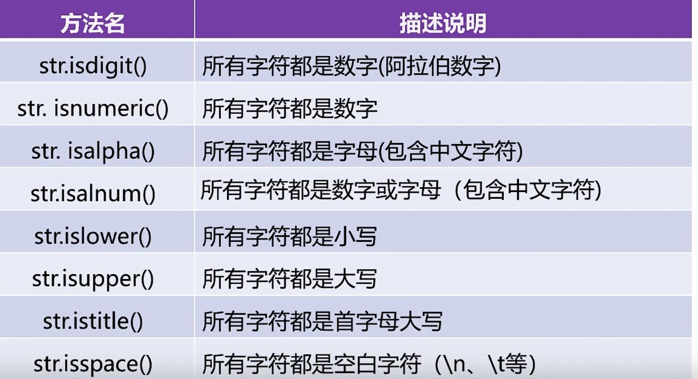

### 3.2 正则表达式

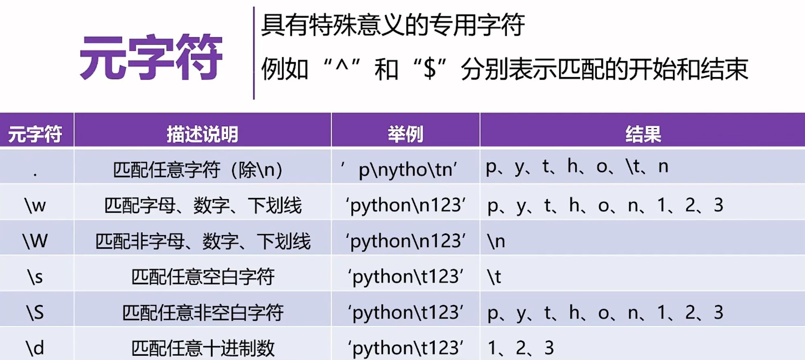
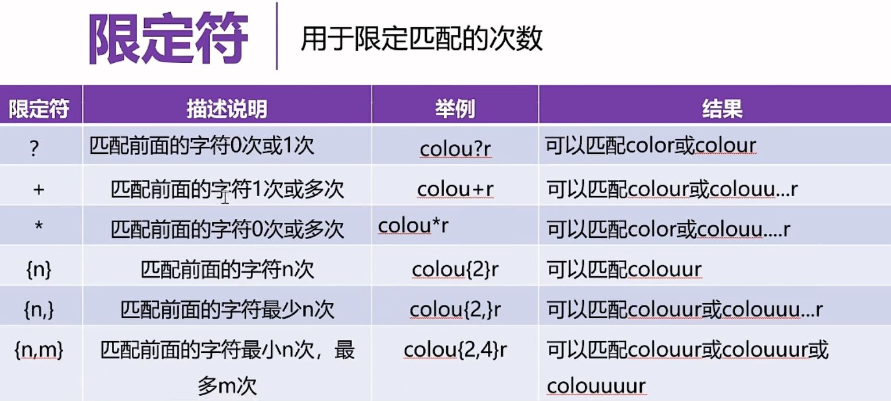
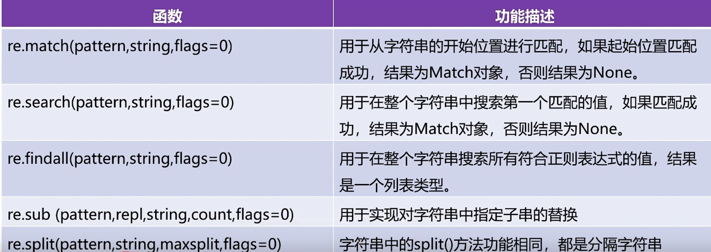
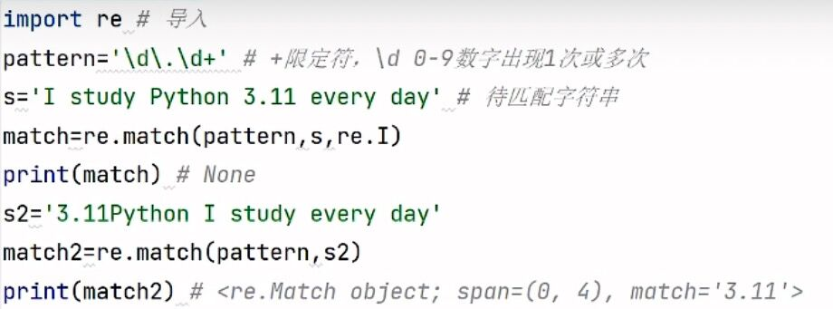
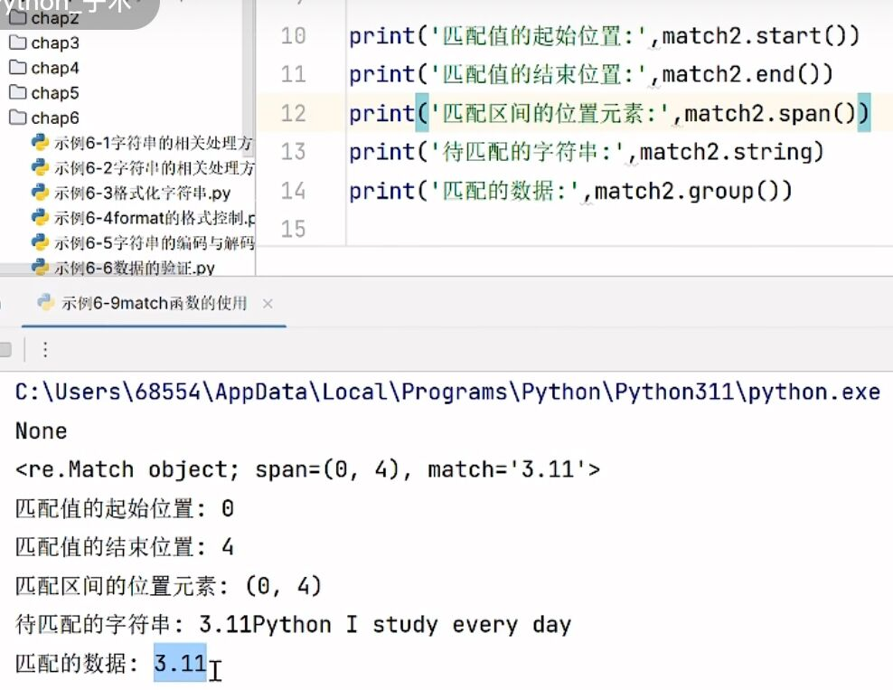

## 4.1 异常处理

```python
try:
    pass  #可能出错的代码
except ZeroDivisionError:
    pass
except ValueError:
    pass
except BaseException:
    pass
else:
    pass  #没有抛异常要执行的代码
finally:
    pass  #无论是否产生异常都要执行的代码
```

## 4.2 raise关键字

抛出一个异常，从而提醒程序出现了异常情况

```python
try:
    gender=input('Enter your gender:')
    if gender!='男'and gender!='女':
        raise Exception('Invalid gender')
    else:
        print('gender')
except Exception as e:
    print(e)
```

## 4.3 Python中常见异常类型

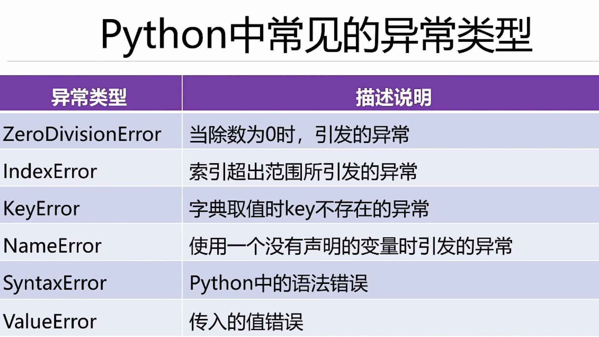
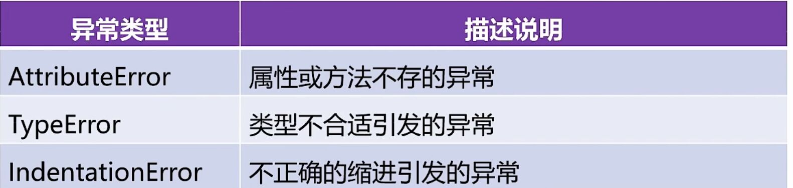

## 4.4 Pycharm程序调试

- 工具栏
- 右键 Debug
- shift+F9

---


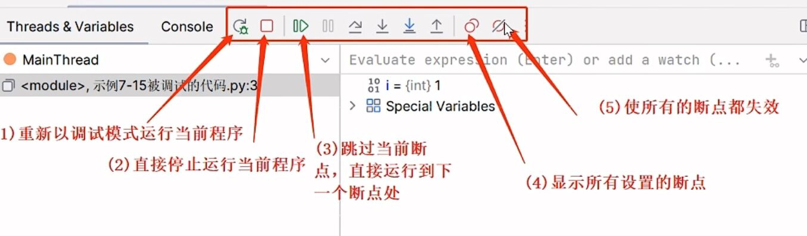
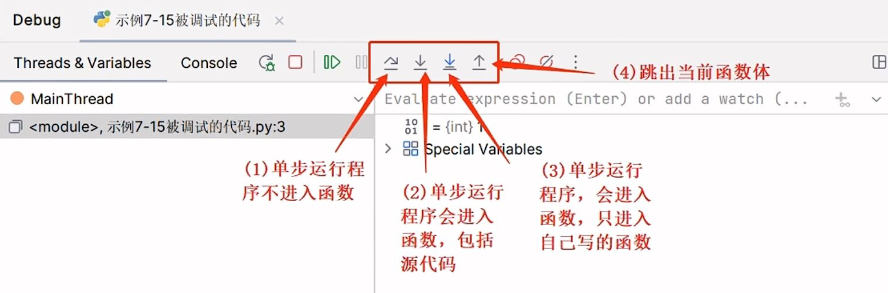

---
## 5.函数

## 5.1 函数的参数传递

- 位置传参、关键字传参与默认值参数

```python
def happy_birthday(name,age)
#位置传参
happy_birthday('小昱',16)
#关键字传参
happy_birthday(age=16,name='小昱')
#既有位置传参又有关键字传参，位置传参在前
happy_birthday('小昱',age=16)
#位置参数在前，默认值参数在后
def fun1(a,b=20`)
```

- 可变参数

  - 个数可变的位置参数

  在参数前加*，函数调用时可接收任意个数的实参，并放到一个元组中

  - 个数可变的位置参数

  在参数前加**，函数调用时可接收多个“参数=值”形式的参数，并放到一个字典中

```python
def fun1(*para):
    for item in para:
        print(item) 
      
fun1(*[10,20,30,40])  #调用时，参数前加一颗星，将列表解包


def fun2(**para):
    for key,value in para.items():
        print(key,value)
      
d={'a':1,'b':2,'c':3}
fun2(**d)  #前加**，进行系列解包操作
```

## 5.2 函数的返回值

若返回值有多个，则结果是一个元组类型，可对返回结果进行解包

```python
a,b,c=fun(10)
```

## 5.3 匿名函数lambda

指没有名字的函数，只能使用一次
一般在函数体只有一句代码，且只有一个返回值时使用
语法结构：result=lambda 参数列表：

```python
s=lambda a,b:a+b  #type(s)=function
print(s(10,20))

for i in range(len(lst)):
    result=lambda x:x[i]  #x为形参
    print(result(lst))    #lst为实参

scores.sort(key=lambda x:x.get('score'),reverse='True')
```

## 5.4 常用内置函数

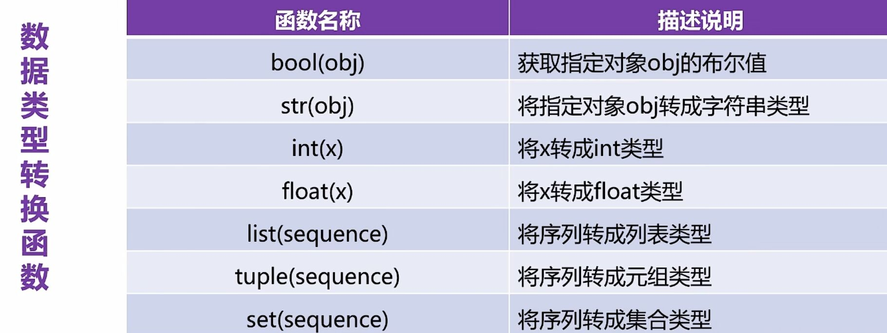
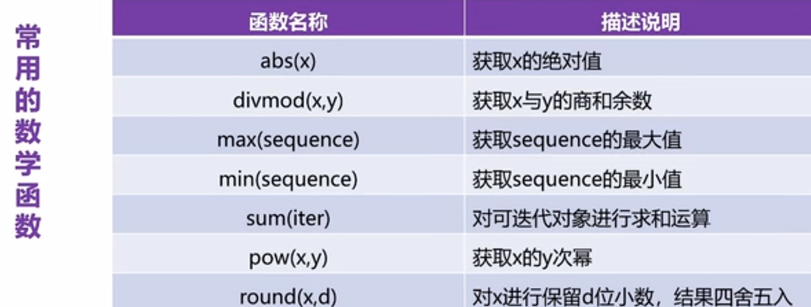
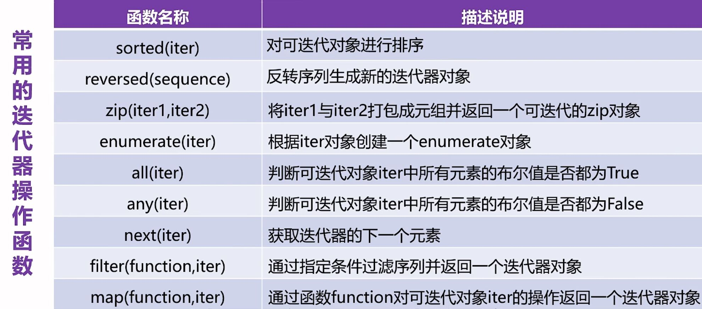

> - reversed()、zip()、enumerate() 结果需要转换类型
> - 函数作为参数不需要写小括号

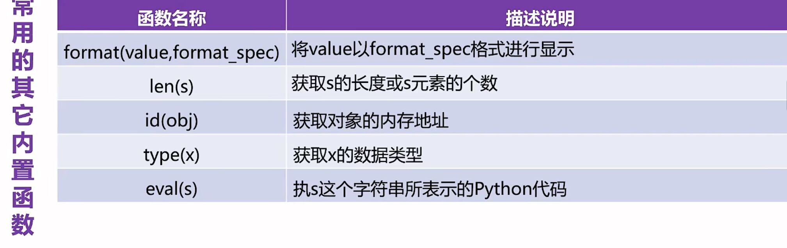

```python
print(format(3.14,'20'))    #数值型默认右对齐
print(format('hello',20))   #字符型默认左对齐
print(format('hello','*<20')) 
```
## 6.类

---
### 6.1 类的组成
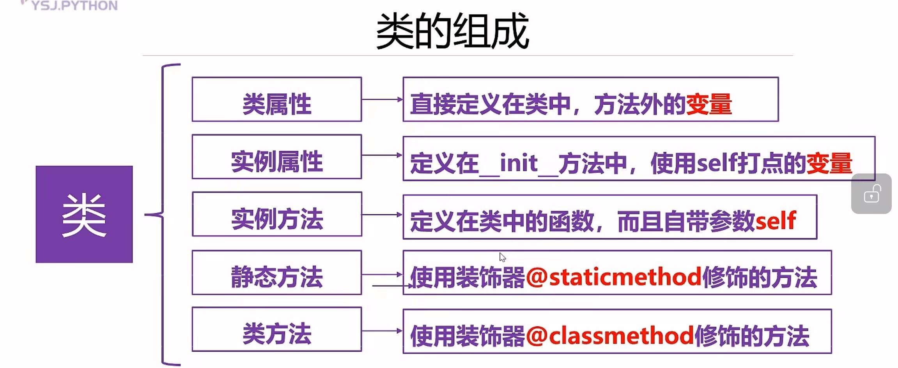
```python
class Student:
    #类属性：定义在类中，方法外的变量
    school='8z'
    
    #初始化方法
    def __init__(self,xm,age):  #xm，age是方法的参数
        self.name = xm  #将局部变量的值赋给实例属性
        self.age = age
        
    #定义在类中的函数，称为方法，自带一个参数self
    def show(self):
        print(f'xm: {self.xm}, age: {self.age}')

    #静态方法（不能调用实例属性、实例方法）
    @staticmethod
    def cm():

    #类方法（不能调用实例属性、实例方法）
    @classmethod
    def sm(cls):
-------------------------------------    
#创建类的对象
stu=Student('xln',18)
-------------------------------------
#实例属性，使用对象名进行打点调用
print(stu.name,stu.age)
#类属性，直接使用类名进行打点调用
print(Student.school)
-------------------------------------
#实例方法，使用对象名进行打点调用
stu.show()
#类方法，直接使用类名打点调用
Student.cm()
#静态方法，直接使用类名打点调用
Student.sm()
```
### 6.2 动态绑定属性和方法
```python
#动态绑定属性
stu.gender='女'
print(stu.xm,stu.age,stu.gender)
#动态绑定方法
def intruduce():
    pass
stu.fun=intruduce  #函数的赋值，注意不加小括号
```
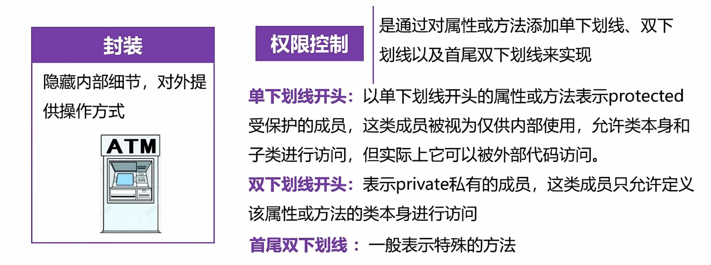

---
- 访问私有的实例属性和方法
```python
print(stu._Student__age)
stu._Student__fun()
```

> 不推荐
### 6.3 属性的设置
- 使用@property修改方法，将方法转成属性使用
```python
def __init__(self,name,gender):
  self.name=name
  self.__gender=gender  #self.__gender是私有的实例属性
  
  @property  #只能查看值，不能修改值
  def gender(self):
    return self.__gender
  
  #将gender属性设置为可写属性
  @gender.setter
  def gender(self,value):
    self.__gender=value

      
stu=Student('小昱'，16)
print(stu.name,stu,gender)  #stu.gender会执行stu.gender()

stu.gender='女'
```
### 6.4 继承
- 一个子类可以继承多个父类

`class 类名(父类1，父类2，...)`
- 一个父类可以拥有多个子类
- 如果一个类没有继承任何类，那么这个类默认继承object类（可不写小括号）
```python
class Penson:
    def __init__(self,name,age):
        self.name=name
        self.age=age
    def show(self):
        print(f'你好，我是{self.name},我今年{self.age}岁')

class Student(Penson):
    def __init__(self,name,age,stuno):
        super().__init__(name,age)  #调用父类的初始化方法
        self.stuno=stuno

class Doctor(Penson):
    def __init__(self,name,age,department):
        super().__init__(name,age)  #调用父类的初始化方法
        self.department=department

stu=Student(a,b,c)
stu,show()
```
多继承
```python
calss FatherA():
    def __init__(self,name):
        self.name=name
    
    def showA(self):
        print('A')

calss FatherB():
    def __init__(self,age):
        self.age=age
    
    def showB(self):
        print('B')

class Son(FatherA,FatherB):
    def __init__(self,name,age,gender):
    #调用两个父类的初始化方法
    FatherA.__init__(self,name)
    FatherB.__init__(self,age)
    self.gender=gender

son=Son('小昱'，16,'女')
son.showA()
son.showB()
```
### 6.5 方法重写
子类在重写父类的方法时，要求方法的名称必须与父类方法的名称相同   
在子类重写后的方法中可以通过super().xxx()调用父类中的方法
```python
def show(self):
    super.(),show()
    print('C')
```
### 6.6 多态
指”多种形态“，即使不知道一个变量引用的对象到底是什么类型，仍可以通过这个变量调用变量的方法  
在程序运行过程中根据变量所引用对象的数据类型，**动态决定**调用哪个对象的方法  
Python语言中的多态不关心对象的数据类型，也不关心类之间是否存在继承关系，只关心对象的行为（方法）   
只要不同的类型中有**同名的方法**，即可实现多态
```python
class Person():
    def eat(self):
        print('人吃五谷杂粮')
class Cat():
    def eat(self):
        print('猫吃鱼')
class Dog():
    def eat(self):
        print('狗啃骨头')
#这三个类中都有一个同名的方法eat

#编写函数
def fun(obj):  #obj是函数形参，在定义处不知道其数据类型
    obj.eat()  #通过变量obj（对象）调用eat方法
    
#创建三个类的对象
per=Person()
cat=Cat()
dog=Dog()

#调用fun函数
fun(per)
fun(cat)
fun(dog)
```
### 6.7 object类
- object类是所有类直接或间接的父类
- 所有类都具有object类的属性和方法
